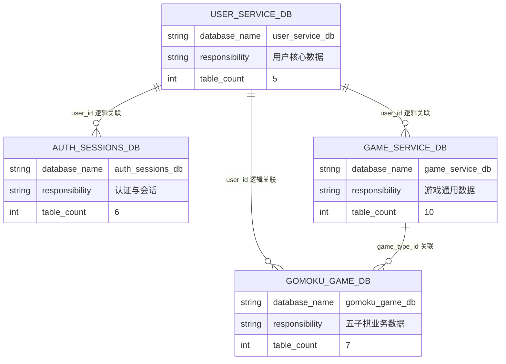
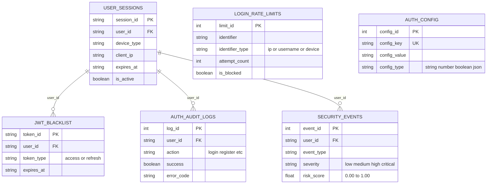
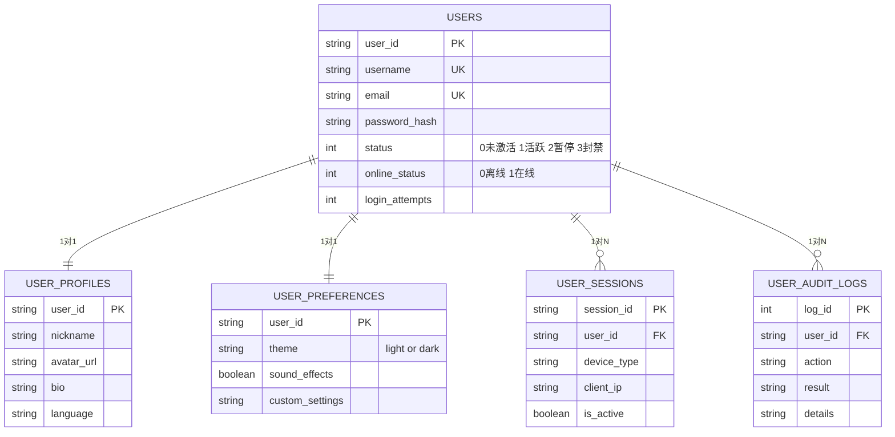
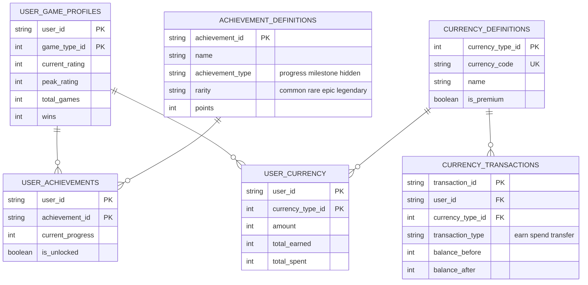
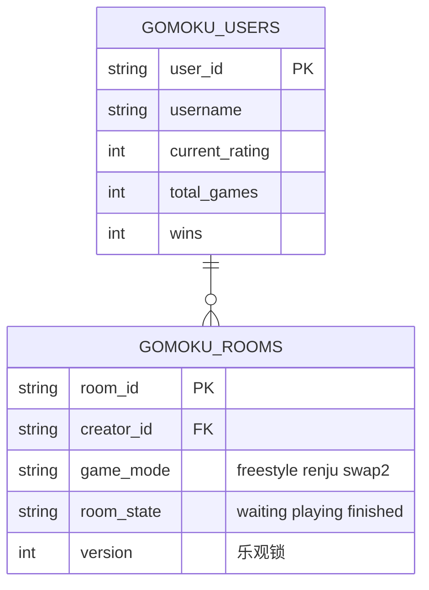
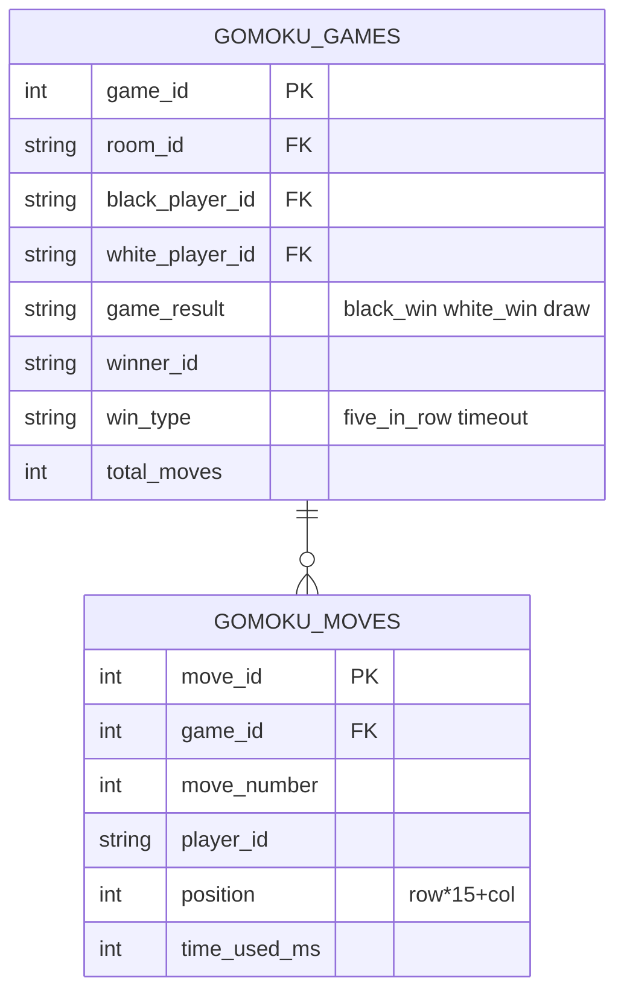

# 数据库 ER 图（Mermaid 格式）

> 使用 Mermaid Live Editor (https://mermaid.live) 渲染，或直接在支持 Mermaid 的 Markdown 编辑器中预览。

---

## 图4-3 系统总ER图（数据库级关系）

---

## 图4-4 认证服务数据库ER图（auth_sessions_db）

---

## 图4-5 用户服务数据库ER图（user_service_db）

---

## 图4-6 游戏数据服务数据库ER图（game_service_db）

---

## 图4-7 五子棋游戏服务数据库ER图（gomoku_game_db）

**左侧：用户与房间**

**右侧：对局与落子**

**关系说明：**

| 关系 | 类型 | 说明 |
|------|------|------|
| GOMOKU_USERS → GOMOKU_ROOMS | 1:N | 用户创建房间 |
| GOMOKU_ROOMS → GOMOKU_GAMES | 1:N | 房间内进行多局对弈 |
| GOMOKU_GAMES → GOMOKU_MOVES | 1:N | 一局对弈包含多步落子 |
| GOMOKU_USERS → GOMOKU_GAMES | 1:N | 用户作为玩家参与对局 |
