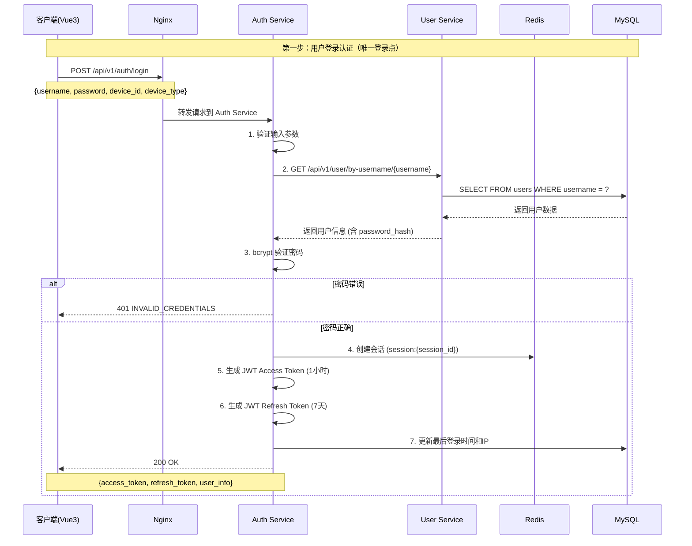
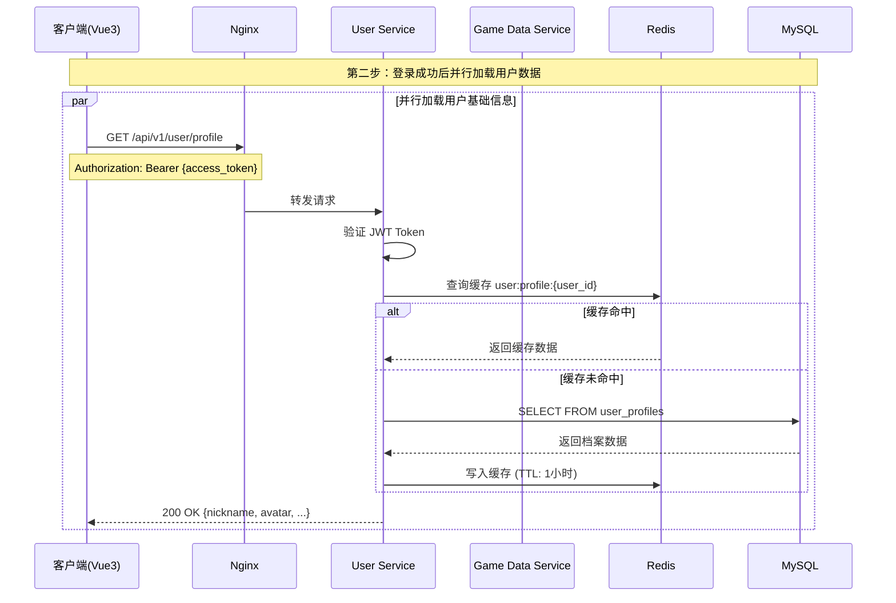
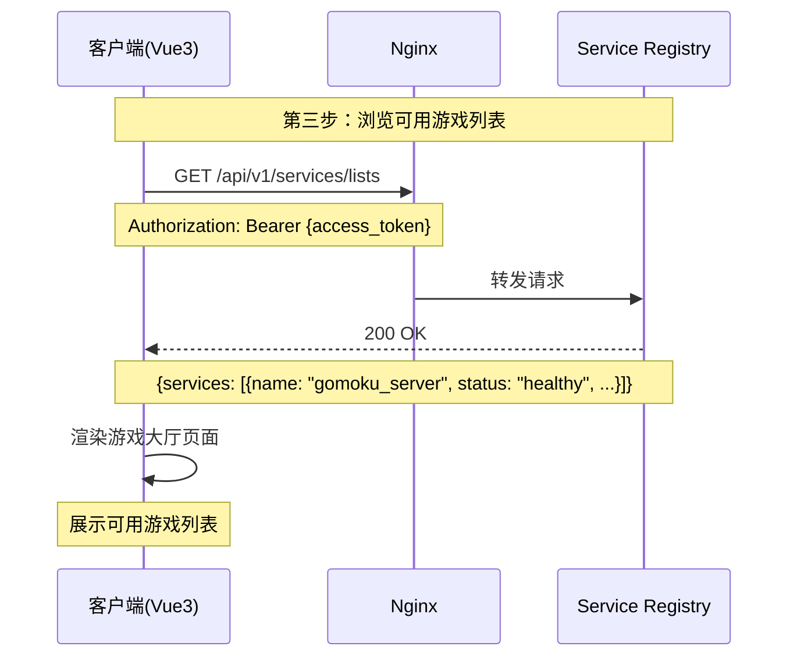
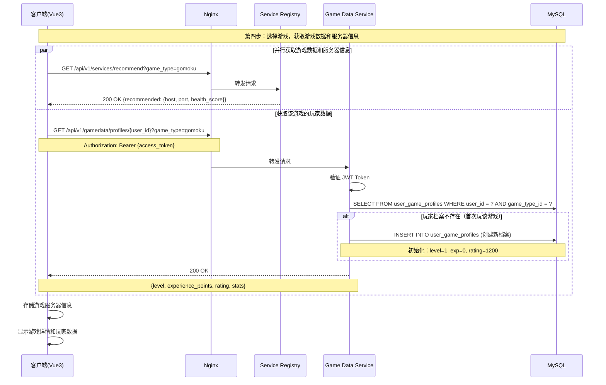
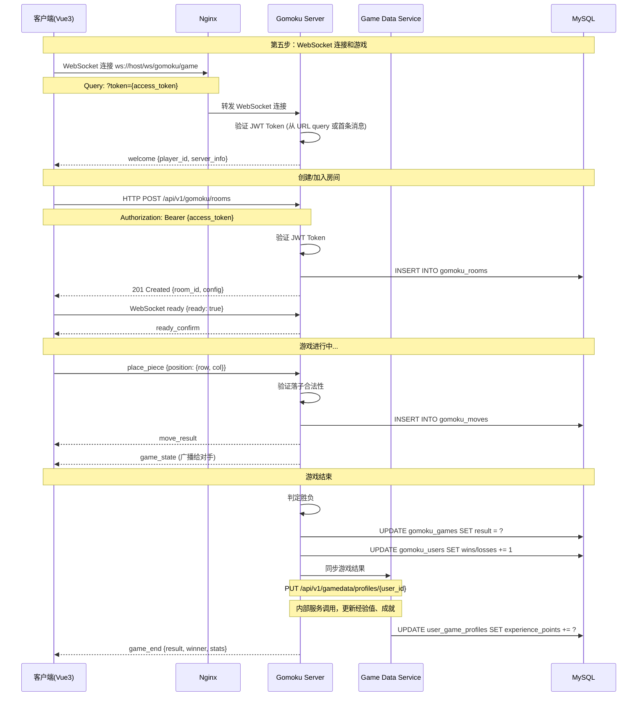
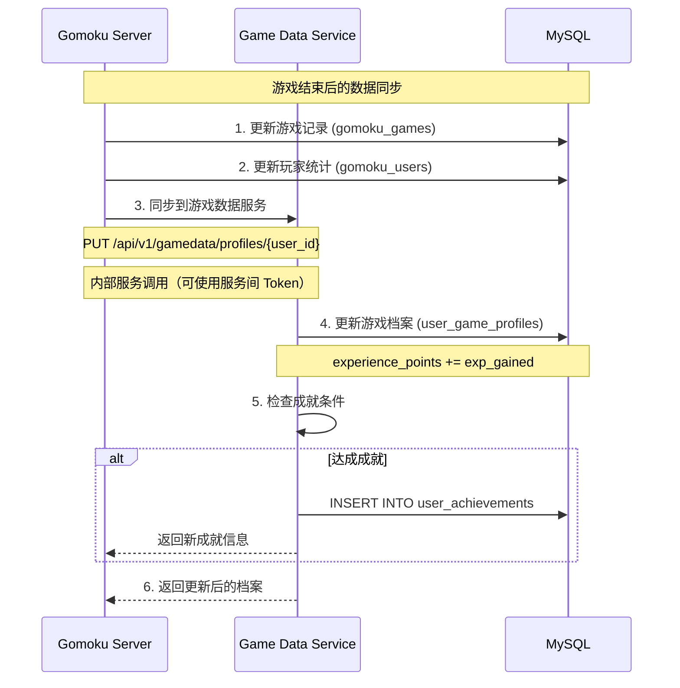

# 玩家从登录到游戏的完整业务流程

## 文档概述

本文档详细描述玩家从进入游戏平台、完成登录认证、选择游戏、到最终进入游戏进行对弈的完整业务流程。重点关注各服务之间的协作关系和数据流转。

**设计原则**：
- **单一登录**：用户在大厅登录一次，JWT Token 跨服务通用
- **按需获取**：选择游戏时获取该游戏的数据，无需重复认证
- **自动初始化**：首次进入某游戏时自动创建游戏档案

---

## 1. 系统架构概览

### 1.1 服务架构图

```
                                    ┌─────────────────────────────────────┐
                                    │          Nginx 反向代理              │
                                    │    (宝塔面板配置, 负载均衡/路由)      │
                                    │         Port: 80/443               │
                                    └────────────────┬────────────────────┘
                                                     │
                                                     ▼
                                    ┌─────────────────────────────────────┐
                                    │         API Gateway                 │
                                    │    (统一入口、JWT验证、限流熔断)     │
                                    │           Port: 8081               │
                                    └────────────────┬────────────────────┘
                                                     │
        ┌────────────────────────────────────────────┼────────────────────────────────────────────┐
        │                                            │                                            │
        ▼                                            ▼                                            ▼
┌───────────────┐                          ┌───────────────┐                            ┌───────────────┐
│  Auth Service │◄─────────────────────────│Service Registry│──────────────────────────►│  User Service │
│   (认证服务)   │        服务发现/心跳       │  (服务注册中心) │       用户信息查询          │   (用户服务)   │
│   Port: 8083  │                          │   Port: 8090  │                            │   Port: 8082  │
│               │                          │               │                            │               │
│ jwt_manager.h │                          │service_registry│                           │user_service.h │
│ auth_service.h│                          │    .h         │                            │user_models.h  │
└───────┬───────┘                          └───────────────┘                            └───────────────┘
        │
        │ JWT Token 验证 (所有服务共享)
        ▼
┌───────────────┐                          ┌───────────────┐
│Game Data Svc  │◄───── 游戏结果同步 ──────│ Gomoku Server │
│ (游戏数据服务) │                         │ (五子棋服务)   │
│   Port: 8084  │─────── 玩家档案/成就 ────►│  HTTP: 8085   │
│               │                          │  WS: 8086     │
│game_service.h │                          │               │
│elo_rating_    │                          │gomoku_server.h│
│  calculator.h │                          │gomoku_logic.h │
│currency_      │                          │gomoku_room.h  │
│  manager.h    │                          │websocket_     │
└───────────────┘                          │  handler.h    │
                                           └───────────────┘
```

### 1.2 服务职责

| 服务 | 端口 | 核心职责 | 核心类/文件 |
|------|------|----------|-------------|
| **API Gateway** | 8081 | 统一入口、JWT 验证、限流熔断、路由转发 | `api_gateway.h` |
| **Auth Service** | 8083 | 用户认证、JWT Token 管理、会话控制 | `jwt_manager.h`, `auth_service.h` |
| **User Service** | 8082 | 用户基础信息、档案、偏好设置 | `user_service.h`, `user_models.h` |
| **Game Data Service** | 8084 | 游戏档案、成就、库存、货币、排行榜 | `game_service.h`, `elo_rating_calculator.h` |
| **Gomoku Server** | 8085/8086 | 五子棋游戏逻辑、房间管理、实时对弈 | `gomoku_server.h`, `gomoku_logic.h` |
| **Service Registry** | 8090 | 服务注册、发现、健康检查 | `service_registry.h` |

### 1.3 认证机制说明

**JWT Token 统一认证**：
- 用户在大厅登录后获得 JWT Access Token
- 所有服务（User、Game Data、Gomoku）共享同一个 JWT 密钥
- 客户端在所有请求中携带 `Authorization: Bearer {access_token}`
- 各服务独立验证 JWT Token，无需回调 Auth Service

**实现细节** (`JwtManager` 类):

```cpp
// JWT 配置
struct JwtConfig {
    std::string secret_key;           // 至少32字符
    std::string issuer = "game-microservices-auth";
    std::string audience = "game-microservices-clients";
    int access_token_expire_seconds = 3600;    // 1小时
    int refresh_token_expire_seconds = 604800; // 7天
    std::string algorithm = "HS256";
    bool enable_token_blacklist = true;
};

// JWT 载荷包含的信息
struct JwtPayload {
    std::string user_id;
    std::string username;
    std::string email;
    std::vector<std::string> roles;
    std::string session_id;
    std::string device_type;
    std::string client_ip;
};
```

**密码安全**:
- 使用 PBKDF2 算法进行密码哈希
- 每个用户有唯一的盐值 (salt)
- 登录失败次数限制，自动锁定机制

---

## 2. 完整业务流程（优化版）

### 2.1 阶段一：平台登录（唯一认证点）



**关键点**：
- 登录成功后，JWT Token 可用于所有服务
- 无需再进行"游戏登录"
- Token 包含 `user_id`、`username`、`role` 等信息

### 2.2 阶段二：加载用户数据（登录后初始化）



**注意**：此时只加载用户基础信息，游戏数据在选择具体游戏时再加载。

### 2.3 阶段三：游戏大厅（浏览游戏列表）



### 2.4 阶段四：选择游戏（获取游戏数据 + 服务器信息）



**关键改进**：
- ❌ **移除** `POST /api/v1/game/login` 游戏登录接口
- ✅ **简化** 为两个并行请求：
  1. 获取游戏服务器地址（Service Registry）
  2. 获取该游戏的玩家数据（Game Data Service）
- ✅ **自动初始化**：首次进入某游戏时自动创建游戏档案

### 2.5 阶段五：WebSocket 连接和游戏对弈



**认证方式改进**：
- WebSocket 连接时通过 URL query 参数传递 Token：`ws://host/ws/gomoku/game?token={access_token}`
- 或在首条消息中传递：`{type: "auth", token: "{access_token}"}`
- Gomoku Server 独立验证 JWT Token，无需回调 Auth Service

---

## 3. Game Data Service 的核心作用

### 3.1 服务职责详解

**Game Data Service** 是游戏平台的核心数据服务，负责管理所有与游戏相关的玩家数据：

| 模块 | 功能 | 调用时机 |
|------|------|----------|
| **用户游戏档案** | 等级、经验值、评分 | 选择游戏时加载、游戏结束时更新 |
| **成就系统** | 成就定义、解锁、查询 | 完成特定条件时检查、展示成就时查询 |
| **库存管理** | 物品获取、使用、查询 | 购买/获得物品时、使用道具时 |
| **货币系统** | 多种货币余额管理 | 充值时、消费时、查询余额时 |
| **排行榜** | 全球/周/月排行 | 游戏结束时更新、浏览排行榜时查询 |

### 3.2 优化后的数据流向

```
┌─────────────────────────────────────────────────────────────────────┐
│                     玩家选择游戏（五子棋）                            │
└────────────────────────────────┬────────────────────────────────────┘
                                 │
          ┌──────────────────────┴──────────────────────┐
          │                                             │
          ▼                                             ▼
┌─────────────────────────┐               ┌─────────────────────────┐
│  Service Registry       │               │  Game Data Service      │
│  获取游戏服务器地址       │               │  获取该游戏的玩家数据     │
│  GET /services/recommend │               │  GET /gamedata/profiles │
│  ?game_type=gomoku      │               │  ?game_type=gomoku      │
└───────────┬─────────────┘               └───────────┬─────────────┘
            │                                         │
            │ {host, port, health_score}              │ {level, exp, rating}
            │                                         │
            └──────────────────┬──────────────────────┘
                               │
                               ▼
┌─────────────────────────────────────────────────────────────────────┐
│  客户端存储：                                                        │
│  - gameServer: {host, port}                                         │
│  - gameProfile: {level, exp, rating}                                │
│  - accessToken: JWT Token（已存在）                                  │
└────────────────────────────────┬────────────────────────────────────┘
                                 │
                                 ▼
┌─────────────────────────────────────────────────────────────────────┐
│  WebSocket 连接游戏服务器                                            │
│  ws://{host}:{port}/ws/gomoku/game?token={access_token}            │
└─────────────────────────────────────────────────────────────────────┘
```

### 3.3 API 调用时机总结（优化版）

| 时机 | 调用方 | API | 目的 |
|------|--------|-----|------|
| 登录后 | 客户端 | `GET /user/profile` | 加载用户基础信息 |
| 选择游戏 | 客户端 | `GET /services/recommend?game_type=xxx` | 获取游戏服务器地址 |
| 选择游戏 | 客户端 | `GET /gamedata/profiles/{user_id}?game_type=xxx` | 加载该游戏档案（自动创建） |
| 游戏结束 | Gomoku Server | `PUT /gamedata/profiles/{user_id}` | 更新经验值/等级 |
| 浏览排行 | 客户端 | `GET /gamedata/leaderboard/{type}/{game}` | 获取排行榜 |

### 3.4 详细 API 调用示例

#### 3.4.1 选择游戏时（并行请求）

```http
# 1. 获取游戏服务器地址
GET /api/v1/services/recommend?game_type=gomoku
Authorization: Bearer {access_token}

Response: {
  "success": true,
  "data": {
    "recommended": {
      "service_id": "gomoku_server_1",
      "host": "127.0.0.1",
      "port": 8085,
      "ws_port": 8086,
      "health_score": 95,
      "current_players": 10
    }
  }
}

# 2. 获取该游戏的玩家档案（首次自动创建）
GET /api/v1/gamedata/profiles/{user_id}?game_type=gomoku
Authorization: Bearer {access_token}

Response: {
  "success": true,
  "data": {
    "user_id": "usr_123",
    "game_type": "gomoku",
    "level": 5,
    "experience_points": 1500,
    "current_rating": 1250,
    "total_games": 50,
    "wins": 30,
    "losses": 18,
    "draws": 2,
    "is_new_player": false
  }
}
```

#### 3.4.2 WebSocket 连接认证

```javascript
// 方式1：URL Query 参数
const ws = new WebSocket(`ws://${host}:${ws_port}/ws/gomoku/game?token=${accessToken}`);

// 方式2：首条消息认证
const ws = new WebSocket(`ws://${host}:${ws_port}/ws/gomoku/game`);
ws.onopen = () => {
  ws.send(JSON.stringify({
    type: 'authenticate',
    token: accessToken
  }));
};
```

---

## 4. 数据一致性保证

### 4.1 跨服务数据同步



### 4.2 缓存策略

| 数据类型 | 缓存位置 | TTL | 失效策略 |
|----------|----------|-----|----------|
| 用户游戏档案 | Redis | 5分钟 | 写入时失效 |
| 货币余额 | Redis | 3分钟 | 交易时失效 |
| 成就列表 | Redis | 10分钟 | 解锁时失效 |
| 排行榜 | Redis Sorted Set | 10分钟 | 定时刷新 |

---

## 5. 前端页面流程（优化版）

### 5.1 页面导航流程

```
┌─────────────────────────────────────────────────────────────────────┐
│                         登录页面 (/login)                           │
│  - 用户名/密码输入                                                   │
│  - 调用 POST /api/v1/auth/login                                     │
│  - 存储 access_token 到 localStorage/Pinia                         │
└────────────────────────────────┬────────────────────────────────────┘
                                 │ 登录成功
                                 ▼
┌─────────────────────────────────────────────────────────────────────┐
│                       游戏大厅 (/lobby)                             │
│  - 加载用户档案: GET /api/v1/user/profile                           │
│  - 加载游戏列表: GET /api/v1/services/lists                         │
│  - 展示可用游戏列表                                                  │
│  - 展示用户基础信息                                                  │
└────────────────────────────────┬────────────────────────────────────┘
                                 │ 选择游戏 (五子棋)
                                 ▼
┌─────────────────────────────────────────────────────────────────────┐
│                    游戏详情页 (/game/gomoku)                         │
│  - 并行请求:                                                        │
│    1. GET /api/v1/services/recommend?game_type=gomoku              │
│    2. GET /api/v1/gamedata/profiles/{user_id}?game_type=gomoku     │
│  - 展示游戏规则、玩家该游戏数据、排行榜                               │
│  - "开始游戏"按钮                                                   │
└────────────────────────────────┬────────────────────────────────────┘
                                 │ 开始游戏
                                 ▼
┌─────────────────────────────────────────────────────────────────────┐
│                    游戏房间页 (/game/gomoku/room)                    │
│  - WebSocket 连接: ws://{host}:{port}/ws/gomoku/game?token={jwt}   │
│  - 房间管理: 创建/加入/开始                                         │
│  - 实时对弈                                                         │
│  - 游戏结束展示结果                                                 │
└─────────────────────────────────────────────────────────────────────┘
```

### 5.2 关键状态管理

```typescript
// Pinia Store 示例
interface GameState {
  // 认证状态（大厅登录获得）
  accessToken: string | null;
  refreshToken: string | null;

  // 用户基础信息 (来自 User Service)
  userProfile: {
    userId: string;
    username: string;
    nickname: string;
    avatar: string;
  };

  // 当前选择的游戏
  currentGame: {
    gameType: string;  // "gomoku"
    server: {
      host: string;
      port: number;
      wsPort: number;
    };
    // 该游戏的玩家数据
    profile: {
      level: number;
      experience: number;
      rating: number;
      totalGames: number;
      wins: number;
      losses: number;
    };
  };

  // 当前游戏房间
  currentRoom: {
    roomId: string | null;
    playerColor: 'black' | 'white' | null;
  };
}
```

---

## 6. 总结

### 6.1 优化后的核心流程

1. **登录阶段**: Auth Service 验证凭证，生成 JWT Token（唯一认证点）
2. **大厅阶段**: 加载用户基础信息，展示游戏列表
3. **选择游戏阶段**: 并行获取游戏服务器地址 + 该游戏的玩家数据
4. **游戏对弈阶段**: WebSocket 连接（使用 JWT Token 认证）

### 6.2 关键改进点

| 改进项 | 原设计 | 优化后 |
|--------|--------|--------|
| 认证次数 | 2次（大厅登录 + 游戏登录） | 1次（仅大厅登录） |
| 游戏会话 Token | 需要生成 Game Session Token | 复用 JWT Access Token |
| 游戏数据加载 | 进入游戏时由 Auth Service 代理获取 | 客户端直接并行获取 |
| 首次进入处理 | Auth Service 调用 GameDS 创建 | GameDS 自动检测并创建 |
| WebSocket 认证 | 需要 Game Session Token | 直接使用 JWT Token |

### 6.3 服务间协作关系（优化后）

```
登录 → Auth Service (认证，生成 JWT)
        ↓
     User Service (用户基础信息)
        ↓
     选择游戏
        ├─→ Service Registry (获取游戏服务器)
        └─→ Game Data Service (获取该游戏数据，自动初始化)
        ↓
     Gomoku Server (WebSocket + JWT Token)
        ↓
     Game Data Service (游戏结束同步数据)
```

### 6.4 为什么这样设计是可行的

1. **JWT Token 跨服务验证**：所有服务共享 JWT 密钥，可以独立验证 Token
2. **无状态认证**：不需要 Auth Service 介入每次请求
3. **职责清晰**：
   - Auth Service：只负责登录认证
   - Game Data Service：负责游戏数据，包括自动初始化
   - Service Registry：负责服务发现
4. **减少网络开销**：客户端直接并行请求，减少中间代理

---

**文档版本**: 2.1.0
**创建日期**: 2025-02-20
**更新日期**: 2026-02-21
**维护状态**: ✅ 已优化 + 实现细节补充
**主要变更**:
- 移除游戏登录流程，简化为单一登录 + 按需获取游戏数据
- 补充实际代码实现路径和类名
- 添加 API Gateway 服务层
- 补充认证系统实现细节

---

## 附录 A. 实际代码实现路径

### A.1 服务核心文件位置

| 服务 | 核心头文件 | 核心实现文件 |
|------|-----------|-------------|
| **API Gateway** | `src/core_services/api_gateway/include/api_gateway.h` | `src/core_services/api_gateway/src/api_gateway.cpp` |
| **Auth Service** | `src/core_services/auth_service/include/auth_service.h` | `src/core_services/auth_service/src/auth_service.cpp` |
| **User Service** | `src/core_services/user_service/include/user_service.h` | `src/core_services/user_service/src/user_service.cpp` |
| **Game Data Service** | `src/core_services/game_data_service/include/game_service.h` | `src/core_services/game_data_service/src/game_service.cpp` |
| **Gomoku Server** | `src/game_services/gomoku/include/gomoku_server.h` | `src/game_services/gomoku/src/gomoku_server.cpp` |

### A.2 认证系统实现

#### JwtManager 类
**文件**: `src/core_services/auth_service/include/jwt_manager.h`

```cpp
namespace auth_service {

class JwtManager {
public:
    struct Config {
        std::string secret_key;           // 至少32字符
        std::string issuer = "game-microservices-auth";
        std::string audience = "game-microservices-clients";
        int access_token_expire_seconds = 3600;    // 1小时
        int refresh_token_expire_seconds = 604800; // 7天
        std::string algorithm = "HS256";
        bool enable_token_blacklist = true;
    };

    // 生成访问令牌
    std::string generateAccessToken(const CoreUserInfo& user,
                                    const std::string& session_id,
                                    const std::string& device_type,
                                    const std::string& client_ip);

    // 生成刷新令牌
    std::string generateRefreshToken(const std::string& user_id,
                                     const std::string& session_id);

    // 验证令牌
    ValidationResult validateAccessToken(const std::string& token);
    ValidationResult validateRefreshToken(const std::string& token);

    // 黑名单管理
    void addToBlacklist(const std::string& token);
    bool isBlacklisted(const std::string& token);
};

} // namespace auth_service
```

#### 密码管理
**文件**: `src/core_services/auth_service/include/password_manager.h`

```cpp
class PasswordManager {
public:
    // 使用 PBKDF2 算法哈希密码
    std::string hashPassword(const std::string& password, const std::string& salt);

    // 生成随机盐值
    std::string generateSalt();

    // 验证密码
    bool verifyPassword(const std::string& password,
                       const std::string& hash,
                       const std::string& salt);
};
```

### A.3 用户数据模型

**文件**: `src/core_services/auth_service/include/user_models.h`

```cpp
struct CoreUserInfo {
    std::string user_id;           // 用户ID（主键）
    std::string username;          // 用户名（唯一）
    std::string email;             // 邮箱地址（唯一）
    std::string password_hash;     // 密码哈希值
    std::string salt;              // 密码盐值
    std::string nickname;          // 昵称
    UserStatus status;             // ACTIVE/SUSPENDED/BANNED
    OnlineStatus online_status;    // 在线状态
    int login_attempts;            // 登录尝试次数
    std::chrono::system_clock::time_point locked_until; // 锁定到期时间
    std::vector<std::string> roles; // 用户角色列表
};

enum class UserStatus { ACTIVE, SUSPENDED, BANNED, DELETED };
enum class OnlineStatus { OFFLINE, ONLINE, IN_GAME, AWAY };
```

### A.4 WebSocket 处理器实现

**文件**: `src/game_services/gomoku/include/gomoku_websocket_handler.h`

```cpp
class GomokuWebSocketHandler : public game_base::WebSocketHandlerBase {
public:
    // 认证相关方法
    bool validateGameSessionTokenInHandshake(
        const std::unordered_map<std::string, std::string>& headers,
        int client_fd);

    bool validateGameSessionToken(const std::string& token);

    bool authenticatePlayer(const std::string& player_id);

    bool isPlayerAuthenticated(const std::string& player_id) const;

    // 消息处理
    void handleGomokuGameMessage(const std::string& player_id,
                                 const nlohmann::json& message);

private:
    // 消息类型处理
    void handleRoomMessage(const std::string& player_id, const nlohmann::json& message);
    void handleReadyMessage(const std::string& player_id, const nlohmann::json& message);
    void handleGameMessage(const std::string& player_id, const nlohmann::json& message);
};
```

### A.5 服务客户端

**文件**: `src/game_services/gomoku/include/service_client.h`

```cpp
// 用户服务客户端
class UserServiceClient {
public:
    std::optional<CoreUserInfo> getUserInfo(const std::string& user_id);
    bool updateOnlineStatus(const std::string& user_id, const std::string& status);
};

// 游戏数据服务客户端
class GameDataServiceClient {
public:
    std::optional<UserGameProfile> getUserGameProfile(
        const std::string& user_id, int game_type_id);

    bool recordGameResult(const GameResultData& result);

    bool createUserGameProfile(const std::string& user_id, int game_type_id);
};
```

### A.6 配置文件位置

| 服务 | 配置文件 |
|------|---------|
| API Gateway | `config/api_gateway_config.yml` |
| Auth Service | `config/auth_service_config.yml` |
| User Service | `config/user_service_config.yml` |
| Game Data Service | `config/game_data_service.yml` |
| Gomoku Server | `config/gomoku_server.yml` |
| Service Registry | `config/service_registry.yml` |
| Nginx | `deploy/nginx/nginx.conf` |

---

## 附录 B. 完整服务架构图（含 API Gateway）

```
┌─────────────────────────────────────────────────────────────────────────────────┐
│                              客户端层                                             │
│  ┌─────────────┐   ┌─────────────┐   ┌─────────────┐   ┌─────────────┐         │
│  │  Web 客户端 │   │ Qt6 客户端  │   │ 移动客户端  │   │  第三方接入 │         │
│  └──────┬──────┘   └──────┬──────┘   └──────┬──────┘   └──────┬──────┘         │
└─────────┼─────────────────┼─────────────────┼─────────────────┼─────────────────┘
          │                 │                 │                 │
          ▼                 ▼                 ▼                 ▼
┌─────────────────────────────────────────────────────────────────────────────────┐
│                      Nginx 反向代理层 (Port 80/443)                              │
│  ┌─────────────────────────────────────────────────────────────────────────┐   │
│  │  路由转发 │ 负载均衡 │ WebSocket 代理 │ 静态资源 │ SSL 终止 │ 缓存       │   │
│  └─────────────────────────────────────────────────────────────────────────┘   │
└─────────────────────────────────────────────────────────────────────────────────┘
          │
          ▼
┌─────────────────────────────────────────────────────────────────────────────────┐
│                      API Gateway (Port 8081)                                    │
│  ┌─────────────────────────────────────────────────────────────────────────┐   │
│  │  • JWT 统一验证          • 请求路由/负载均衡       • 限流熔断            │   │
│  │  • CORS 处理             • API 聚合               • 指标收集            │   │
│  │  • 黑名单检查            • 服务发现集成           • Kafka 事件发布       │   │
│  └─────────────────────────────────────────────────────────────────────────┘   │
└─────────────────────────────────────────────────────────────────────────────────┘
          │
    ┌─────┴─────┬─────────────┬─────────────┬─────────────┐
    ▼           ▼             ▼             ▼             ▼
┌────────┐ ┌────────┐ ┌────────────┐ ┌───────────┐ ┌───────────────┐
│  Auth  │ │  User  │ │ Game Data  │ │  Gomoku   │ │   Service     │
│ Service│ │ Service│ │  Service   │ │  Server   │ │   Registry    │
│ :8083  │ │ :8082  │ │   :8084    │ │:8085/8086 │ │    :8090      │
└────────┘ └────────┘ └────────────┘ └───────────┘ └───────────────┘
```

---

## 附录 C. 实现状态核对表

| 功能模块 | 设计要求 | 实现状态 | 核心文件 |
|---------|---------|---------|---------|
| **JWT 认证** | 统一 Token 管理 | ✅ 已实现 | `jwt_manager.h/.cpp` |
| **密码哈希** | PBKDF2 算法 | ✅ 已实现 | `password_manager.h/.cpp` |
| **会话管理** | Redis 会话存储 | ✅ 已实现 | `session_manager.h/.cpp` |
| **账户锁定** | 登录失败限制 | ✅ 已实现 | `auth_service.cpp` |
| **Token 黑名单** | 主动撤销 Token | ✅ 已实现 | `jwt_manager.cpp` |
| **WebSocket 认证** | 握手阶段验证 | ✅ 已实现 | `gomoku_websocket_handler.cpp` |
| **服务注册** | 心跳健康检查 | ✅ 已实现 | `service_client.h` |
| **游戏数据同步** | 游戏结束回调 | ✅ 已实现 | `game_end_processor.h/.cpp` |
