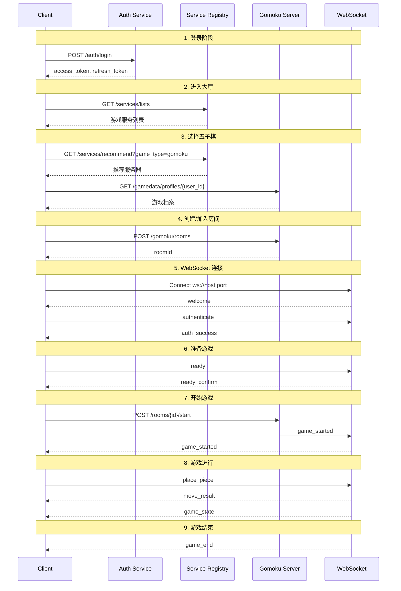

# 客户端操作流程指南

## 文档信息

| 项目 | 内容 |
|------|------|
| 版本 | 2.5.4 |
| 创建日期 | 2026-02-21 |
| 更新日期 | 2026-02-22 |
| 用途 | 指导 AI 编写客户端代码，明确 API 调用顺序和消息协议 |
| 目标读者 | 前端开发者、AI 编程助手 |
| 架构方案 | **选择游戏时建立 WebSocket + 混合 HTTP** |
| 关联文档 | `docs/plans/websocket_architecture_upgrade_plan.md` |

---

## 0. 架构决策说明

### 0.1 通信协议分工

| 操作类型 | 协议 | 原因 |
|---------|------|------|
| 登录/注册 | HTTP | 无状态，一次性 |
| 服务发现 | HTTP | 低频，缓存友好 |
| **房间列表** | **WebSocket** | **需要实时更新** |
| **创建/加入房间** | **WebSocket** | **连接已建立，直接使用** |
| **准备状态** | **WebSocket** | **需要实时广播** |
| **游戏内所有操作** | **WebSocket** | **低延迟要求** |
| 排行榜查询 | HTTP | 低频，可缓存 |
| 历史记录查询 | HTTP | 分页查询，适合 HTTP |
| 成就列表 | HTTP | 低频更新 |
| 用户档案 | HTTP | 低频更新 |

### 0.2 WebSocket 连接时机

**关键决策：选择游戏时立即建立 WebSocket 连接**

```
┌─────────────────────────────────────────────────────────────────────────────────┐
│                         WebSocket 连接生命周期                                    │
└─────────────────────────────────────────────────────────────────────────────────┘

阶段1：登录/大厅          阶段2：选择游戏              阶段3：进入房间
┌──────────────┐         ┌──────────────┐           ┌──────────────┐
│   HTTP API   │         │  WebSocket   │           │  WebSocket   │
│   (无状态)   │ ──────► │  (游戏级连接) │ ────────► │  (房间内通信) │
└──────────────┘         └──────────────┘           └──────────────┘
      │                        │                          │
      ▼                        ▼                          ▼
 • 登录/注册             • 实时房间列表              • 准备状态
 • 服务列表              • 玩家在线状态              • 落子操作
 • 用户信息              • 房间状态变化              • 聊天消息
                         • 系统公告                  • 悔棋/认输
                                                     • 游戏结束

                        ┌──────────────┐
                        │   HTTP API   │
                        │  (补充查询)  │
                        └──────────────┘
                              │
                              ▼
                         • 排行榜查询
                         • 历史记录
                         • 成就列表
                         • 用户档案
```

---

## 1. 整体页面流程图

```
┌─────────────────────────────────────────────────────────────────────────────────┐
│                              用户操作流程                                        │
└─────────────────────────────────────────────────────────────────────────────────┘

┌──────────────┐     ┌──────────────┐     ┌──────────────┐     ┌──────────────┐
│   登录页面    │────►│   游戏大厅    │────►│  五子棋大厅   │────►│   游戏房间    │
│  /login      │     │   /lobby     │     │  /game/gomoku │     │  /room/:id   │
└──────────────┘     └──────────────┘     └──────────────┘     └──────────────┘
       │                    │                    │                    │
       ▼                    ▼                    ▼                    ▼
  HTTP API:            HTTP API:          WebSocket 连接:       WebSocket:
  POST /auth/login     GET /services      1. 握手 + 认证        复用已有连接
                       GET /user/profile  2. 订阅房间列表       所有房间操作
                                          3. 接收实时更新       游戏内操作

                                          HTTP API (并行):
                                          GET /gamedata/profiles

                                                    │
                                                    ▼
                                              ┌──────────────┐
                                              │   游戏对战    │
                                              │   (进行中)    │
                                              │  WebSocket   │
                                              └──────────────┘
```

---

## 2. 阶段一：登录流程

### 2.1 用户操作
用户在登录页面输入用户名和密码，点击"登录"按钮。

### 2.2 API 调用

```typescript
// 第一步：调用登录 API
POST /api/v1/auth/login
Content-Type: application/json

// 请求体
{
  "username": "player1",
  "password": "Password123!",
  "device_type": "web",
  "device_id": "browser_abc123"
}

// 成功响应 (200)
{
  "success": true,
  "access_token": "eyJhbGciOiJIUzI1NiJ9...",
  "refresh_token": "eyJhbGciOiJIUzI1NiJ9...",
  "expires_in": 3600,
  "token_type": "Bearer",
  "user_id": "usr_1758694452619_6306"
}

// 失败响应 (401)
{
  "success": false,
  "error": "INVALID_CREDENTIALS",
  "message": "用户名或密码错误"
}
```

### 2.3 客户端处理

```typescript
// 登录成功后的处理流程
async function handleLoginSuccess(response: LoginResponse) {
  // 1. 存储 Token（使用 sessionStorage 更安全）
  sessionStorage.setItem('access_token', response.access_token);
  sessionStorage.setItem('refresh_token', response.refresh_token);
  sessionStorage.setItem('user_id', response.user_id);

  // 2. 设置 Axios 默认 Authorization 头
  axios.defaults.headers.common['Authorization'] = `Bearer ${response.access_token}`;

  // 3. 跳转到游戏大厅
  router.push('/lobby');
}
```

### 2.4 完整代码示例

```typescript
// views/LoginView.vue
async function login() {
  try {
    loading.value = true;
    const response = await authApi.login({
      username: form.username,
      password: form.password,
      device_type: 'web',
      device_id: getDeviceId()
    });

    if (response.success) {
      // 存储认证信息
      authStore.setTokens(response.access_token, response.refresh_token);
      authStore.setUserId(response.user_id);

      // 跳转到大厅
      router.push('/lobby');
    }
  } catch (error) {
    showError('登录失败，请检查用户名和密码');
  } finally {
    loading.value = false;
  }
}
```

---

## 3. 阶段二：游戏大厅流程

### 3.1 用户操作
用户登录成功后进入游戏大厅，可以看到游戏列表。

### 3.2 API 调用顺序

```typescript
// 进入大厅页面时，并行调用以下 API：

// 1. 获取用户信息
GET /api/v1/user/{user_id}
Authorization: Bearer {access_token}

// 2. 获取游戏服务列表
GET /api/v1/services/lists?service_type=game&healthy_only=true
Authorization: Bearer {access_token}
```

### 3.3 响应格式

```json
// GET /api/v1/user/{user_id} 响应
{
  "user_id": "usr_1758694452619_6306",
  "username": "player1",
  "email": "player1@example.com",
  "nickname": "玩家一号",
  "online_status": "online",
  "status": "active"
}

// GET /api/v1/services/lists 响应
{
  "success": true,
  "services": [
    {
      "service_name": "gomoku_server",
      "service_type": "game",
      "host": "127.0.0.1",
      "port": 8085,
      "ws_port": 8085,
      "status": "healthy",
      "health_score": 95,
      "metadata": {
        "game_type": "gomoku",
        "current_players": 12,
        "active_rooms": 5
      }
    }
  ]
}
```

### 3.4 完整代码示例

```typescript
// views/LobbyView.vue
import { onMounted } from 'vue';
import { useAuthStore } from '@/stores/auth.store';
import { userApi, serviceApi } from '@/api';

const authStore = useAuthStore();
const userInfo = ref(null);
const gameServices = ref([]);

onMounted(async () => {
  try {
    // 并行获取用户信息和服务列表
    const [userRes, servicesRes] = await Promise.all([
      userApi.getUser(authStore.userId),
      serviceApi.getServiceList({ service_type: 'game', healthy_only: true })
    ]);

    userInfo.value = userRes;
    gameServices.value = servicesRes.services;
  } catch (error) {
    console.error('Failed to load lobby data:', error);
  }
});

// 点击游戏卡片
function selectGame(gameType: string) {
  router.push(`/game/${gameType}`);
}
```

---

## 4. 阶段三：选择游戏流程（以五子棋为例）⭐ WebSocket 连接时机

### 4.1 用户操作
用户在游戏大厅点击"五子棋"，进入五子棋游戏子大厅。

### 4.2 API 调用顺序（修改后）

```typescript
// 点击五子棋后，并行执行以下操作：

// ===== HTTP API =====
// 1. 获取推荐的游戏服务器
GET /api/v1/services/recommend?service_type=game&game_type=gomoku&strategy=least_load
Authorization: Bearer {access_token}

// 2. 获取用户的五子棋游戏档案
GET /api/v1/gamedata/profiles/{user_id}?game_type=gomoku
Authorization: Bearer {access_token}

// ===== WebSocket 连接（关键变更！）=====
// 3. 立即建立 WebSocket 连接到游戏服务器
ws://{host}:{ws_port}?token={access_token}
// 或连接后通过消息认证
```

### 4.3 响应格式

```json
// GET /api/v1/services/recommend 响应
{
  "success": true,
  "recommended": {
    "service_id": "gomoku_server_1",
    "service_name": "gomoku_server",
    "host": "127.0.0.1",
    "port": 8085,
    "ws_port": 8085,
    "health_score": 95,
    "metadata": {
      "game_type": "gomoku",
      "current_players": 12,
      "active_rooms": 5
    }
  }
}

// GET /api/v1/gamedata/profiles/{user_id} 响应（首次会自动创建）
{
  "success": true,
  "data": {
    "user_id": "usr_1758694452619_6306",
    "game_type": "gomoku",
    "level": 5,
    "experience_points": 1500,
    "current_rating": 1250,
    "total_games": 50,
    "wins": 30,
    "losses": 18,
    "draws": 2,
    "current_win_streak": 3,
    "best_win_streak": 8
  }
}
```

### 4.4 客户端处理（修改后）

```typescript
// views/GomokuLobbyView.vue
const gameServer = ref(null);
const gameProfile = ref(null);
const wsConnected = ref(false);
const roomList = ref([]);

onMounted(async () => {
  try {
    // 第一步：获取服务器信息和用户档案
    const [serverRes, profileRes] = await Promise.all([
      serviceApi.getRecommendServer({
        service_type: 'game',
        game_type: 'gomoku',
        strategy: 'least_load'
      }),
      gameDataApi.getProfile(authStore.userId, 'gomoku')
    ]);

    gameServer.value = serverRes.recommended;
    gameProfile.value = profileRes.data;

    // 存储到 Pinia Store
    gameStore.setServer(gameServer.value);
    gameStore.setProfile(gameProfile.value);

    // 第二步：立即建立 WebSocket 连接 ⭐ 关键变更
    await connectToGameServer(gameServer.value);

  } catch (error) {
    console.error('Failed to load game data:', error);
  }
});

// WebSocket 连接函数
async function connectToGameServer(server: ServerInfo) {
  const token = sessionStorage.getItem('access_token');
  const wsUrl = `ws://${server.host}:${server.ws_port}?token=${token}`;

  socket.connect(wsUrl);

  // 连接成功后自动订阅房间列表
  socket.on('connected', () => {
    wsConnected.value = true;
    // 订阅房间列表更新
    socket.send({ type: 'subscribe_room_list' });
  });

  // 接收房间列表更新
  socket.on('room_list', (data) => {
    roomList.value = data.rooms;
  });

  // 接收房间状态变化
  socket.on('room_update', (data) => {
    updateRoomInList(data.room);
  });
}
```

### 4.5 新增：房间列表实时更新

```typescript
// WebSocket 消息：订阅房间列表
// 客户端发送
{
  "type": "subscribe_room_list",
  "data": {
    "filters": {
      "gameMode": "freestyle"  // 可选过滤器
    }
  }
}

// 服务器确认
{
  "type": "subscribe_confirm",
  "data": {
    "rooms": [...],  // 当前房间列表
    "subscriptionId": "sub_1234567890_usr_xxx"  // 订阅ID
  }
}

// 服务器推送：新房间创建
{
  "type": "room_added",
  "data": {
    "room": {
      "room_id": "gomoku_xxx",
      "creator_id": "usr_xxx",
      "current_players": 1,
      "state": "waiting_players"
    }
  }
}

// 服务器推送：房间状态变化
{
  "type": "room_updated",
  "data": {
    "roomId": "gomoku_xxx",  // 注意：使用 camelCase
    "changes": {
      "current_players": 2,
      "state": "waiting_players"
    }
  }
}

// 服务器推送：房间移除
{
  "type": "room_removed",
  "data": {
    "roomId": "gomoku_xxx",  // 注意：使用 camelCase
    "reason": "room_closed"  // 移除原因
  }
}
```

---

## 5. 阶段四：创建/加入房间流程（修改后：使用 WebSocket）⭐

### 5.1 创建房间（WebSocket）

#### 5.1.1 用户操作
用户点击"创建房间"按钮，填写房间配置，确认创建。

#### 5.1.2 WebSocket 消息（替代 HTTP API）

```typescript
// 客户端发送：创建房间
{
  "type": "create_room",
  "data": {
    "creatorId": "usr_1758694452619_6306",
    "config": {
      "gameMode": "freestyle",
      "timeLimit": 900,
      "incrementPerMove": 10,
      "allowUndo": false,
      "allowSpectators": true,
      "maxSpectators": 50
    }
  }
}

// 服务器响应：创建成功
{
  "type": "room_created",
  "data": {
    "roomId": "gomoku_934912_1759255132843",
    "creatorId": "usr_1758694452619_6306",
    "pieceType": "black",
    "config": {
      "gameMode": 0,
      "gameModeStr": "freestyle",
      "timeLimit": 900,
      "incrementPerMove": 10,
      "allowUndo": false,
      "allowSpectators": true,
      "maxSpectators": 50
    }
  },
  "timestamp": 1234567890123
}
```

### 5.2 加入房间（WebSocket）

#### 5.2.1 用户操作
用户在房间列表中选择一个房间，点击"加入"按钮。

#### 5.2.2 WebSocket 消息（替代 HTTP API）

```typescript
// 客户端发送：加入房间
{
  "type": "join_room",
  "data": {
    "roomId": "gomoku_934912_1759255132843",
    "role": "player"   // 可选: player / spectator
  }
}

// 服务器响应：加入成功
{
  "type": "room_joined",
  "data": {
    "roomId": "gomoku_934912_1759255132843",
    "playerId": "usr_1758694452619_6306",
    "role": "player",
    "pieceType": "white",
    "roomInfo": {
      "roomId": "gomoku_934912_1759255132843",
      "creatorId": "usr_xxx",
      "gameType": 1,
      "roomState": 0,
      "currentPlayers": 2,
      "maxPlayers": 2,
      "players": [
        {
          "playerId": "usr_xxx",
          "state": 1,
          "isQt6": false,
          "piece": 1,
          "username": "player1",
          "nickname": "玩家1",
          "rating": 1500,
          "level": 1
        },
        {
          "playerId": "usr_1758694452619_6306",
          "state": 1,
          "isQt6": false,
          "piece": 2,
          "username": "player2",
          "nickname": "玩家2",
          "rating": 1500,
          "level": 1
        }
      ],
      "createdAt": 1234567890123,
      "lastActivity": 1234567890123
    }
  }
}

// 服务器广播：有玩家加入
// 发送给房间内其他玩家
{
  "type": "player_joined",
  "data": {
    "playerId": "usr_1758694452619_6306",
    "roomId": "gomoku_934912_1759255132843",
    "pieceType": 2,
    "playerCount": 2,
    "playerInfo": {
      "playerId": "usr_1758694452619_6306",
      "username": "player1",
      "nickname": "玩家昵称",
      "avatarUrl": "https://...",
      "level": 10,
      "rating": 1250,
      "totalGames": 100,
      "wins": 60,
      "losses": 40
    }
  }
}
```

### 5.3 获取房间列表（已改为实时推送）

房间列表在 WebSocket 连接后自动订阅，通过实时推送更新，无需轮询 HTTP API。

```typescript
// 订阅已在阶段三完成
// 此处只需处理推送消息

socket.on('room_list', (data) => {
  roomList.value = data.rooms;
});

socket.on('room_added', (data) => {
  roomList.value.push(data.room);
});

socket.on('room_updated', (data) => {
  const index = roomList.value.findIndex(r => r.room_id === data.roomId);
  if (index !== -1) {
    Object.assign(roomList.value[index], data.changes);
  }
});

socket.on('room_removed', (data) => {
  roomList.value = roomList.value.filter(r => r.room_id !== data.roomId);
});
```

### 5.4 完整代码示例（修改后）

```typescript
// composables/useRoom.ts
export function useRoom() {
  const gameStore = useGameStore();
  const router = useRouter();
  const socket = useSocket();

  // 创建房间（使用 WebSocket）
  function createRoom(config: RoomConfig) {
    socket.send({
      type: 'create_room',
      data: {
        creatorId: authStore.userId,
        config
      }
    });
  }

  // 监听创建结果
  socket.on('room_created', (data) => {
    gameStore.setCurrentRoom({
      roomId: data.roomId,
      isCreator: true,
      pieceType: data.pieceType,
      config: data.config
    });

    // 跳转到房间页面
    router.push(`/room/${data.roomId}`);
  });

  // 加入房间（使用 WebSocket）
  function joinRoom(roomId: string, role: 'player' | 'spectator' = 'player') {
    socket.send({
      type: 'join_room',
      data: {
        roomId,
        role
      }
    });
  }

  // 监听加入结果
  socket.on('room_joined', (data) => {
    gameStore.setCurrentRoom({
      roomId: data.roomId,
      isCreator: false,
      pieceType: data.pieceType
    });

    // 跳转到房间页面
    router.push(`/room/${data.roomId}`);
  });

  // 离开房间（使用 WebSocket）
  function leaveRoom() {
    socket.send({
      type: 'leave_room',
      data: {
        roomId: gameStore.currentRoom?.roomId
      }
    });
  }

  return { createRoom, joinRoom, leaveRoom };
}
```

### 5.5 HTTP API 保留场景（可选）

以下场景仍可使用 HTTP API 作为备用：

```typescript
// 场景1：页面刷新后重新获取房间详情
GET /api/v1/gomoku/rooms/{room_id}

// 场景2：服务器端渲染/SEO 需要
GET /api/v1/gomoku/rooms?offset=0&limit=20
```

---

## 6. 阶段五：WebSocket 连接验证（已在阶段三完成）⭐

### 6.1 连接状态检查

由于 WebSocket 连接已在**阶段三（选择游戏时）**建立，进入房间页面时只需验证连接状态。

```typescript
// views/RoomView.vue
onMounted(() => {
  // 检查 WebSocket 连接状态
  if (!socket.isConnected) {
    // 连接断开，尝试重连
    reconnectWebSocket();
  }

  if (!socket.isAuthenticated) {
    // 未认证，重新认证
    socket.authenticate();
  }

  // 发送进入房间消息
  socket.send({
    type: 'enter_room',
    data: {
      roomId: route.params.id
    }
  });
});
```

### 6.2 连接与认证流程（已在阶段三完成）

```
┌────────────┐                    ┌────────────┐
│   Client   │                    │   Server   │
└─────┬──────┘                    └─────┬──────┘
      │                                 │
      │  1. WebSocket 连接（阶段三）    │
      │ ─────────────────────────────► │
      │                                 │
      │  2. welcome 消息                │
      │ ◄───────────────────────────── │
      │  {"type":"welcome",             │
      │   "player_id":"temp_29_12649"}  │
      │                                 │
      │  3. authenticate 消息           │
      │ ─────────────────────────────► │
      │  {"type":"authenticate",        │
      │   "data":{                      │
      │     "token":"eyJhbG...",        │
      │     "playerId":"usr_xxx"        │
      │   }}                            │
      │                                 │
      │  4. auth_success 消息           │
      │ ◄───────────────────────────── │
      │  {"type":"auth_success",        │
      │   "data":{"playerId":"usr_xxx"}}│
      │                                 │
      │  5. subscribe_room_list（阶段三）│
      │ ─────────────────────────────► │
      │                                 │
      │  === 进入房间页面（阶段五）===   │
      │                                 │
      │  6. enter_room 消息             │
      │ ─────────────────────────────► │
      │  {"type":"enter_room",          │
      │   "data":{"roomId":"gomoku_xxx"}}│
      │                                 │
      │  7. room_config 消息            │
      │ ◄───────────────────────────── │
      │  {"type":"room_config", ...}    │
```

### 6.3 断线重连处理

```typescript
// composables/useWebSocket.ts
export function useWebSocket() {
  const reconnectAttempts = ref(0);
  const maxReconnectAttempts = 5;

  // 断线重连
  function handleDisconnect() {
    if (reconnectAttempts.value < maxReconnectAttempts) {
      const delay = Math.min(1000 * Math.pow(2, reconnectAttempts.value), 30000);
      console.log(`Reconnecting in ${delay}ms...`);

      setTimeout(() => {
        reconnectAttempts.value++;
        reconnect();
      }, delay);
    } else {
      // 重连失败，提示用户
      showError('连接失败，请刷新页面重试');
    }
  }

  // 重连后恢复状态
  async function reconnect() {
    await connect(gameStore.server);
    await authenticate();

    // 如果之前在房间内，重新进入
    if (gameStore.currentRoom) {
      socket.send({
        type: 'enter_room',
        data: { roomId: gameStore.currentRoom.roomId }
      });

      // 如果之前已准备，重新发送准备状态
      if (gameStore.isReady) {
        socket.send({
          type: 'ready',
          data: { ready: true }
        });
      }
    }
  }
}
```

---

## 7. 阶段六：房间内准备流程

### 7.1 进入房间后的消息流

```
┌────────────┐                    ┌────────────┐
│   Client   │                    │   Server   │
└─────┬──────┘                    └─────┬──────┘
      │                                 │
      │  (认证成功后)                    │
      │                                 │
      │  1. room_config 消息            │
      │ ◄───────────────────────────── │
      │  {"type":"room_config",         │
      │   "data":{                      │
      │     "gameMode":"freestyle",     │
      │     "timeLimit":900             │
      │   }}                            │
      │                                 │
      │  2. player_piece_assigned       │
      │ ◄───────────────────────────── │
      │  {"type":"player_piece_assigned"│
      │   "data":{                      │
      │     "playerId":"usr_xxx",       │
      │     "piece":1  // 1=黑, 2=白    │
      │   }}                            │
      │                                 │
```

### 7.2 发送准备状态

```typescript
// 客户端发送准备消息
{
  "type": "ready",
  "data": {
    "ready": true
  }
}

// 服务器确认
{
  "type": "ready_confirm",
  "data": {
    "playerId": "usr_1758694452619_6306",
    "ready": true
  }
}

// 广播给房间内所有玩家
{
  "type": "player_ready_status",
  "data": {
    "players": [
      { "playerId": "usr_xxx", "ready": true },
      { "playerId": "usr_yyy", "ready": false }
    ]
  }
}
```

### 7.3 完整代码示例

```typescript
// views/RoomView.vue
const isReady = ref(false);
const opponentReady = ref(false);
const myPiece = ref<'black' | 'white' | null>(null);

// WebSocket 消息处理
function handleSocketMessage(message: any) {
  switch (message.type) {
    case 'room_config':
      // 收到房间配置
      gameStore.setRoomConfig(message.data);
      break;

    case 'player_piece_assigned':
      // 收到棋子分配
      myPiece.value = message.data.piece === 1 ? 'black' : 'white';
      gameStore.setMyPiece(myPiece.value);
      break;

    case 'ready_confirm':
      // 自己的准备状态确认
      isReady.value = message.data.ready;
      break;

    case 'player_ready_status':
      // 对手的准备状态
      const players = message.data.players;
      const opponent = players.find(p => p.playerId !== authStore.userId);
      if (opponent) {
        opponentReady.value = opponent.ready;
      }
      break;

    case 'game_started':
      // 游戏开始
      gameStore.setGameState('playing');
      break;
  }
}

// 点击准备按钮
function toggleReady() {
  socket.send({
    type: 'ready',
    data: {
      ready: !isReady.value
    }
  });
}
```

---

## 8. 阶段七：开始游戏流程 ⭐ 手动开始

**重要变更**: 游戏不再自动开始，需要房主（创建者）手动点击"开始游戏"按钮。

### 8.1 开始游戏的条件

1. 调用者必须是**房间创建者**（isCreator = true）
2. 房间内有 **2 名玩家**
3. **所有玩家都已准备**（isReady = true）
4. 房间状态为 `waiting_players`

### 8.2 WebSocket 消息（推荐）

```typescript
// 房主发送开始游戏消息
{
  "type": "room_operation",
  "data": {
    "operation": "start_game",
    "roomId": "gomoku_xxx"  // 可选，如果在房间内可省略
  }
}

// 服务器响应（成功）
{
  "type": "operation_result",
  "data": {
    "operation": "start_game",
    "success": true,
    "roomId": "gomoku_xxx"
  }
}

// 服务器响应（失败 - 非房主）
{
  "type": "operation_result",
  "data": {
    "operation": "start_game",
    "success": false,
    "error": "NOT_CREATOR",
    "message": "Only room creator can start the game"
  }
}

// 服务器响应（失败 - 条件不满足）
{
  "type": "operation_result",
  "data": {
    "operation": "start_game",
    "success": false,
    "error": "CANNOT_START",
    "message": "Cannot start game: not all players ready"
  }
}
```

### 8.3 HTTP API（备用）

```typescript
// 房主调用开始游戏 API
POST /api/v1/gomoku/rooms/{room_id}/start
Authorization: Bearer {access_token}
Content-Type: application/json

// 请求体
{
  "playerId": "usr_1758694452619_6306"  // 房主的 playerId
}

// 成功响应 (200)
{
  "success": true,
  "message": "游戏开始成功",
  "roomId": "gomoku_xxx",
  "gameState": {
    "board": {
      "board": [[0,0,0,...], ...],  // 15x15 棋盘
      "currentPlayer": 1,           // 当前回合: 1=黑, 2=白
      "gameResult": 0,
      "moveHistory": [],
      "totalMoves": 0,
      "blackTimeLeft": 900,
      "whiteTimeLeft": 900
    },
    "currentTurn": "usr_xxx_black_player",
    "playerPieces": {
      "usr_player1": 1,
      "usr_player2": 2
    }
  }
}
```

### 8.4 WebSocket 游戏开始广播

```typescript
// 服务器广播游戏开始（发送给房间内所有玩家）
{
  "type": "game_started",
  "data": {
    "board": [[0,0,0,...], ...],
    "currentPlayer": 1,           // 当前回合 (1=黑, 2=白)
    "blackPlayer": "usr_xxx",     // 黑方玩家ID
    "whitePlayer": "usr_yyy",     // 白方玩家ID
    "blackTimeLeft": 900,         // 黑方剩余时间(秒)
    "whiteTimeLeft": 900,         // 白方剩余时间(秒)
    "playerPieces": {             // 玩家棋子映射
      "usr_xxx": 1,
      "usr_yyy": 2
    },
    "totalMoves": 0               // 当前回合数
  }
}
```

### 8.5 完整代码示例

```typescript
// views/RoomView.vue
const isCreator = computed(() => gameStore.isCreator);
const playerCount = computed(() => gameStore.playerCount);
const allReady = computed(() => {
  return gameStore.players.every(p => p.ready);
});

const canStartGame = computed(() => {
  return isCreator.value &&           // 必须是房主
         playerCount.value === 2 &&   // 必须有2名玩家
         allReady.value;              // 所有人都准备
});

// 开始游戏（仅房主可调用）
function startGame() {
  if (!canStartGame.value) {
    if (!isCreator.value) {
      showError('只有房主可以开始游戏');
    } else if (playerCount.value < 2) {
      showError('等待其他玩家加入');
    } else if (!allReady.value) {
      showError('等待所有玩家准备');
    }
    return;
  }

  socket.send({
    type: 'room_operation',
    data: {
      operation: 'start_game',
      roomId: gameStore.roomId
    }
  });
}

// 监听操作结果
socket.on('operation_result', (data) => {
  if (data.operation === 'start_game') {
    if (data.success) {
      console.log('Game start requested, waiting for game_started broadcast');
    } else {
      showError(data.message || '开始游戏失败');
    }
  }
});

// 监听游戏开始广播
socket.on('game_started', (data) => {
  gameStore.setGameState('playing');
  gameStore.setBoard(data.board);
  gameStore.setCurrentPlayer(data.currentPlayer);
  // ... 更新其他状态
});
```

---

## 9. 阶段八：游戏中操作流程

### 9.1 落子操作

```typescript
// 客户端发送落子消息
{
  "type": "place_piece",
  "data": {
    "position": {
      "row": 7,
      "col": 7
    }
  }
}

// 服务器返回落子结果
{
  "type": "move_result",
  "data": {
    "playerId": "usr_1758694452619_6306",
    "position": { "row": 7, "col": 7 },
    "piece": 1,  // 1=黑, 2=白
    "success": true
  }
}

// 服务器广播更新后的游戏状态
{
  "type": "game_state",
  "data": {
    "board": [[0,0,0,...], ...],
    "currentPlayer": 2,  // 切换到白方 (1=黑, 2=白)
    "blackPlayer": "usr_A",
    "whitePlayer": "usr_B",
    "blackTimeLeft": 895,
    "whiteTimeLeft": 900,
    "playerPieces": { "usr_A": 1, "usr_B": 2 },
    "totalMoves": 1
  }
}
```

### 9.2 悔棋请求

```typescript
// 客户端发送悔棋请求
{
  "type": "undo_move",
  "data": {}
}

// 服务器广播悔棋请求给对手
{
  "type": "undo_request",
  "data": {
    "fromPlayer": "usr_1758694452619_6306"
  }
}

// 对手响应悔棋
{
  "type": "undo_response",
  "data": {
    "accepted": true
  }
}

// 悔棋成功
{
  "type": "move_undone",
  "data": {
    "playerId": "usr_1758694452619_6306",
    "board": [[0,0,0,...], ...],
    "totalMoves": 0
  }
}
```

### 9.3 认输操作

```typescript
// 客户端发送认输消息
{
  "type": "surrender",
  "data": {}
}

// 服务器广播认输
{
  "type": "player_surrendered",
  "data": {
    "playerId": "usr_1758694452619_6306",
    "piece": 1
  }
}
```

### 9.4 和棋请求

```typescript
// 客户端发送和棋请求
{
  "type": "draw_offer",
  "data": {}
}

// 服务器广播给对手
{
  "type": "draw_offer",
  "data": {
    "fromPlayer": "usr_1758694452619_6306"
  }
}

// 对手响应
{
  "type": "draw_response",
  "data": {
    "accepted": true  // 或 false
  }
}
```

### 9.5 完整代码示例

```typescript
// composables/useGame.ts
export function useGame() {
  const gameStore = useGameStore();
  const socket = useSocket();

  // 是否轮到我
  const isMyTurn = computed(() => {
    if (!gameStore.myPiece) return false;
    const currentPlayer = gameStore.currentPlayer;
    const myPiece = gameStore.myPiece;
    return (currentPlayer === 1 && myPiece === 'black') ||
           (currentPlayer === 2 && myPiece === 'white');
  });

  // 落子
  function placePiece(row: number, col: number) {
    if (!isMyTurn.value) {
      console.warn('Not your turn');
      return;
    }

    if (gameStore.board[row][col] !== 0) {
      console.warn('Position already occupied');
      return;
    }

    socket.send({
      type: 'place_piece',
      data: {
        position: { row, col }
      }
    });
  }

  // 悔棋
  function requestUndo() {
    socket.send({
      type: 'undo_move',
      data: {}
    });
  }

  // 响应悔棋
  function respondUndo(accepted: boolean) {
    socket.send({
      type: 'undo_response',
      data: { accepted }
    });
  }

  // 认输
  function surrender() {
    socket.send({
      type: 'surrender',
      data: {}
    });
  }

  // 和棋
  function offerDraw() {
    socket.send({
      type: 'draw_offer',
      data: {}
    });
  }

  // 响应和棋
  function respondDraw(accepted: boolean) {
    socket.send({
      type: 'draw_response',
      data: { accepted }
    });
  }

  return {
    isMyTurn,
    placePiece,
    requestUndo,
    respondUndo,
    surrender,
    offerDraw,
    respondDraw
  };
}
```

---

## 10. 阶段九：游戏结束流程

### 10.1 游戏结束消息

```typescript
// 服务器广播游戏结束
{
  "type": "game_end",
  "data": {
    "result": 1,  // 1=黑胜, 2=白胜, 3=平局, 4=黑方禁手, 5=超时, 6=投降
    "winnerId": "usr_1758694452619_6306",
    "winnerPiece": 1,
    "reason": "五子连珠",
    "stats": {
      "totalMoves": 45,
      "duration": 320,
      "blackTimeLeft": 500,
      "whiteTimeLeft": 300
    },
    "achievements": [
      {
        "id": "first_win",
        "name": "首胜",
        "description": "赢得第一场游戏"
      }
    ]
  }
}
```

### 10.2 游戏结束原因枚举

| 值 | 含义 |
|---|------|
| 1 | 黑方获胜（五子连珠） |
| 2 | 白方获胜（五子连珠） |
| 3 | 平局（棋盘下满） |
| 4 | 黑方禁手判负 |
| 5 | 超时判负 |
| 6 | 投降判负 |

### 10.3 完整代码示例

```typescript
// views/GameView.vue
const gameResult = ref<GameResult | null>(null);
const showResultDialog = ref(false);

function handleSocketMessage(message: any) {
  switch (message.type) {
    case 'game_end':
      // 游戏结束
      gameResult.value = message.data;
      showResultDialog.value = true;

      // 显示成就解锁（如果有）
      if (message.data.achievements?.length > 0) {
        message.data.achievements.forEach(achievement => {
          showAchievementNotification(achievement);
        });
      }
      break;
  }
}

// 再来一局
function playAgain() {
  showResultDialog.value = false;
  gameResult.value = null;
  // 重置游戏状态
  gameStore.resetGame();
  // 重新发送准备状态
  socket.send({ type: 'ready', data: { ready: true } });
}

// 返回大厅
function backToLobby() {
  socket.disconnect();
  router.push('/game/gomoku');
}
```

---

## 11. 完整消息类型参考

### 11.1 客户端 → 服务器

| 消息类型 | 用途 | 数据格式 |
|---------|------|---------|
| `authenticate` | 认证 | `{ token, playerId }` |
| `ready` | 准备状态 | `{ ready: boolean }` |
| `room_operation` | 房间操作 | `{ operation, roomId? }` |
| `place_piece` | 落子 | `{ position: { row, col } }` |
| `undo_move` | 悔棋请求 | `{}` |
| `undo_response` | 悔棋响应 | `{ accepted: boolean }` |
| `surrender` | 认输 | `{}` |
| `draw_offer` | 和棋提议 | `{}` |
| `draw_response` | 和棋响应 | `{ accepted: boolean }` |
| `chat` | 聊天 | `{ message: string }` |
| `heartbeat` | 心跳 | `{}` |

### 11.2 服务器 → 客户端

| 消息类型 | 用途 | 数据格式 |
|---------|------|---------|
| `welcome` | 连接欢迎 | `{ player_id }` |
| `auth_success` | 认证成功 | `{ playerId, userInfo }` |
| `auth_failed` | 认证失败 | `{ error, message }` |
| `room_config` | 房间配置 | `{ gameMode, timeLimit, ... }` |
| `player_piece_assigned` | 棋子分配 | `{ playerId, piece }` |
| `ready_confirm` | 准备确认 | `{ playerId, ready }` |
| `player_ready` | 玩家准备状态（广播） | `{ playerId, roomId, ready }` |
| `player_ready_status` | 玩家准备状态 | `{ players: [...] }` |
| `operation_result` | 操作结果 | `{ operation, success, error?, message? }` |
| `game_started` | 游戏开始 | `{ board, currentPlayer, blackPlayer, whitePlayer, blackTimeLeft, whiteTimeLeft, playerPieces, totalMoves }` |
| `game_state` | 游戏状态更新 | `{ board, currentPlayer, blackPlayer, whitePlayer, blackTimeLeft, whiteTimeLeft, playerPieces, totalMoves }` |
| `move_result` | 落子结果 | `{ playerId, position, piece, success }` |
| `move_undone` | 悔棋成功 | `{ playerId, board, totalMoves }` |
| `undo_request` | 悔棋请求 | `{ fromPlayer }` |
| `player_surrendered` | 玩家认输 | `{ playerId, piece }` |
| `draw_offer` | 和棋提议 | `{ fromPlayer }` |
| `draw_response` | 和棋响应结果 | `{ fromPlayer, accepted }` |
| `game_end` | 游戏结束 | `{ result, resultStr, winnerId, winnerPiece, reason, stats }` |
| `time_update` | 时间更新 | `{ blackTime, whiteTime }` |
| `chat` | 聊天消息 | `{ playerId, message, timestamp }` |
| `error` | 错误消息 | `{ code, message }` |

---

## 11.3 多玩家房间交互流程（客户端视角）

### 11.3.1 场景：两个玩家进入同一房间

以下展示两个不同玩家（玩家A为创建者，玩家B为加入者）如何通过 WebSocket 进入同一房间并进行游戏。

```
┌─────────────────────────────────────────────────────────────────────────────────────┐
│                    多玩家房间交互 - 客户端视角                                        │
└─────────────────────────────────────────────────────────────────────────────────────┘

玩家A 客户端                                            玩家B 客户端
    │                                                       │
    │ ════ 阶段1: 玩家A进入游戏并创建房间 ════               │
    │                                                       │
    │  1. 进入五子棋页面                                     │
    │  2. 建立 WebSocket 连接                                │
    │  3. 发送 authenticate                                  │
    │  4. 发送 subscribe_room_list                           │
    │  5. 发送 create_room                                   │
    │                                                       │
    │  收到 room_created:                                   │
    │  {                                                    │
    │    "type": "room_created",                            │
    │    "data": {                                          │
    │      "roomId": "gomoku_xxx",                          │
    │      "creatorId": "usr_A",                            │
    │      "pieceType": "black",  // 创建者默认黑子          │
    │      "config": {...}                                  │
    │    },                                                 │
    │    "timestamp": 1234567890123                         │
    │  }                                                    │
    │                                                       │
    │  6. 更新本地状态:                                       │
    │     - currentRoom = { roomId: "gomoku_xxx" }          │
    │     - myPiece = "black"                               │
    │     - isCreator = true                                │
    │                                                       │
    │  7. 跳转到房间页面 /room/gomoku_xxx                    │
    │                                                       │
    │ ════ 阶段2: 玩家B看到房间并加入 ════                   │
    │                                                       │
    │  (玩家A在房间内等待)                                   │ 1. 进入五子棋页面
    │                                                       │ 2. 建立 WebSocket 连接
    │                                                       │ 3. 发送 authenticate
    │                                                       │ 4. 发送 subscribe_room_list
    │                                                       │
    │                                                       │ 收到 room_added:
    │                                                       │ {
    │                                                       │   "type": "room_added",
    │                                                       │   "data": {
    │                                                       │     "room": {
    │                                                       │       "room_id": "gomoku_xxx",
    │                                                       │       "creator_id": "usr_A",
    │                                                       │       "current_players": 1,
    │                                                       │       "state": "waiting_players"
    │                                                       │     }
    │                                                       │   }
    │                                                       │ }
    │                                                       │
    │                                                       │ 5. 房间列表显示新房间
    │                                                       │ 6. 点击"加入"按钮
    │                                                       │ 7. 发送 join_room
    │                                                       │    {
    │                                                       │      "type": "join_room",
    │                                                       │      "data": {
    │                                                       │        "roomId": "gomoku_xxx"
    │                                                       │      }
    │                                                       │    }
    │                                                       │
    │ ════ 阶段3: 双方收到加入通知 ════                      │
    │                                                       │
    │  收到 player_joined:                                  │ 收到 room_joined:
    │  {                                                    │ {
    │    "type": "player_joined",                           │   "type": "room_joined",
    │    "data": {                                          │   "data": {
    │      "playerId": "usr_B",                             │     "roomId": "gomoku_xxx",
    │      "roomId": "gomoku_xxx",                          │     "pieceType": "white",
    │      "pieceType": 2,                                  │     "roomInfo": {...}
    │      "playerCount": 2,                                │   }
    │      "playerInfo": {                                  │ }
    │        "playerId": "usr_B",                           │
    │        "username": "player2",                         │
    │        "nickname": "玩家B",                            │
    │        "level": 8,                                    │
    │        "rating": 1400                                 │
    │      }                                                │
    │    }                                                  │
    │  }                                                    │
    │                                                       │
    │  8. 更新UI:                                           │ 8. 更新本地状态:
    │     - 显示对手信息                                     │    - currentRoom = {...}
    │     - 启用准备按钮                                     │    - myPiece = "white"
    │                                                       │    - isCreator = false
    │                                                       │
    │                                                       │ 9. 跳转到房间页面
    │                                                       │
    │ ════ 阶段4: 双方准备 ════                             │
    │                                                       │
    │  9. 点击"准备"按钮                                     │
    │  10. 发送 ready (true)                                │
    │                                                       │
    │  收到 ready_confirm:                                  │
    │  {                                                    │
    │    "type": "ready_confirm",                           │
    │    "data": { "ready": true }                          │
    │  }                                                    │
    │                                                       │
    │  收到 player_ready_status (广播):                     │ 收到 player_ready_status:
    │  {                                                    │ {
    │    "type": "player_ready_status",                     │   "type": "player_ready_status",
    │    "data": {                                          │   "data": {
    │      "players": [                                     │     "players": [
    │        { "playerId": "usr_A", "ready": true },        │       { "playerId": "usr_A", "ready": true },
    │        { "playerId": "usr_B", "ready": false }        │       { "playerId": "usr_B", "ready": false }
    │      ]                                                │     ]
    │    }                                                  │   }
    │  }                                                    │ }
    │                                                       │
    │  11. 显示对手未准备                                    │ 10. 显示对手已准备
    │                                                       │ 11. 点击"准备"按钮
    │                                                       │ 12. 发送 ready (true)
    │                                                       │
    │                                                       │ (双方都收到更新后的 player_ready_status)
    │                                                       │
    │ ════ 阶段5: 房主手动开始游戏 ════                      │
    │                                                       │
    │  12. 检查条件:                                         │
    │      - isCreator = true ✓                             │
    │      - 双方都已准备 ✓                                  │
    │      - playerCount = 2 ✓                              │
    │                                                       │
    │  13. "开始游戏"按钮变为可用                             │
    │  14. 点击"开始游戏"按钮                                │
    │  15. 发送 room_operation:                             │
    │      {                                                │
    │        "type": "room_operation",                      │
    │        "data": {                                      │
    │          "operation": "start_game",                   │
    │          "roomId": "gomoku_xxx"                       │
    │        }                                              │
    │      }                                                │
    │                                                       │
    │  收到 operation_result:                               │
    │  {                                                    │
    │    "type": "operation_result",                        │
    │    "data": {                                          │
    │      "operation": "start_game",                       │
    │      "success": true                                  │
    │    }                                                  │
    │  }                                                    │
    │                                                       │
    │ ════ 阶段6: 游戏开始（双方同时收到广播）════           │
    │                                                       │
    │  收到 game_started:                                   │ 收到 game_started:
    │  {                                                    │ {
    │    "type": "game_started",                            │   "type": "game_started",
    │    "data": {                                          │   "data": {
    │      "board": [[0,...]],                              │     "board": [[0,...]],
    │      "currentPlayer": 1,  // 黑方先行                 │     "currentPlayer": 1,
    │      "blackPlayer": "usr_A",                          │     "blackPlayer": "usr_A",
    │      "whitePlayer": "usr_B",                          │     "whitePlayer": "usr_B",
    │      "blackTimeLeft": 900,                            │     "blackTimeLeft": 900,
    │      "whiteTimeLeft": 900                             │     "whiteTimeLeft": 900
    │    }                                                  │   }
    │  }                                                    │ }
    │                                                       │
    │  15. 更新游戏状态:                                     │ 13. 更新游戏状态:
    │      - gameState = "playing"                          │     - gameState = "playing"
    │      - isMyTurn = true (黑方先行)                     │     - isMyTurn = false
    │                                                       │
    │ ════ 阶段7: 游戏进行中（落子同步）════                 │
    │                                                       │
    │  16. 玩家A点击棋盘落子                                  │
    │  17. 发送 place_piece:                                │
    │      {                                                │
    │        "type": "place_piece",                         │
    │        "data": { "position": { "row": 7, "col": 7 } } │
    │      }                                                │
    │                                                       │
    │  收到 move_result:                                    │
    │  {                                                    │
    │    "type": "move_result",                             │
    │    "data": {                                          │
    │      "playerId": "usr_A",                             │
    │      "position": { "row": 7, "col": 7 },              │
    │      "piece": 1,                                      │
    │      "success": true                                  │
    │    }                                                  │
    │  }                                                    │
    │                                                       │
    │  收到 game_state (广播):                              │ 收到 game_state (广播):
    │  {                                                    │ {
    │    "type": "game_state",                              │   "type": "game_state",
    │    "data": {                                          │   "data": {
    │      "board": [[...]],                                │     "board": [[...]],
    │      "currentPlayer": 2,  // 切换到白方                │     "currentPlayer": 2,
    │      "totalMoves": 1                                  │     "totalMoves": 1
    │    }                                                  │   }
    │  }                                                    │ }
    │                                                       │
    │  18. 更新棋盘显示                                      │ 14. 更新棋盘显示
    │  19. isMyTurn = false                                 │ 15. isMyTurn = true (轮到白方)
    │                                                       │
    │                                                       │ 16. 玩家B点击棋盘落子
    │                                                       │ 17. 发送 place_piece
    │                                                       │     ...
    │                                                       │
    │  ... 双方交替进行 ...                                  │
    │                                                       │
    │ ════ 阶段8: 游戏结束（双方同时收到）════               │
    │                                                       │
    │  收到 game_end (广播):                                │ 收到 game_end (广播):
    │  {                                                    │ {
    │    "type": "game_end",                                │   "type": "game_end",
    │    "data": {                                          │   "data": {
    │      "result": 1,  // 黑方胜                          │     "result": 1,
    │      "resultStr": "BLACK_WIN",                        │     "resultStr": "BLACK_WIN",
    │      "winnerId": "usr_A",                             │     "winnerId": "usr_A",
    │      "winnerPiece": 1,                                │     "winnerPiece": 1,
    │      "reason": "五子连珠",                             │     "reason": "五子连珠",
    │      "stats": {                                       │     "stats": {
    │        "totalMoves": 45,                              │       "totalMoves": 45,
    │        "duration": 320,                               │       "duration": 320,
    │        "blackTimeLeft": 500,                          │       "blackTimeLeft": 500,
    │        "whiteTimeLeft": 300                           │       "whiteTimeLeft": 300
    │      }                                                │     }
    │    }                                                  │   }
    │  }                                                    │ }
    │                                                       │
    │  20. 显示胜利界面                                      │ 18. 显示失败界面
    │  21. 显示"再来一局"按钮                                │ 19. 显示"再来一局"按钮
```

### 11.3.2 客户端状态同步要点

```typescript
// composables/useRoomState.ts - 房间状态管理
export function useRoomState() {
  const socket = useSocket();
  const gameStore = useGameStore();

  // 处理玩家加入消息
  function handlePlayerJoined(data: PlayerJoinedData) {
    // 更新房间玩家列表
    gameStore.addPlayer({
      id: data.playerId,
      pieceType: data.pieceType,
      ready: false
    });

    // 如果这是第二个玩家，启用准备按钮
    if (gameStore.playerCount === 2) {
      gameStore.setCanReady(true);
    }
  }

  // 处理准备状态更新
  function handlePlayerReadyStatus(data: ReadyStatusData) {
    // 更新所有玩家的准备状态
    data.players.forEach(p => {
      gameStore.updatePlayerReady(p.playerId, p.ready);
    });

    // 检查是否可以开始游戏
    const allReady = data.players.every(p => p.ready);
    const isFull = gameStore.playerCount === 2;
    gameStore.setCanStart(allReady && isFull && gameStore.isCreator);
  }

  // 处理游戏状态更新
  function handleGameState(data: GameStateData) {
    // 更新棋盘
    gameStore.setBoard(data.board);

    // 更新当前回合
    gameStore.setCurrentPlayer(data.currentPlayer);

    // 更新是否轮到我
    const isMyTurn = (data.currentPlayer === 1 && gameStore.myPiece === 'black') ||
                     (data.currentPlayer === 2 && gameStore.myPiece === 'white');
    gameStore.setIsMyTurn(isMyTurn);

    // 更新计时器
    gameStore.setTimeLeft('black', data.blackTimeLeft);
    gameStore.setTimeLeft('white', data.whiteTimeLeft);
  }

  // 注册消息处理器
  onMounted(() => {
    socket.on('player_joined', handlePlayerJoined);
    socket.on('player_ready_status', handlePlayerReadyStatus);
    socket.on('game_state', handleGameState);
    socket.on('move_result', handleMoveResult);
    socket.on('game_started', handleGameStarted);
    socket.on('game_end', handleGameEnd);
    socket.on('time_update', handleTimeUpdate);
  });

  return {
    handlePlayerJoined,
    handlePlayerReadyStatus,
    handleGameState
  };
}
```

### 11.3.3 关键实现注意事项

| 场景 | 客户端处理 | 说明 |
|------|-----------|------|
| 房间创建者断线 | 服务器销毁房间 | 其他玩家收到 `room_removed` |
| 加入者断线 | 房间继续存在 | 房主收到 `player_left`，可等待其他人 |
| 游戏中断线 | 判负处理 | 对手收到 `game_end` (对手胜利) |
| 轮到自己时断线 | 重连后恢复 | 需要重新发送准备状态 |
| 双方同时落子 | 服务器仲裁 | 先到达的有效，后到达的返回错误 |

---

## 12. 常见问题与解决方案

### 12.1 WebSocket 连接失败

```typescript
// 错误处理与重连
class GomokuSocket {
  private reconnectAttempts = 0;
  private maxReconnectAttempts = 5;

  private handleDisconnect() {
    if (this.reconnectAttempts < this.maxReconnectAttempts) {
      const delay = Math.min(1000 * Math.pow(2, this.reconnectAttempts), 30000);
      console.log(`Reconnecting in ${delay}ms...`);

      setTimeout(() => {
        this.reconnectAttempts++;
        this.connect(this.serverHost, this.serverPort, this.token);
      }, delay);
    } else {
      showError('连接失败，请刷新页面重试');
    }
  }
}
```

### 12.2 Token 过期处理

```typescript
// 在 Axios 响应拦截器中处理 401
axios.interceptors.response.use(
  response => response,
  async error => {
    if (error.response?.status === 401) {
      // Token 过期，尝试刷新
      try {
        const newToken = await authApi.refreshToken(refreshToken);
        sessionStorage.setItem('access_token', newToken.access_token);

        // 重试原请求
        error.config.headers.Authorization = `Bearer ${newToken.access_token}`;
        return axios.request(error.config);
      } catch (refreshError) {
        // 刷新失败，跳转登录
        router.push('/login');
      }
    }
    return Promise.reject(error);
  }
);
```

### 12.3 断线重连后状态恢复

```typescript
// 重连后重新发送准备状态
async function handleReconnect() {
  // 1. 重新认证
  await authenticate();

  // 2. 获取当前游戏状态
  const gameState = await gomokuApi.getGameState(roomId);

  // 3. 同步本地状态
  gameStore.syncState(gameState);

  // 4. 如果之前已准备，重新发送准备状态
  if (wasReady) {
    socket.send({ type: 'ready', data: { ready: true } });
  }
}
```

---

## 13. 完整流程图（Mermaid）



---

## 附录 A：API 端点速查表（更新版）

### HTTP API（保留）

| 阶段 | 端点 | 方法 | 说明 |
|------|------|------|------|
| 登录 | `/api/v1/auth/login` | POST | 用户登录 |
| 登录 | `/api/v1/auth/register` | POST | 用户注册 |
| 登录 | `/api/v1/auth/refresh` | POST | 刷新 Token |
| 大厅 | `/api/v1/user/{user_id}` | GET | 获取用户信息 |
| 大厅 | `/api/v1/services/lists` | GET | 获取服务列表 |
| 游戏 | `/api/v1/services/recommend` | GET | 获取推荐服务器 |
| 游戏 | `/api/v1/gamedata/profiles/{user_id}` | GET | 获取游戏档案 |
| 查询 | `/api/v1/gamedata/leaderboard/{type}/{game}` | GET | 排行榜 |
| 查询 | `/api/v1/gamedata/achievements/{user_id}` | GET | 用户成就 |

### WebSocket 消息（主要通信方式）⭐

#### 连接与认证

| 消息类型 | 方向 | 说明 |
|---------|------|------|
| `welcome` | S→C | 连接建立后的欢迎消息 |
| `authenticate` | C→S | 客户端认证请求 |
| `auth_success` | S→C | 认证成功 |
| `auth_failed` | S→C | 认证失败 |
| `heartbeat` | C→S | 心跳 |
| `heartbeat_ack` | S→C | 心跳响应 |

#### 房间管理

| 消息类型 | 方向 | 说明 |
|---------|------|------|
| `subscribe_room_list` | C→S | 订阅房间列表 |
| `subscribe_confirm` | S→C | 订阅确认（含 subscriptionId） |
| `room_list` | S→C | 房间列表数据 |
| `room_added` | S→C | 新房间创建通知 |
| `room_updated` | S→C | 房间状态变化（使用 roomId） |
| `room_removed` | S→C | 房间移除通知（含 reason） |
| `create_room` | C→S | 创建房间 |
| `room_created` | S→C | 房间创建成功（含 timestamp） |
| `join_room` | C→S | 加入房间 |
| `room_joined` | S→C | 加入房间成功 |
| `player_joined` | S→C | 其他玩家加入通知（含 playerInfo） |
| `leave_room` | C→S | 离开房间 |
| `enter_room` | C→S | 进入房间页面 |
| `room_config` | S→C | 房间配置信息 |

#### 游戏操作

| 消息类型 | 方向 | 说明 |
|---------|------|------|
| `ready` | C→S | 准备状态 |
| `ready_confirm` | S→C | 准备确认 |
| `player_ready_status` | S→C | 玩家准备状态广播 |
| `room_operation` | C→S | 房间操作（含 start_game） |
| `operation_result` | S→C | 操作结果响应 |
| `game_started` | S→C | 游戏开始（广播） |
| `place_piece` | C→S | 落子 |
| `move_result` | S→C | 落子结果 |
| `game_state` | S→C | 游戏状态更新 |
| `undo_move` | C→S | 悔棋请求 |
| `undo_response` | C→S | 悔棋响应 |
| `surrender` | C→S | 认输 |
| `draw_offer` | C→S | 和棋提议 |
| `draw_response` | C→S | 和棋响应 |
| `game_end` | S→C | 游戏结束 |
| `time_update` | S→C | 计时器更新 |

---

## 附录 B：连接状态机

```typescript
enum ConnectionState {
  DISCONNECTED,     // 未连接
  CONNECTING,       // 连接中
  AUTHENTICATING,   // 认证中
  CONNECTED,        // 已连接（在大厅/房间列表）
  IN_ROOM,          // 在房间内
  IN_GAME,          // 游戏进行中
  RECONNECTING      // 重连中
}

// 状态转换
DISCONNECTED → CONNECTING → AUTHENTICATING → CONNECTED
    ↑                                            ↓
    │                                       IN_ROOM
    │                                            ↓
    └──────── RECONNECTING ←─────────────── IN_GAME
```

---

## 附录 C：错误处理

### WebSocket 错误码

| 错误码 | 说明 | 客户端处理 |
|--------|------|-----------|
| 1000 | 正常关闭 | 无需处理 |
| 1001 | 端点离开 | 尝试重连 |
| 1006 | 异常断开 | 立即重连 |
| 1008 | 策略违规 | 提示用户 |
| 1011 | 服务器错误 | 稍后重试 |

### 业务错误码

| 错误码 | 说明 | 客户端处理 |
|--------|------|-----------|
| `INVALID_TOKEN` | Token 无效 | 重新登录 |
| `TOKEN_EXPIRED` | Token 过期 | 刷新 Token |
| `ROOM_NOT_FOUND` | 房间不存在 | 返回大厅 |
| `ROOM_FULL` | 房间已满 | 提示用户 |
| `GAME_ALREADY_STARTED` | 游戏已开始 | 观战模式 |
| `NOT_YOUR_TURN` | 不是你的回合 | 提示用户 |

---

**文档版本**: 2.5.4
**最后更新**: 2026-02-23
**更新内容**:
- **v2.5.4**: 修复 `roomInfo` 字段名不一致问题
  - 将 `getRoomInfo()` 返回的字段名从 snake_case 改为 camelCase
  - `room_id` → `roomId`
  - `creator_id` → `creatorId`
  - `player_id` → `playerId`
  - `current_players` → `currentPlayers`
  - `max_players` → `maxPlayers`
  - `game_type` → `gameType`
  - `state` → `roomState`
  - `is_qt6` → `isQt6`
  - `created_at` → `createdAt`
  - `last_activity` → `lastActivity`
  - 添加调试日志追踪 `players` 数组是否正确返回
- **v2.5.3**: 修复加入房间消息格式问题
  - 将服务端的 `room_info` 消息改为符合文档的 `room_joined` 格式
  - 添加顶层 `pieceType` 字段（"black" / "white" / "none"）
  - 添加 `playerId` 和 `role` 字段
  - 之前客户端需要在 `players` 数组中查找自己的 `piece`，现在可以直接使用顶层 `pieceType`
- **v2.5.2**: 修复时间不减少问题
  - 移除 `tickGameSpecific()` 中的 `updateTime()` 调用
  - 时间控制现在仅由时间控制定时器（每秒）处理
  - 之前游戏主循环（100ms）和时间控制定时器都调用 `updateTime()`，导致秒数被截断为0
- **v2.5.1**: 修复 `draw_response` 字段名解析问题
  - 服务器现在正确解析客户端发送的 `accepted` 字段（之前错误解析为 `accept`）
  - 和棋功能现在可以正常工作
- **v2.5.0**: 修复 `time_update` 消息未发送问题
  - 游戏开始时启动时间控制定时器
  - 每秒广播 `time_update` 消息到所有玩家
  - 游戏结束时停止定时器
  - 超时判负功能现在可以正常工作
- **v2.4.0**: 修复服务端消息格式与文档一致
  - `move_result` 添加 `piece` 字段
  - `player_surrendered` 添加 `piece` 字段
  - `move_undone` 添加 `board`, `totalMoves` 字段
  - `game_started` / `game_state` 添加完整字段: `blackPlayer`, `whitePlayer`, `blackTimeLeft`, `whiteTimeLeft`, `playerPieces`, `totalMoves`
  - `draw_response` 添加到消息参考表
- **v2.3.0**: 游戏开始改为手动触发（房主点击开始按钮）
- **v2.2.0**: WebSocket 连接时机从"进入房间"改为"选择游戏时"
