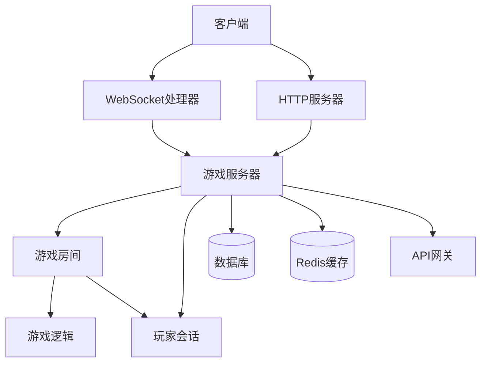

# 游戏扩展性框架设计文档

## 概述

本文档描述了基于 `GameBase` 框架开发的游戏服务扩展性设计，以五子棋游戏为示例，展示如何创建可扩展、可配置的游戏服务。

## 架构设计

### 1. 继承层次结构

```
GameServerBase (基础服务器)
├── GomokuServer (五子棋服务器)
└── [其他游戏服务器...]

GameLogicBase (基础游戏逻辑)
├── GomokuLogic (五子棋逻辑)
└── [其他游戏逻辑...]

GameRoomBase (基础房间管理)
├── GomokuRoom (五子棋房间)
└── [其他游戏房间...]

PlayerSessionBase (基础玩家会话)
├── GomokuPlayerSession (五子棋玩家会话)
└── [其他游戏会话...]

WebSocketHandlerBase (基础WebSocket处理)
├── GomokuWebSocketHandler (五子棋WebSocket处理)
└── [其他游戏WebSocket处理...]
```

### 2. 组件交互图



## 扩展性特性

### 1. 多游戏模式支持

五子棋服务器支持多种游戏规则和模式：

#### 基础模式
- **自由模式 (Freestyle)**: 无禁手规则
- **连珠模式 (Renju)**: 黑棋有禁手规则
- **Swap2规则**: 公平交换规则
- **职业规则**: 职业比赛标准
- **锦标赛规则**: 正式比赛规则

#### 配置示例
```yaml
gomoku:
  game_modes:
    freestyle:
      name: "自由模式"
      forbidden_rules: []
      time_settings:
        default_time: 900
        increment: 10
    
    renju:
      name: "连珠模式"
      forbidden_rules: ["three_three", "four_four", "overline"]
      time_settings:
        default_time: 1800
        increment: 15
```

### 2. 房间类型扩展

支持不同类型的游戏房间：

```yaml
room_types:
  casual:
    name: "休闲房间"
    allow_undo: true
    time_limit: 600
    
  ranked:
    name: "排位房间"
    allow_undo: false
    rating_required: true
    
  tournament:
    name: "锦标赛房间"
    tournament_mode: true
    max_spectators: 200
```

### 3. 功能模块化

#### 核心功能模块
- **游戏逻辑模块**: 规则判断、胜负检测
- **房间管理模块**: 玩家匹配、房间状态
- **通信模块**: WebSocket实时通信
- **数据持久化模块**: 游戏数据存储
- **性能监控模块**: 系统性能追踪

#### 可选功能模块
- **AI对手模块**: 人机对战
- **教学模式模块**: 新手指导
- **复盘分析模块**: 游戏分析
- **社交功能模块**: 好友系统

## 开发新游戏的步骤

### 1. 定义游戏类型和规则

```cpp
// 创建游戏特定的类型定义
namespace my_game {
    enum class GamePiece { EMPTY, PLAYER1, PLAYER2 };
    enum class GameResult { ONGOING, PLAYER1_WIN, PLAYER2_WIN, DRAW };
    
    struct GameState {
        // 游戏状态定义
    };
}
```

### 2. 实现游戏逻辑类

```cpp
class MyGameLogic : public GameLogicBase {
public:
    bool initializeGameSpecific(...) override;
    void tickGameSpecific() override;
    bool processPlayerActionSpecific(...) override;
    bool checkGameEndSpecific() override;
    nlohmann::json getGameSpecificState() const override;
    
    // 游戏特定的方法
    bool makeMove(...);
    bool validateMove(...);
};
```

### 3. 实现房间管理类

```cpp
class MyGameRoom : public GameRoomBase {
public:
    bool startGameSpecific() override;
    bool processGameActionSpecific(...) override;
    nlohmann::json getGameSpecificState() const override;
    
    // 房间特定的方法
    bool handlePlayerAction(...);
    void broadcastGameUpdate();
};
```

### 4. 实现玩家会话类

```cpp
class MyGamePlayerSession : public PlayerSessionBase {
public:
    bool sendMessage(const nlohmann::json& message) override;
    void closeConnection() override;
    bool isConnectionValid() const override;
    
    // 会话特定的方法
    void sendGameState(...);
    void handleGameMessage(...);
};
```

### 5. 实现WebSocket处理器

```cpp
class MyGameWebSocketHandler : public WebSocketHandlerBase {
protected:
    void handleWebSocketMessage(...) override;
    void handleWebSocketDisconnection(...) override;
    std::shared_ptr<PlayerSessionBase> createPlayerSession(...) override;
    
    // WebSocket特定的方法
    void handleGameAction(...);
    void broadcastToRoom(...);
};
```

### 6. 实现游戏服务器类

```cpp
class MyGameServer : public GameServerBase {
public:
    bool initializeGameSpecific() override;
    std::string getGameTypeName() const override;
    int getWebSocketPort() const override;
    std::shared_ptr<GameRoomBase> createGameRoom(...) override;
    
    // 服务器特定的方法
    void handleHttpRoutes();
    void setupWebSocketCallbacks();
};
```

### 7. 创建主程序

```cpp
int main(int argc, char* argv[]) {
    // 解析配置
    auto config = MyGameServer::loadConfig("config.json");
    
    // 创建服务器
    auto server = std::make_unique<MyGameServer>(config);
    
    // 启动服务器
    server->initialize();
    server->start();
    
    // 运行主循环
    server->run();
    
    return 0;
}
```

## 配置系统

### 1. 分层配置结构

```yaml
# 基础服务器配置
server:
  host: "0.0.0.0"
  port: 8084
  websocket_port: 8085

# 游戏特定配置
game_specific:
  game_modes: {...}
  room_types: {...}
  features: {...}

# 性能监控配置
monitoring:
  enable_performance_monitoring: true
  metrics_interval_seconds: 60

# 安全配置
security:
  enable_rate_limiting: true
  require_authentication: true
```

### 2. 动态配置更新

支持运行时配置更新，无需重启服务器：

```cpp
// 动态更新游戏配置
server->updateGameConfig(new_config);

// 动态更新房间规则
room->updateRoomRules(new_rules);
```

## 性能优化策略

### 1. 内存管理
- 使用智能指针管理对象生命周期
- 实现对象池减少内存分配
- 定期清理过期资源

### 2. 并发处理
- 使用读写锁优化并发访问
- 线程池处理异步任务
- EventLoop处理网络I/O

### 3. 数据库优化
- 连接池管理数据库连接
- 批量操作提高写入性能
- Redis缓存热点数据

### 4. 网络优化
- WebSocket长连接减少延迟
- 消息压缩减少带宽占用
- 心跳检测维持连接活跃

## 监控和调试

### 1. 性能指标
- CPU和内存使用率
- 网络延迟和吞吐量
- 数据库查询性能
- 游戏特定指标（如平均游戏时长）

### 2. 日志系统
- 分级日志记录
- 结构化日志格式
- 日志轮转和压缩
- 错误报警机制

### 3. 健康检查
- 服务状态监控
- 自动故障恢复
- 负载均衡支持
- 微服务发现

## 部署和运维

### 1. 容器化部署
```dockerfile
FROM ubuntu:20.04
COPY gomoku_server /app/
COPY config/ /app/config/
WORKDIR /app
CMD ["./gomoku_server", "--config", "config/production.yml"]
```

### 2. 服务编排
```yaml
version: '3.8'
services:
  gomoku-server:
    image: gomoku-game:latest
    ports:
      - "8084:8084"
      - "8085:8085"
    depends_on:
      - mysql
      - redis
    environment:
      - MYSQL_HOST=mysql
      - REDIS_HOST=redis
```

### 3. 负载均衡
- 支持多实例部署
- API网关路由分发
- 会话粘性支持
- 故障自动切换

## 扩展示例

### 示例1: 添加新的五子棋变体

```cpp
// 定义新的游戏模式
enum class GomokuVariant {
    STANDARD = 0,
    PENTE = 1,      // Pente变体
    CONNECT6 = 2    // 六子棋变体
};

// 扩展游戏配置
struct ExtendedGomokuConfig : public GomokuConfig {
    GomokuVariant variant = GomokuVariant::STANDARD;
    bool enable_captures = false;  // 是否允许吃子
    int stones_per_turn = 1;       // 每回合落子数
};
```

### 示例2: 添加AI对手功能

```cpp
class GomokuAI {
public:
    Position calculateBestMove(const Board& board, PieceType piece);
    int evaluatePosition(const Board& board, PieceType piece);
    std::vector<Position> generateMoves(const Board& board);
};

// 在房间中集成AI对手
class AIGomokuRoom : public GomokuRoom {
private:
    std::unique_ptr<GomokuAI> ai_opponent_;
    bool is_ai_game_ = false;
    
public:
    bool addAIOpponent(AILevel level);
    void handleAIMove();
};
```

## 总结

通过这种扩展性框架设计，我们可以：

1. **快速开发新游戏**: 继承基础组件，专注游戏逻辑
2. **灵活配置规则**: 支持多种游戏模式和房间类型
3. **模块化功能**: 可选功能模块，按需启用
4. **高性能运行**: 优化的网络和数据库处理
5. **易于运维**: 完善的监控和部署支持

这个框架为游戏服务器开发提供了坚实的基础，既保证了代码的复用性，又提供了足够的灵活性来满足不同游戏的特定需求。


