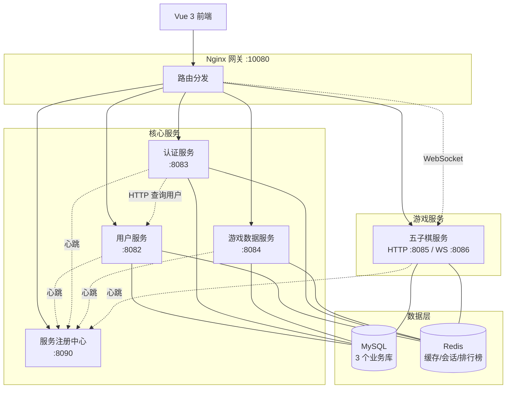
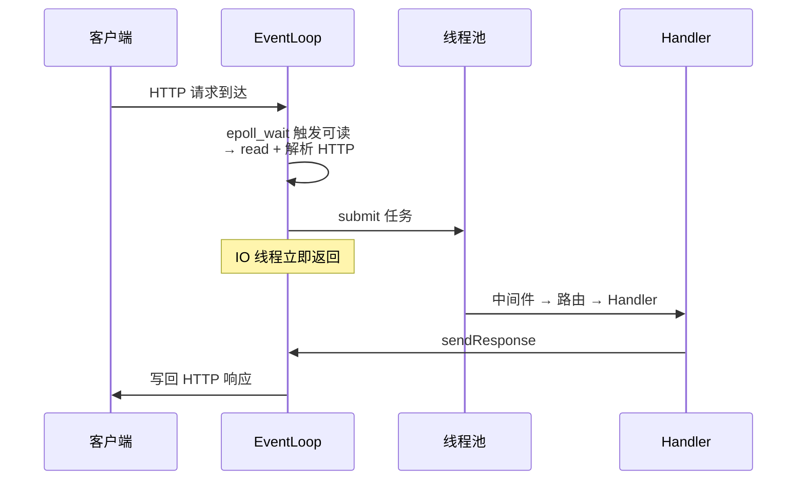
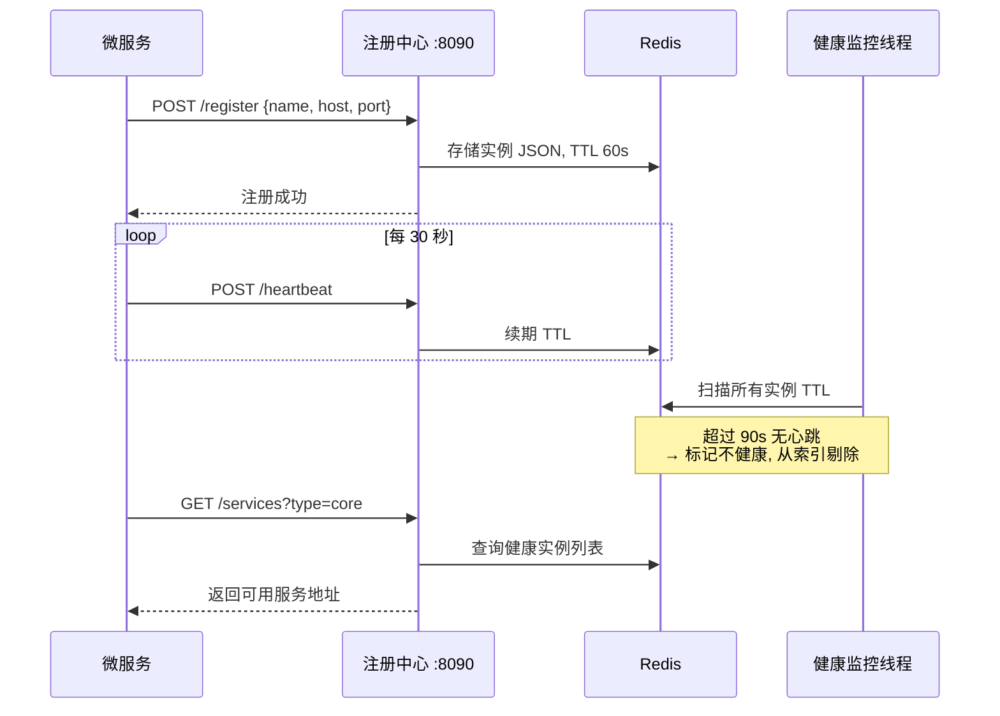
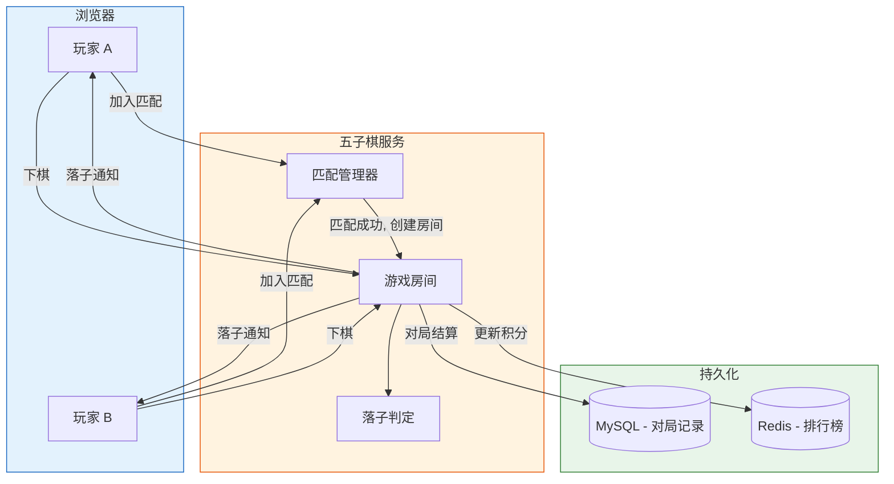

# 游戏微服务平台 - 毕业答辩 PPT 内容

> 总时长 3 分钟 | 共 5 页 Slide | 每页标注讲解原话

---

## 开场白（10 秒）

> 各位老师好，我是 XXX，我的毕设题目是**基于Epoll的高并发微服务架构游戏平台的设计与实现**。
>
> 下面我将从系统架构、网络框架、服务治理、实时对战四个方面进行汇报。

---

## Slide 1: 系统全景架构（30 秒）

### 讲解原话

> 本项目是一个基于 C++17 的游戏微服务平台，整体分三层：
>
> 最上面是 **Vue 3 前端**，提供用户注册登录、游戏数据查看、五子棋在线对战等功能，通过 **Nginx 网关**统一接入；
>
> 中间是 **5 个微服务**——服务注册中心负责服务发现，用户服务管理账户，认证服务处理登录，游戏数据服务管理档案和排行榜，五子棋服务提供实时对战；
>
> 底层是 **MySQL 和 Redis**，每个服务拥有独立数据库，通过 Redis 共享缓存和会话。
>
> 服务之间通过 REST API 同步调用，游戏对局通过 WebSocket 实时通信。

---

## Slide 2: 网络框架 — Reactor + 线程池（40 秒）

### 讲解原话

> 网络框架参考了 Reactor 模式来实现。以一个请求的处理过程来说：
>
> 客户端发送请求后，IO 线程通过 **epoll_wait** 检测到可读事件，执行 **read** 读取数据并解析 HTTP 报文。解析完成后，IO 线程将请求处理任务 **submit 到线程池**，自己立即回到 epoll_wait 继续监听其他连接，不会等待业务完成。
>
> Worker 线程拿到任务后，依次执行**中间件检查、路由匹配、业务 Handler**，比如 JWT 验证、数据库查询这些逻辑。处理完后调用 sendResponse，将响应交回 IO 线程，IO 线程通过 **write** 系统调用把响应写回客户端。
>
> 整个过程 IO 线程只负责网络读写，不碰业务逻辑，所以不会被数据库查询阻塞。连接层面支持 Keep-Alive 复用，减少 TCP 握手开销。
>
> 网络层代码参考了 muduo 等开源库的设计思路，在此基础上做了简化实现。

---

## Slide 3: 服务治理 — 注册中心（35 秒）

### 讲解原话

> 微服务架构需要解决的一个基础问题是**服务发现**——服务之间怎么找到对方。
>
> 这里实现了一个基于 Redis 的服务注册中心。每个服务启动时向注册中心上报地址和端口，注册中心写入 Redis 并设置 60 秒过期时间。之后每个服务每 **30 秒发一次心跳**续期。
>
> 注册中心后台有个健康监控线程，如果某个服务超过 **90 秒没有心跳**，就自动从可用列表中剔除。
>
> 当然，这个实现比较简单，目前是单节点，不支持集群选举和分布式一致性，和生产级的 Nacos、Consul 相比还有差距。但对于本项目的学习和实践目的来说，能够覆盖服务注册、发现、健康检查这些核心概念。

---

## Slide 4: 五子棋实时对战（25 秒）

### 讲解原话

> 五子棋是本项目的一个完整业务场景，用 **WebSocket 长连接**做实时双向通信。
>
> 两个玩家通过匹配管理器自动配对，配对成功后创建一个独立的**游戏房间**对象，落子操作通过 WebSocket 实时同步，GomokuLogic 模块负责判定胜负。
>
> 对局结束后自动结算，MySQL 存对局记录，Redis 更新排行榜。

---

## Slide 5: 总结（30 秒）

### 技术实践

| 维度 | 实践内容 |
|------|---------|
| **网络框架** | 参考 Reactor 模式，Epoll + IO/业务线程分离 |
| **微服务架构** | 5 个服务独立部署，数据库隔离 |
| **服务治理** | 基于 Redis 的注册中心，心跳 + 健康监控 |
| **安全设计** | JWT 无状态认证 + BCrypt 密码哈希 |
| **实时通信** | WebSocket 五子棋对战 + 房间模型 |
| **数据访问** | Repository 模式 + MySQL/Redis 连接池 + 缓存 |
| **容器部署** | Docker Compose 多容器编排 + Nginx 网关 |

### 不足与展望

| 方面 | 当前状态 | 改进方向 |
|------|---------|---------|
| 注册中心 | 单节点，无一致性协议 | 引入 Raft 选举或使用 Nacos |
| 测试验证 | 手动测试 + wrk 压测 | 补充单元测试和自动化 CI |
| 链路追踪 | 未实现 | OpenTelemetry 分布式追踪 |
| 性能优化 | 登录接口 ~12 QPS | 缓存预热、BCrypt 异步化 |

### 讲解原话

> 总结一下，本项目的主要实践：
>
> 第一，**网络框架**——参考 Reactor 模式，用 Epoll 加线程池实现了 IO 和业务分离。
>
> 第二，**服务治理**——实现了基于 Redis 的注册中心，覆盖注册、心跳、健康检查等核心流程。
>
> 第三，**安全设计**——JWT 加 BCrypt 的认证体系，Redis 管理分布式会话。
>
> 第四，**实时对战**——基于 WebSocket 的五子棋，支持自动匹配和房间管理。
>
> 当然项目还有不少不足：注册中心是单节点，没有分布式一致性保障；登录性能受 BCrypt 和跨服务调用的影响比较大；链路追踪也还没做。这些都是后续可以改进的方向。
>
> 以上就是我的全部汇报，感谢各位老师的聆听，欢迎批评指正。

---

## 附录：答辩节奏控制

| Slide | 内容 | 目标时长 | 累计 |
|-------|------|---------|------|
| - | 开场白 | 10s | 0:10 |
| 1 | 系统全景 | 30s | 0:40 |
| 2 | 网络框架 | 40s | 1:20 |
| 3 | 服务治理 | 35s | 1:55 |
| 4 | 五子棋对战 | 25s | 2:20 |
| 5 | 总结 + 不足 | 30s | 2:50 |

> 预留 10 秒缓冲，总计约 2 分 50 秒 ~ 3 分钟。

---

## 附录 B：评委常问问题准备

### 1. 为什么用 C++ 而不是 Java/Go 做微服务？

> 当时主要是想深入练习 Linux 网络编程和系统级编程。C++ 做 HTTP 服务器需要自己处理 epoll、线程池、HTTP 解析这些底层细节，虽然开发效率不如 Java/Go，但对理解网络框架原理很有帮助。实际项目中，Java/Go 生态更成熟，开发效率更高。

### 2. 为什么不直接用现成的框架（如 drogon、oat++）？

> 也调研过 drogon、oat++ 这些 C++ Web 框架，功能很完善。但毕设的目标是学习和实践底层原理，所以选择从 epoll 封装开始实现。参考了 muduo 的 Reactor 模式设计思路，做了简化版本。

### 3. Epoll 的 ET 和 LT 模式有什么区别？你用的是哪种？

> LT（水平触发）只要缓冲区有数据就一直通知，ET（边沿触发）只在状态变化时通知一次。项目用的是 ET 模式，所以 read 时必须循环读取直到返回 EAGAIN，否则可能漏数据。ET 模式效率更高，但编程复杂度也更高。

### 4. 你的注册中心和 Nacos/Consul 相比有什么差距？

> 主要三个差距：一是单节点，没有集群部署和 Leader 选举，存在单点故障风险；二是没有强一致性协议（如 Raft），Redis 存储的数据在网络分区时可能出现不一致；三是没有配置中心和服务熔断功能。这些是后续可以改进的方向。

### 5. 线程池的线程数是怎么确定的？

> 参考了经验公式：CPU 密集型任务线程数 ≈ CPU 核数，IO 密集型可以适当放大。项目中网络 IO 线程数设为 CPU 核数（配置中的 io_threads），业务线程池设为 CPU 核数的 2 倍左右（config 中的 worker_threads）。实际最优值需要通过压测来调。

### 6. JWT 和 Session 方案各有什么优缺点？

> JWT 的优点是无状态，每个服务可以独立验证 token，不需要回查认证服务，适合微服务。缺点是签发后无法主动撤销（除非配合黑名单），token 体积也比 Session ID 大。Session 方案优点是服务端可控，缺点是需要集中存储，增加依赖。项目中用了 JWT + Redis 黑名单的组合方案。

### 7. WebSocket 和 HTTP 轮询相比，优势在哪？

> WebSocket 建立一次连接后可以持续双向通信，不需要反复发 HTTP 请求。对于游戏场景，落子操作需要毫秒级响应，HTTP 轮询的延迟和开销都不合适。WebSocket 的开销主要在连接建立阶段，之后每条消息只有 2-10 字节的帧头。

### 8. MySQL 连接池的工作原理是什么？

> 连接池预先创建一批数据库连接（初始 5 个），放在池中复用。业务需要时从池中借一个连接，用完归还而不是关闭。池子有最大连接数限制（20），超出的请求排队等待。后台线程每 30 秒做一次健康检查，验证连接是否可用，不可用的自动回收重建。这样避免频繁创建和销毁 TCP 连接的开销。

### 9. Redis 缓存和 MySQL 数据一致性怎么保证？

> 采用的是"先更新 MySQL，再删除 Redis 缓存"的策略，也叫 Cache Aside 模式。读取时先查缓存，命中直接返回；未命中则查 MySQL，结果写入缓存并设置 TTL。这种方案在极端并发场景下仍有短暂不一致窗口，但对于本项目的业务场景可以接受。

### 10. 项目中遇到过什么技术难题？怎么解决的？

> 可结合实际经历回答，例如：
> - **线程池分发不生效**：EventLoop 配置中 `enable_thread_pool` 未显式开启，导致所有请求都在 IO 线程同步执行，QPS 只有 10 左右。排查后修改配置，QPS 提升到数千。
> - **idle 崩溃**：game_data_service 空闲运行约 1 小时后出现 `pthread_mutex_lock ESRCH` 错误。定位到信号处理函数中调用了非 async-signal-safe 的函数，导致持有 mutex 的线程被信号中断后死锁。修复后信号处理函数只设置原子标志位。
> - **WebSocket fd 耗尽**：压测时 "Too many open files"，需要 `ulimit -n 65535` 调整系统限制。

