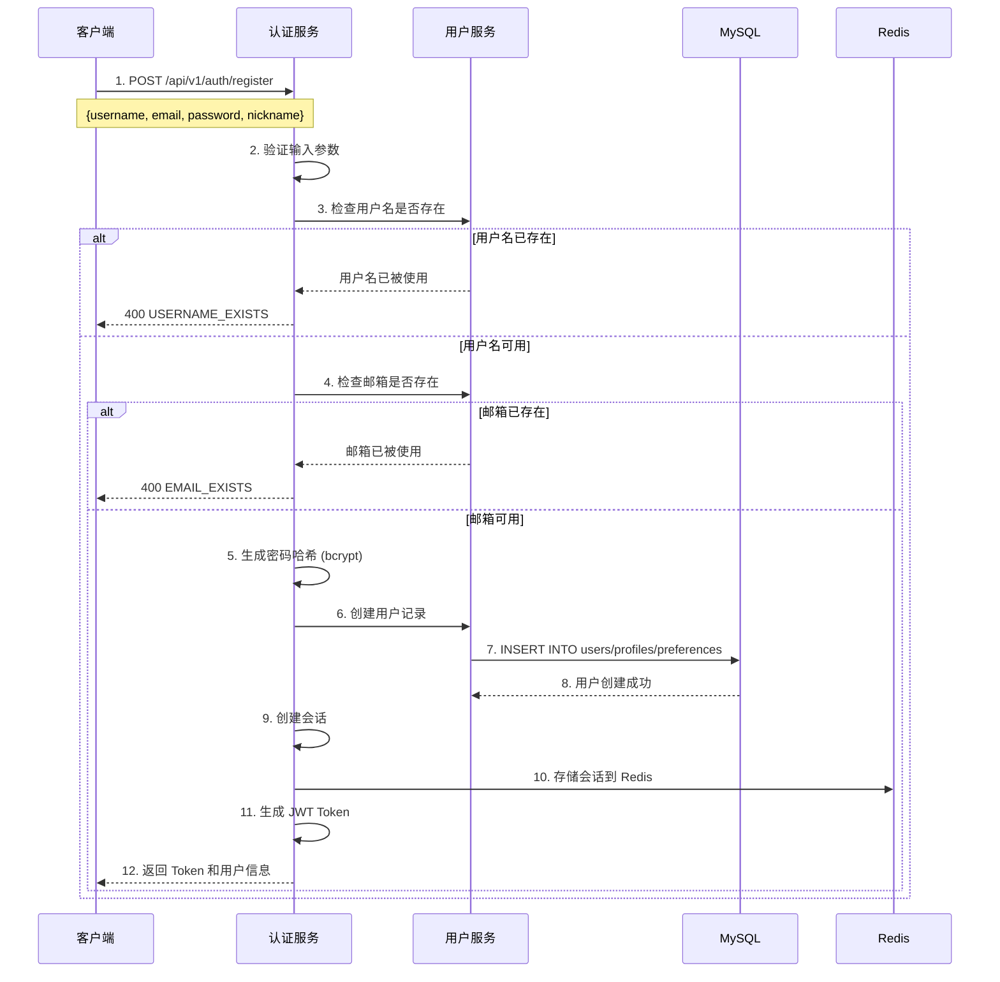
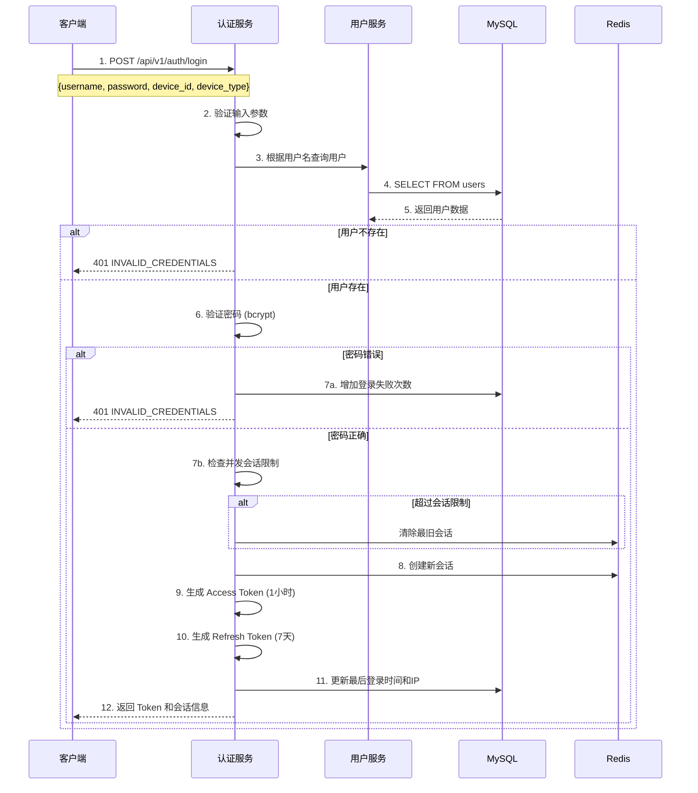
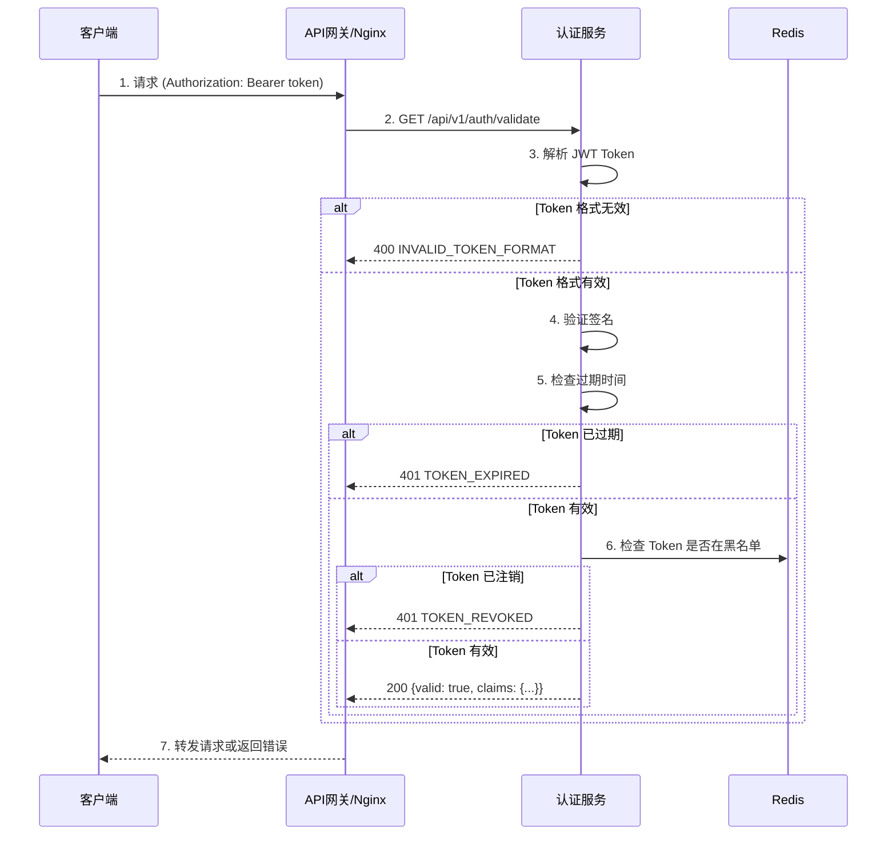
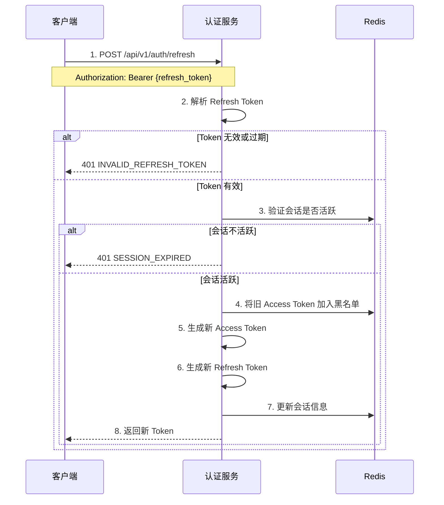
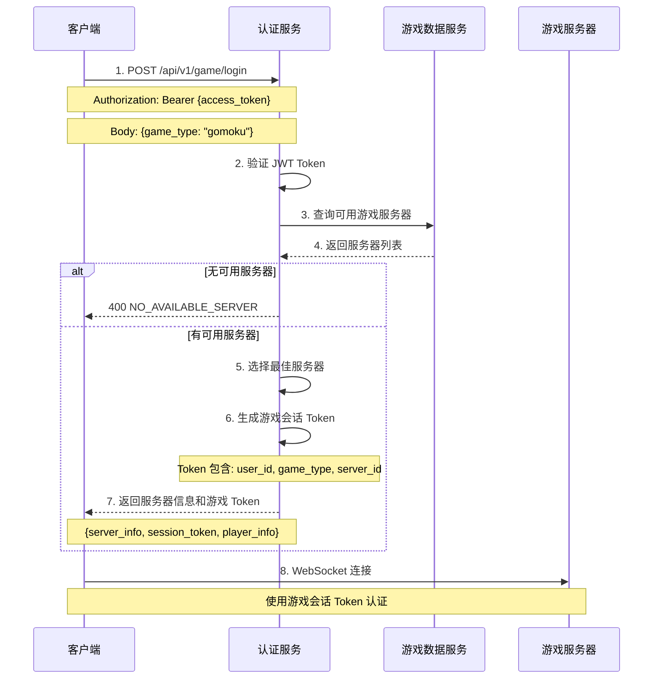

# 认证服务 (Auth Service) 详细文档

## 1. 服务概述

| 项目 | 说明 |
|------|------|
| 服务名称 | auth_service |
| 默认端口 | 8083 (HTTP) |
| 服务版本 | 1.0.0 |
| 基础路径 | `/api/v1/auth/` |
| 数据库 | MySQL (user_service_db) + Redis (会话缓存) |
| 架构模式 | 服务层 + JWT 认证 + 会话管理 |

### 1.1 服务职责

认证服务负责处理所有用户认证相关的功能：
- 用户注册（创建账户）
- 用户登录（凭证验证）
- 用户登出（会话销毁）
- JWT Token 生成和验证
- Refresh Token 管理
- 会话管理（多设备登录控制）
- 游戏登录（获取游戏服务器信息）

---

## 2. 架构设计

### 2.1 分层架构

```
┌──────────────────────────────────────────────────────┐
│                   HTTP Controller                     │
│         (路由处理、请求验证、响应格式化)               │
├──────────────────────────────────────────────────────┤
│              Authentication Service                   │
│        (认证逻辑、JWT管理、会话管理)                   │
├──────────────────────────────────────────────────────┤
│    JWT Manager   │   Session Manager   │   User Repo │
│   (令牌生成验证)  │   (会话状态管理)     │  (用户数据) │
├──────────────────┬──────────────────────┬────────────┤
│    MySQL Pool    │      Redis Pool      │  HTTP Client│
│   (持久化存储)    │    (会话/Token缓存)   │ (服务调用)  │
└──────────────────┴──────────────────────┴────────────┘
```

### 2.2 核心组件

| 组件 | 职责 |
|------|------|
| AuthService | 服务主类、生命周期管理、API 路由 |
| JWTManager | JWT Token 生成、验证、刷新 |
| SessionManager | 会话创建、管理、销毁 |
| PasswordManager | 密码哈希、验证（bcrypt） |
| UserRepository | 用户数据访问 |
| SessionRedisRepository | 会话 Redis 缓存操作 |
| DeviceRedisRepository | 设备信息缓存 |
| SecurityEventRedisRepository | 安全事件记录 |

### 2.3 JWT Token 结构

```json
{
  "header": {
    "alg": "HS256",
    "typ": "JWT"
  },
  "payload": {
    "iss": "game-microservices-auth",     // 签发者
    "sub": "32",                           // 用户ID
    "aud": "game-microservices-clients",   // 受众
    "iat": 1757920291,                      // 签发时间
    "exp": 1757923891,                      // 过期时间
    "nbf": 1757920291,                      // 生效时间
    "jti": "b3c62351-dcff-4776-a762-...",   // JWT ID
    "username": "test35",                   // 用户名
    "email": "test@example.com",            // 邮箱
    "nickname": "Test User",                // 昵称
    "session_id": "4b9abca4-f660-4ad8-...", // 会话ID
    "token_type": "access_token",           // Token类型
    "device_type": "web",                   // 设备类型
    "client_ip": "192.168.1.100",           // 客户端IP
    "roles": ["user"]                       // 角色
  }
}
```

---

## 3. API 端点

### 3.1 认证 API

| 方法 | 端点 | 功能 | 实现状态 |
|------|------|------|----------|
| POST | `/api/v1/auth/register` | 用户注册 | ✅ 完成 |
| POST | `/api/v1/auth/login` | 用户登录 | ✅ 完成 |
| POST | `/api/v1/auth/logout` | 用户登出 | ✅ 完成 |
| POST | `/api/v1/auth/refresh` | 刷新Token | ✅ 完成 |
| GET | `/api/v1/auth/validate` | 验证Token | ✅ 完成 |

### 3.2 系统 API

| 方法 | 端点 | 功能 | 实现状态 |
|------|------|------|----------|
| GET | `/api/v1/auth/health` | 健康检查 | ✅ 完成 |
| GET | `/api/v1/auth/stats` | 服务统计 | ✅ 完成 |
| GET | `/api/v1/auth/service/endpoints` | 端点发现 | ✅ 完成 |

---

## 4. 业务流程

### 4.1 用户注册流程



### 4.2 用户登录流程



### 4.3 Token 验证流程



### 4.4 Token 刷新流程



### 4.5 游戏登录流程



---

## 5. 会话管理

### 5.1 会话数据结构

```cpp
struct Session {
    std::string session_id;      // 会话唯一标识
    int64_t user_id;             // 用户ID
    std::string device_id;       // 设备标识
    std::string device_type;     // 设备类型: web/mobile/desktop
    std::string client_ip;       // 客户端IP
    std::string user_agent;      // 浏览器标识
    bool is_active;              // 是否活跃
    int64_t created_at;          // 创建时间
    int64_t last_activity_at;    // 最后活动时间
    int64_t expires_at;          // 过期时间
    nlohmann::json metadata;     // 扩展元数据
};
```

### 5.2 会话存储

| 存储位置 | 键格式 | TTL | 说明 |
|----------|--------|-----|------|
| Redis | `session:{session_id}` | 1小时 | 主会话数据 |
| Redis | `auth:user_sessions:{user_id}` | 1小时 | 用户会话列表 |
| Redis | `auth:device:{user_id}:{device_id}` | 24小时 | 设备信息 |
| Redis | `auth:blacklist:{jti}` | Token剩余有效期 | 已注销Token |

### 5.3 并发会话控制

```yaml
# 配置项
session:
  max_concurrent_sessions: 5      # 最大并发会话数
  cleanup_interval: 3600          # 清理间隔（秒）
  idle_timeout: 3600              # 空闲超时（秒）
```

---

## 6. Token 管理

### 6.1 Token 类型

| Token 类型 | 有效期 | 用途 |
|-----------|--------|------|
| Access Token | 1小时 | API 请求认证 |
| Refresh Token | 7天 | 刷新 Access Token |
| Game Session Token | 1小时 | 游戏服务器认证 |

### 6.2 Token 安全

- **签名算法**: HS256
- **密钥来源**: 环境变量 `JWT_SECRET_KEY` 或 SecretManager
- **黑名单机制**: 登出时将 Token JTI 加入 Redis 黑名单
- **刷新机制**: 刷新时生成全新的 Token 对

---

## 7. 密码管理

### 7.1 密码哈希

```cpp
// 使用 bcrypt 算法
std::string PasswordManager::hashPassword(const std::string& password) {
    // bcrypt 自动处理 salt 生成
    // cost factor = 12 (2^12 迭代)
    return bcrypt::generateHash(password, 12);
}

bool PasswordManager::verifyPassword(
    const std::string& password,
    const std::string& hash
) {
    return bcrypt::validatePassword(password, hash);
}
```

### 7.2 密码策略

```yaml
# 配置项
password:
  min_length: 8
  max_length: 128
  require_uppercase: true
  require_lowercase: true
  require_numbers: true
  require_special_chars: false
```

---

## 8. 服务间通信

### 8.1 与用户服务通信

```cpp
// 调用用户服务检查用户名/邮箱
auto response = httpClient.get(
    "http://user_service:8082/api/v1/users/by-username/" + username
);

// 调用用户服务创建用户
auto response = httpClient.post(
    "http://user_service:8082/api/v1/users",
    user_data.dump()
);
```

### 8.2 Nginx 反向代理路由

服务通过 Nginx 反向代理对外暴露，路由配置：

```nginx
# 认证服务路由
location /api/v1/auth {
    proxy_pass http://127.0.0.1:8083;
    proxy_set_header Host $host;
    proxy_set_header X-Real-IP $remote_addr;
}

# 游戏登录路由
location /api/v1/game {
    proxy_pass http://127.0.0.1:8083;
    proxy_set_header Host $host;
    proxy_set_header X-Real-IP $remote_addr;
}
```

统一 API 路径格式：`/api/v1/{serviceName}/{resource}/{...}`

---

## 9. 安全特性

### 9.1 已实现的安全措施

| 措施 | 状态 | 说明 |
|------|------|------|
| JWT 密钥管理 | ✅ | 从环境变量/SecretManager 读取 |
| 密码 bcrypt 哈希 | ✅ | cost factor = 12 |
| Token 黑名单 | ✅ | 登出时加入黑名单 |
| 并发会话限制 | ✅ | 最大 5 个并发会话 |
| 登录失败计数 | ✅ | 记录失败次数 |
| 设备信息追踪 | ✅ | 记录设备类型和 IP |

### 9.2 安全事件记录

```cpp
// 记录安全事件
void SecurityEventRedisRepository::recordSecurityEvent(
    const std::string& user_id,
    const std::string& event_type,
    const nlohmann::json& event_data
) {
    // 存储到 Redis，保留 7 天
    // 事件类型: login_success, login_failure, logout, token_refresh
}
```

---

## 10. 实现状态评估

### 10.1 功能完成度

| 模块 | 完成度 | 说明 |
|------|--------|------|
| 用户注册 | ✅ 100% | 完整实现，包含验证 |
| 用户登录 | ✅ 100% | 完整实现，包含会话管理 |
| 用户登出 | ✅ 100% | 包含 Token 黑名单 |
| Token 刷新 | ✅ 100% | 完整实现 |
| Token 验证 | ✅ 100% | 完整实现 |
| 游戏登录 | ✅ 100% | 包含服务器选择 |
| 会话管理 | ✅ 100% | Redis 存储完整实现 |
| 设备管理 | ✅ 100% | 设备信息追踪 |

### 10.2 业务逻辑正确性

| 检查项 | 状态 | 说明 |
|--------|------|------|
| 用户名唯一性 | ✅ | 注册前检查 |
| 邮箱唯一性 | ✅ | 注册前检查 |
| 密码验证 | ✅ | bcrypt 验证 |
| Token 过期检查 | ✅ | 验证时检查 exp |
| Token 签名验证 | ✅ | HS256 签名 |
| 会话有效性 | ✅ | 检查 is_active 和 expires_at |
| 并发会话限制 | ✅ | 限制最大会话数 |

---

## 11. 服务生命周期

### 11.1 启动流程

认证服务的启动流程如下：

```
main() → AuthService::initialize() → AuthService::start()
```

**初始化阶段** (`initialize()`):
1. 初始化 MySQL 连接池
2. 初始化 Redis 连接池
3. 初始化 Kafka 消费者和生产者（可选）
4. 初始化线程池
5. 初始化定时器管理器
6. 启动 HTTP 服务器线程

**启动阶段** (`start()`):
1. 设置定时任务（会话清理、Token 清理）
2. 启动 Kafka 消费者（如果启用）
3. 服务进入运行状态

### 11.2 关闭流程

认证服务的优雅关闭流程：

```
SIGINT/SIGTERM → signalHandler → AuthService::shutdown()
```

**关闭顺序** (`shutdown()`):
1. 停止定时任务 (`stopCleanupTasks()`)
2. 停止 Kafka 消费者和生产者
3. 停止 HTTP 服务器 (`http_server_->stop()`)
   - 调用 `event_loop_->quit()` 设置退出标志
   - 关闭监听 socket
   - 关闭所有活跃会话
   - 等待 EventLoop 退出
4. 等待 HTTP 服务器线程结束 (`http_server_thread_.join()`)
5. 停止 MySQL 连接池 (`mysql_pool_->stop()`)
6. 停止 Redis 连接池 (`redis_pool_->stop()`)

### 11.3 线程安全注意事项

- **EventLoop 线程安全**: EventLoop 操作必须在 EventLoop 线程中执行
- **跨线程操作**: 使用 `runInLoop()` 或 `queueInLoop()` 进行跨线程调度
- **quit() 方法**: 通过 wakeup fd 实现线程安全，可以从任何线程调用

---

## 12. 配置参考

```yaml
# config/auth_service_config.yml 关键配置

server:
  name: "auth_service"
  port: 8083

jwt:
  secret_key: "${JWT_SECRET_KEY}"     # 从环境变量读取
  issuer: "game-microservices-auth"
  audience: "game-microservices-clients"
  access_token_ttl: 3600              # 1小时
  refresh_token_ttl: 604800           # 7天

session:
  max_concurrent_sessions: 5
  idle_timeout: 3600
  cleanup_interval: 3600

mysql:
  host: "172.26.26.199"
  database: "user_service_db"

redis:
  host: "172.26.26.199"
  database: 3
```

---

**文档版本**: 1.1.0
**更新日期**: 2025-02-18
**维护状态**: ✅ 与代码实现同步
