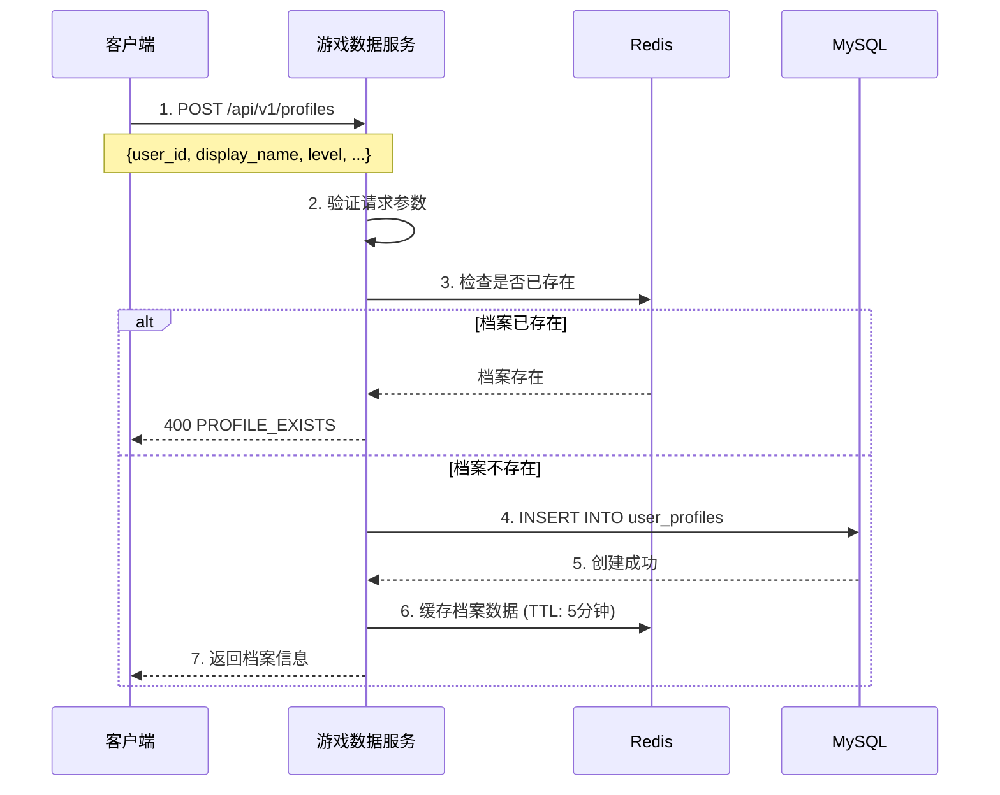
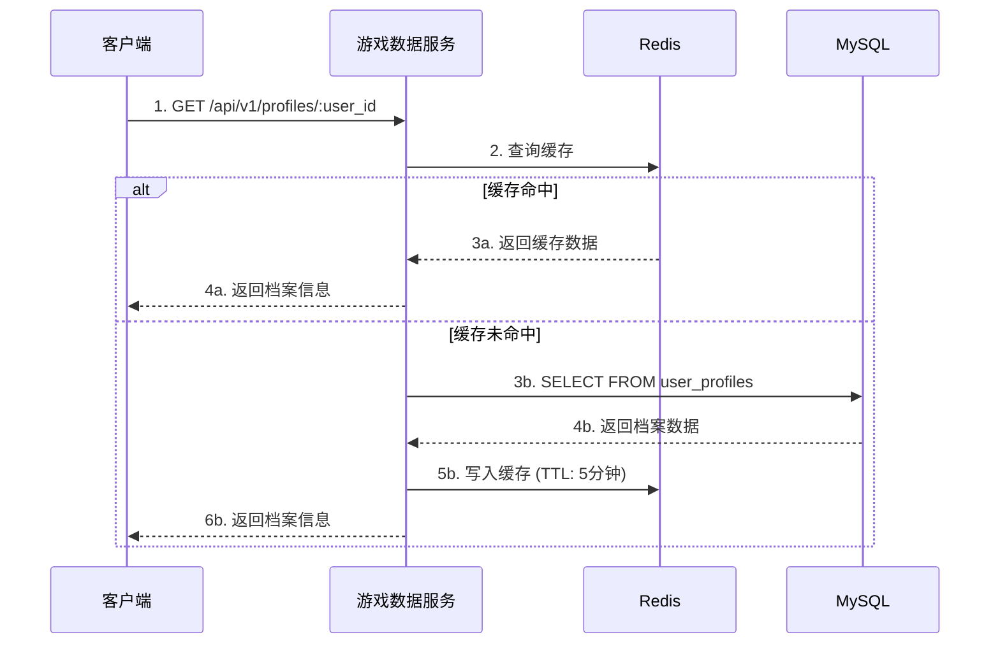
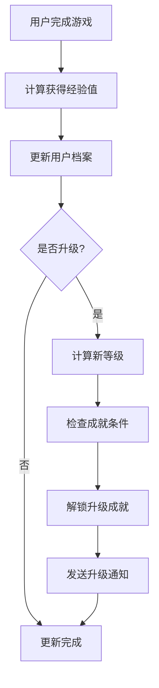
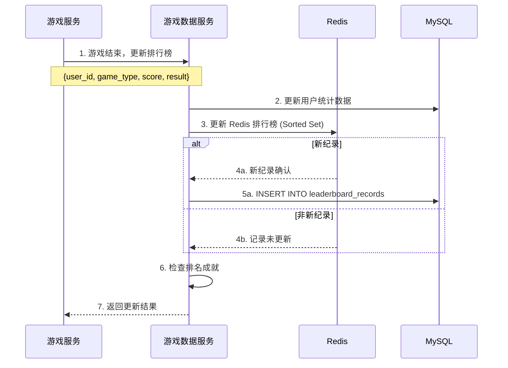

# 游戏数据服务 (Game Data Service) 详细文档

## 1. 服务概述

| 项目 | 说明 |
|------|------|
| 服务名称 | game_data_service |
| 默认端口 | 8084 (HTTP) |
| 服务版本 | 1.0.0 |
| 基础路径 | `/api/v1/` |
| 数据库 | MySQL (game_service_db) + Redis (database 3/4) |
| 架构模式 | Repository 模式 + 分层架构 + 时间轮调度 |

### 1.1 服务职责

游戏数据服务负责管理游戏相关的核心数据：
- 用户游戏档案管理（等级、经验值、显示名称）
- 成就系统（成就定义、解锁、查询）
- 库存管理（物品获取、使用、查询）
- 货币系统（多种货币类型、余额管理）
- 排行榜系统（全球/周/月排行）

---

## 2. 架构设计

### 2.1 分层架构

```
┌──────────────────────────────────────────────────────┐
│                   HTTP Controller                     │
│         (路由处理、请求验证、响应格式化)               │
├──────────────────────────────────────────────────────┤
│                  Game Data Service                    │
│      (业务逻辑、数据验证、缓存策略)                    │
├──────────────────────────────────────────────────────┤
│                   Repository Layer                    │
│  ┌──────────┬───────────┬──────────┬──────────────┐ │
│  │ Profile  │ Achievement│Inventory│  Currency    │ │
│  │ Repo     │ Repo       │ Repo    │  Repo        │ │
│  └──────────┴───────────┴──────────┴──────────────┘ │
├──────────────────┬───────────────────────────────────┤
│   MySQL Pool     │           Redis Pool              │
│   (持久化存储)    │          (缓存加速)                │
└──────────────────┴───────────────────────────────────┘
```

### 2.2 核心组件

| 组件 | 文件路径 | 职责 |
|------|----------|------|
| GameService | `src/core_services/game_data_service/src/game_service.cpp` | 服务主类、生命周期管理 |
| GameDataRedisRepository | `include/game_data_redis_repository.h` | Redis 缓存操作 |
| GameModels | `include/game_models.h` | 数据模型定义 |
| GameEndProcessor | `include/game_end_processor.h` | 游戏结算处理器 |
| EloRatingCalculator | `include/elo_rating_calculator.h` | ELO 评分计算 |
| RewardConfig | `include/reward_config.h` | 奖励配置管理 |
| CurrencyManager | `include/currency_manager.h` | 货币管理器 |

### 2.3 游戏结算系统

```
┌──────────────────────────────────────────────────────────────┐
│                    GameEndProcessor                           │
│                  (游戏结算处理编排器)                          │
├──────────────────────────────────────────────────────────────┤
│  ┌─────────────────┐ ┌─────────────────┐ ┌─────────────────┐ │
│  │ EloRatingCalc   │ │  RewardConfig   │ │ CurrencyManager │ │
│  │ (ELO评分计算)    │ │  (奖励配置)      │ │  (货币发放)      │ │
│  └─────────────────┘ └─────────────────┘ └─────────────────┘ │
├──────────────────────────────────────────────────────────────┤
│                     结算流程                                  │
│  1. 验证请求 → 2. 计算评分 → 3. 计算奖励 → 4. 发放奖励        │
│              → 5. 更新统计 → 6. 检查成就 → 7. 更新排行榜      │
└──────────────────────────────────────────────────────────────┘
```

### 2.4 数据模型

```cpp
// 用户游戏档案
struct UserProfile {
    std::string user_id;           // 用户ID
    std::string display_name;      // 游戏显示名称
    int level;                     // 用户等级
    int64_t experience_points;     // 经验值
    std::string avatar_url;        // 头像URL
    int64_t created_at;            // 创建时间
    int64_t last_login_at;         // 最后登录时间
};

// 用户成就
struct UserAchievement {
    std::string achievement_id;    // 成就ID
    std::string user_id;           // 用户ID
    std::string achievement_type;  // 成就类型
    std::string title;             // 成就标题
    std::string description;       // 成就描述
    int points;                    // 成就积分
    int64_t unlocked_at;           // 解锁时间
};

// 用户库存物品
struct UserInventoryItem {
    std::string inventory_id;      // 库存记录ID (主键)
    std::string item_id;           // 物品定义ID
    std::string user_id;           // 用户ID
    std::string item_type;         // 物品类型
    std::string item_name;         // 物品名称
    int quantity;                  // 数量
    nlohmann::json metadata;       // 物品属性
    int64_t acquired_at;           // 获取时间
};

// 用户货币
struct UserCurrency {
    std::string user_id;           // 用户ID
    std::string currency_type;     // 货币类型: coins/gems/tokens
    int64_t amount;                // 数量
    int64_t last_updated_at;       // 最后更新时间
};

// 排行榜条目
struct LeaderboardEntry {
    std::string user_id;           // 用户ID
    std::string leaderboard_type;  // 排行榜类型: global/weekly/monthly
    std::string game_type;         // 游戏类型
    int64_t score;                 // 分数
    int rank_position;             // 排名
    nlohmann::json extra_data;     // 额外数据
    int64_t recorded_at;           // 记录时间
};
```

---

## 3. API 端点

### 3.1 用户档案 API

| 方法 | 端点 | 功能 | 实现状态 |
|------|------|------|----------|
| POST | `/api/v1/gamedata/profiles` | 创建档案 | ✅ 完成 |
| GET | `/api/v1/gamedata/profiles/:user_id` | 获取档案 | ✅ 完成 |
| PUT | `/api/v1/gamedata/profiles/:user_id` | 更新档案 | ✅ 完成 |
| DELETE | `/api/v1/gamedata/profiles/:user_id` | 删除档案 | ✅ 完成 |
| GET | `/api/v1/gamedata/profiles` | 获取档案列表 | ✅ 完成 |

### 3.2 成就系统 API

| 方法 | 端点 | 功能 | 实现状态 |
|------|------|------|----------|
| POST | `/api/v1/gamedata/achievements` | 解锁成就 | ✅ 完成 |
| GET | `/api/v1/gamedata/achievements/:user_id` | 获取用户成就 | ✅ 完成 |

### 3.3 库存管理 API

| 方法 | 端点 | 功能 | 实现状态 |
|------|------|------|----------|
| POST | `/api/v1/gamedata/inventory` | 添加物品 | ✅ 完成 |
| GET | `/api/v1/gamedata/inventory/:user_id` | 获取库存 | ✅ 完成 |
| POST | `/api/v1/gamedata/inventory/:user_id/use` | 使用物品 | ✅ 完成 |

### 3.4 货币系统 API

| 方法 | 端点 | 功能 | 实现状态 |
|------|------|------|----------|
| GET | `/api/v1/gamedata/currency/:user_id/:currency_type` | 获取货币 | ✅ 完成 |
| PUT | `/api/v1/gamedata/currency` | 更新货币 | ✅ 完成 |
| GET | `/api/v1/gamedata/currency/:user_id` | 获取所有货币 | ✅ 完成 |

### 3.5 排行榜 API

| 方法 | 端点 | 功能 | 实现状态 |
|------|------|------|----------|
| POST | `/api/v1/gamedata/leaderboard` | 更新排行榜 | ✅ 完成 |
| GET | `/api/v1/gamedata/leaderboard/:type/:game_type` | 获取排行榜 | ✅ 完成 |
| GET | `/api/v1/gamedata/leaderboard/:type/:game_type/rank/:user_id` | 获取排名 | ✅ 完成 |

### 3.6 游戏结算 API

| 方法 | 端点 | 功能 | 实现状态 |
|------|------|------|----------|
| POST | `/api/v1/gamedata/settlement` | 游戏结算处理 | ✅ 完成 |
| GET | `/api/v1/gamedata/settlement/:game_id` | 获取游戏结算记录 | ✅ 完成 |
| GET | `/api/v1/gamedata/stats/daily/:user_id` | 获取用户每日统计 | ✅ 完成 |

#### 游戏结算请求示例

```json
{
    "game_id": "game_123456",
    "game_type": "gomoku",
    "mode": "ranked",
    "duration_seconds": 300,
    "players": [
        {
            "user_id": "user_001",
            "result": "win",
            "game_data": {
                "rating_before": 1500,
                "games_played": 50,
                "win_streak": 2,
                "is_first_win_today": true,
                "games_today": 3,
                "tier_level": 5
            }
        },
        {
            "user_id": "user_002",
            "result": "loss",
            "game_data": {
                "rating_before": 1450,
                "games_played": 30,
                "win_streak": -1,
                "is_first_win_today": false,
                "games_today": 5,
                "tier_level": 4
            }
        }
    ]
}
```

#### 游戏结算响应示例

```json
{
    "success": true,
    "message": "Game settlement processed successfully",
    "data": {
        "game_id": "game_123456",
        "game_type": "gomoku",
        "settlements": [
            {
                "user_id": "user_001",
                "result": "win",
                "rating": {
                    "before": 1500,
                    "after": 1516,
                    "change": 16
                },
                "tier": {
                    "before": 5,
                    "after": 5,
                    "changed": false,
                    "promoted": false,
                    "demoted": false
                },
                "rewards": {
                    "gold": 100,
                    "gem": 0,
                    "honor": 45,
                    "experience": 220
                },
                "stats": {
                    "new_win_streak": 3,
                    "new_games_played": 51
                },
                "achievements_unlocked": ["streak_master_3"]
            }
        ]
    }
}
```

### 3.7 系统 API

| 方法 | 端点 | 功能 | 实现状态 |
|------|------|------|----------|
| GET | `/api/v1/gamedata/health` | 健康检查 | ✅ 完成 |
| GET | `/api/v1/gamedata/stats` | 服务统计 | ✅ 完成 |
| GET | `/api/v1/gamedata/service/endpoints` | 端点发现 | ✅ 完成 |

---

## 4. 业务流程

### 4.1 用户档案创建流程



### 4.2 用户档案查询流程



### 4.3 经验值升级流程



### 4.4 排行榜更新流程



---

## 5. 缓存策略

### 5.1 缓存键命名规范

```
gamedata:profile:{user_id}                        # 用户档案
gamedata:achievements:{user_id}                   # 用户成就列表
gamedata:inventory:{user_id}                      # 用户库存
gamedata:currency:{user_id}:{currency_type}       # 用户货币
gamedata:leaderboard:{type}:{game_type}           # 排行榜 (Sorted Set)
gamedata:leaderboard:rank:{type}:{game_type}:{user_id}  # 用户排名
```

### 5.2 TTL 策略

| 数据类型 | TTL | 说明 |
|----------|-----|------|
| 用户档案 | 5分钟 | 变更相对频繁 |
| 成就列表 | 10分钟 | 变更较少 |
| 库存数据 | 3分钟 | 使用后需要快速失效 |
| 货币余额 | 3分钟 | 变更后需要快速同步 |
| 排行榜 | 10分钟 | 定期刷新 |
| 排名缓存 | 5分钟 | 排名可能变化 |

### 5.3 缓存更新策略

```cpp
// 写穿透模式 (Write-Through)
void GameDataRedisRepository::updateProfile(const UserProfile& profile) {
    // 1. 更新数据库
    mysql_repo_.updateProfile(profile);

    // 2. 更新缓存
    std::string cache_key = buildProfileKey(profile.user_id);
    set(cache_key, profile.toJson(), PROFILE_TTL);
}

// 读时填充模式 (Read-Through / Lazy Loading)
std::optional<UserProfile> GameDataRedisRepository::getProfile(
    const std::string& user_id
) {
    // 1. 尝试从缓存读取
    auto cached = get(buildProfileKey(user_id));
    if (cached.has_value()) {
        return UserProfile::fromJson(cached.value());
    }

    // 2. 从数据库加载
    auto profile = mysql_repo_.findProfileById(user_id);
    if (profile.has_value()) {
        // 3. 写入缓存
        set(buildProfileKey(user_id), profile->toJson(), PROFILE_TTL);
    }

    return profile;
}
```

---

## 6. 定时任务

| 任务ID | 任务名称 | 间隔 | 功能 |
|--------|----------|------|------|
| `cache_cleanup_task` | 缓存清理 | 30分钟 | 清理过期缓存数据 |
| `data_archive_task` | 数据归档 | 24小时 | 归档历史游戏数据 |
| `achievement_check_task` | 成就检查 | 1小时 | 检查并自动解锁成就 |
| `leaderboard_update_task` | 排行榜更新 | 10分钟 | 重新计算排行榜 |
| `inventory_cleanup_task` | 库存清理 | 6小时 | 清理过期物品 |
| `currency_audit_task` | 货币审计 | 1小时 | 审计货币变化 |

---

## 7. 数据库设计

### 7.1 用户档案表

```sql
CREATE TABLE user_profiles (
    user_id VARCHAR(50) PRIMARY KEY,
    display_name VARCHAR(100) NOT NULL,
    level INT DEFAULT 1,
    experience_points BIGINT DEFAULT 0,
    avatar_url VARCHAR(500),
    created_at TIMESTAMP DEFAULT CURRENT_TIMESTAMP,
    last_login_at TIMESTAMP,
    INDEX idx_level (level),
    INDEX idx_experience (experience_points)
);
```

### 7.2 用户成就表

```sql
CREATE TABLE user_achievements (
    achievement_id VARCHAR(50) PRIMARY KEY,
    user_id VARCHAR(50) NOT NULL,
    achievement_type VARCHAR(50) NOT NULL,
    title VARCHAR(100) NOT NULL,
    description TEXT,
    points INT DEFAULT 0,
    unlocked_at TIMESTAMP DEFAULT CURRENT_TIMESTAMP,
    INDEX idx_user_id (user_id),
    INDEX idx_type (achievement_type),
    UNIQUE KEY uk_user_achievement (user_id, achievement_type)
);
```

### 7.3 用户库存表

```sql
CREATE TABLE user_inventory (
    inventory_id VARCHAR(50) PRIMARY KEY,
    item_id VARCHAR(50) NOT NULL,
    user_id VARCHAR(50) NOT NULL,
    item_type VARCHAR(50) NOT NULL,
    item_name VARCHAR(100) NOT NULL,
    quantity INT DEFAULT 1,
    metadata JSON,
    acquired_at TIMESTAMP DEFAULT CURRENT_TIMESTAMP,
    expires_at TIMESTAMP,
    INDEX idx_user_id (user_id),
    INDEX idx_item_type (item_type)
);
```

### 7.4 用户货币表

```sql
CREATE TABLE user_currency (
    user_id VARCHAR(50) NOT NULL,
    currency_type VARCHAR(20) NOT NULL,
    amount BIGINT DEFAULT 0,
    last_updated_at TIMESTAMP DEFAULT CURRENT_TIMESTAMP ON UPDATE CURRENT_TIMESTAMP,
    PRIMARY KEY (user_id, currency_type),
    INDEX idx_currency_type (currency_type)
);
```

### 7.5 排行榜表

```sql
CREATE TABLE leaderboard_entries (
    entry_id VARCHAR(50) PRIMARY KEY,
    user_id VARCHAR(50) NOT NULL,
    leaderboard_type ENUM('global', 'weekly', 'monthly') NOT NULL,
    game_type VARCHAR(50) NOT NULL,
    score BIGINT NOT NULL,
    rank_position INT,
    extra_data JSON,
    recorded_at TIMESTAMP DEFAULT CURRENT_TIMESTAMP,
    INDEX idx_leaderboard (leaderboard_type, game_type, score DESC),
    INDEX idx_user_game (user_id, game_type)
);
```

---

## 8. 实现状态评估

### 8.1 功能完成度

| 模块 | 完成度 | 说明 |
|------|--------|------|
| 用户档案 - 创建 | ✅ 100% | 完整实现 |
| 用户档案 - 查询 | ✅ 100% | 包含缓存 |
| 用户档案 - 更新 | ✅ 100% | 包含缓存失效 |
| 用户档案 - 删除 | ✅ 100% | 包含缓存清理 |
| 用户档案 - 列表 | ✅ 100% | 分页查询 |
| 成就系统 | ✅ 100% | 解锁、查询完整实现 |
| 库存管理 | ✅ 100% | 添加、查询、使用完整实现 |
| 货币系统 | ✅ 100% | 查询、增减、设置完整实现 |
| 排行榜 | ✅ 100% | Redis Sorted Set + MySQL 持久化 |
| 系统监控 | ✅ 100% | 健康检查、统计信息 |

### 8.2 业务逻辑正确性检查

| 检查项 | 状态 | 说明 |
|--------|------|------|
| 档案唯一性 | ✅ | 每用户只有一个档案 |
| 经验值非负 | ✅ | 更新时验证 |
| 等级合理性 | ✅ | 范围 1-999 |
| 缓存一致性 | ✅ | 更新时清除缓存 |
| 错误处理 | ✅ | 统一错误格式 |
| 货币余额检查 | ✅ | 扣减前检查余额 |
| 成就重复检查 | ✅ | 解锁前检查是否已解锁 |
| 库存数量检查 | ✅ | 使用前检查数量 |
| 排行榜实时性 | ✅ | 使用 Redis Sorted Set |

### 8.3 API 端点实现状态

| API 端点 | 方法 | 状态 | 说明 |
|----------|------|------|------|
| `/api/v1/gamedata/profiles` | POST | ✅ | 创建用户档案 |
| `/api/v1/gamedata/profiles/{user_id}` | GET | ✅ | 获取用户档案 |
| `/api/v1/gamedata/profiles/{user_id}` | PUT | ✅ | 更新用户档案 |
| `/api/v1/gamedata/profiles/{user_id}` | DELETE | ✅ | 删除用户档案 |
| `/api/v1/gamedata/profiles` | GET | ✅ | 获取用户档案列表 |
| `/api/v1/gamedata/achievements` | POST | ✅ | 解锁成就 |
| `/api/v1/gamedata/achievements/{user_id}` | GET | ✅ | 获取用户成就 |
| `/api/v1/gamedata/inventory` | POST | ✅ | 添加库存物品 |
| `/api/v1/gamedata/inventory/{user_id}` | GET | ✅ | 获取用户库存 |
| `/api/v1/gamedata/inventory/{user_id}/use` | POST | ✅ | 使用库存物品 |
| `/api/v1/gamedata/currency/{user_id}/{currency_type}` | GET | ✅ | 获取单种货币 |
| `/api/v1/gamedata/currency/{user_id}` | GET | ✅ | 获取所有货币 |
| `/api/v1/gamedata/currency` | PUT | ✅ | 更新货币 |
| `/api/v1/gamedata/leaderboard` | POST | ✅ | 更新排行榜 |
| `/api/v1/gamedata/leaderboard/{type}/{game}` | GET | ✅ | 获取排行榜 |
| `/api/v1/gamedata/leaderboard/{type}/{game}/rank/{user_id}` | GET | ✅ | 获取用户排名 |
| `/api/v1/gamedata/health` | GET | ✅ | 健康检查 |
| `/api/v1/gamedata/stats` | GET | ✅ | 服务统计 |
| `/api/v1/gamedata/service/endpoints` | GET | ✅ | 端点发现 |

---

## 9. 配置参考

```yaml
# config/game_data_service.yml 关键配置

server:
  name: "game_data_service"
  version: "1.0.0"
  port: 8084

mysql:
  host: "172.26.26.199"
  database: "game_service_db"
  pool:
    initial_size: 5
    max_size: 20

redis:
  host: "172.26.26.199"
  database: 4  # 游戏数据专用数据库
  pool_size: 10

thread_pool:
  core_pool_size: 4
  max_pool_size: 16
  queue_capacity: 100

cache:
  profile_ttl: 300           # 5分钟
  achievement_ttl: 600       # 10分钟
  inventory_ttl: 180         # 3分钟
  currency_ttl: 180          # 3分钟
  leaderboard_ttl: 600       # 10分钟
```

---

## 10. 潜在问题和建议

### 10.1 已识别问题

1. ~~**功能完成度不足**~~ ✅ 已解决
   - 状态：所有核心功能（用户档案、成就、库存、货币、排行榜）已完整实现

2. **缺少事务处理**
   - 问题：货币变更需要事务保护
   - 建议：实现数据库事务

3. **缺少审计日志**
   - 问题：货币变更无历史记录
   - 建议：添加货币变更记录表

### 10.2 优化建议

1. **排行榜优化** ✅ 已实现
   - 已使用 Redis Sorted Set 实现实时排行榜
   - 已实现 MySQL 持久化存储

2. **库存过期机制**
   - 添加物品过期时间字段
   - 定时清理过期物品

3. **批量操作支持**
   - 添加批量查询接口
   - 减少网络往返

---

## 11. 服务生命周期

### 11.1 启动流程

游戏数据服务的启动流程如下：

```
main() → GameService::initialize() → GameService::start()
```

**初始化阶段** (`initialize()`):
1. 初始化 MySQL 连接池
2. 初始化 Redis 连接池
3. 初始化数据访问层
4. 初始化数据库表结构
5. 初始化线程池
6. 初始化定时器管理器 (`GameTimerManager`)
7. 启动 HTTP 服务器线程

**启动阶段** (`start()`):
1. 设置定时任务
2. 服务进入运行状态

### 11.2 关闭流程

游戏数据服务的优雅关闭流程：

```
SIGINT/SIGTERM → signalHandler → GameService::stop()
```

**关闭顺序** (`stop()`):
1. 停止定时器管理器 (`timer_manager_->stop()`)
2. 停止 HTTP 服务器 (`http_server_->stop()`)
   - 调用 `event_loop_->quit()` 设置退出标志
   - 关闭监听 socket
   - 关闭所有活跃会话
   - 等待 EventLoop 退出
3. 等待 HTTP 服务器线程结束 (`http_server_thread_.join()`)
4. 设置 `running_ = false`

### 11.3 线程安全注意事项

- **EventLoop 线程安全**: EventLoop 操作必须在 EventLoop 线程中执行
- **跨线程操作**: 使用 `runInLoop()` 或 `queueInLoop()` 进行跨线程调度
- **quit() 方法**: 通过 wakeup fd 实现线程安全，可以从任何线程调用

---

**文档版本**: 1.1.0
**更新日期**: 2025-02-18
**维护状态**: ✅ 与代码实现同步
