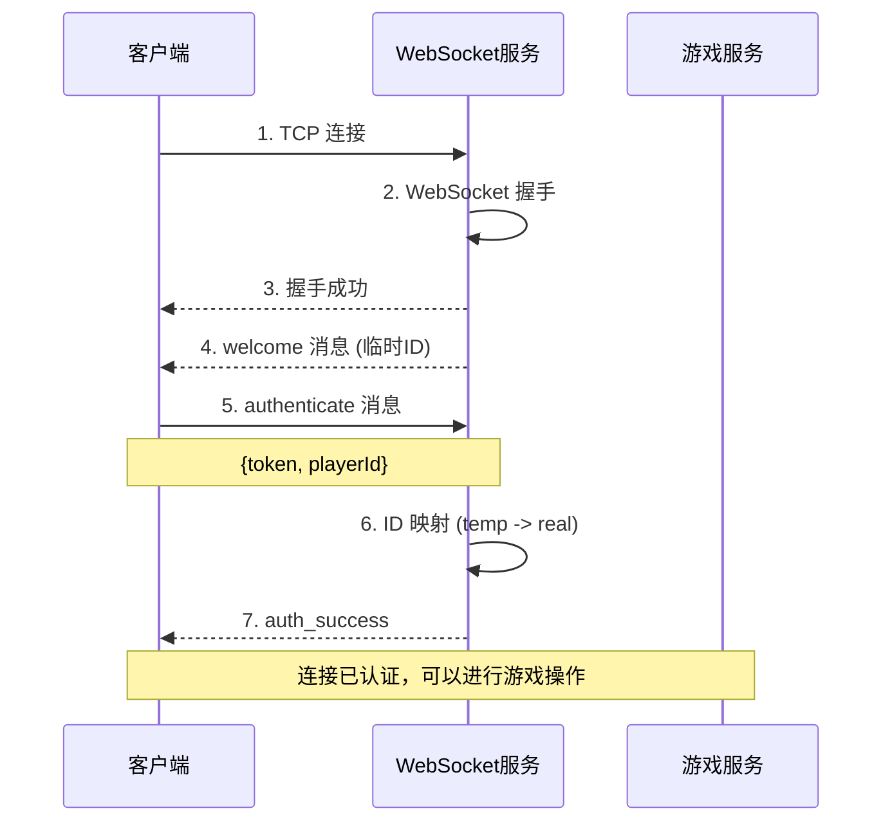
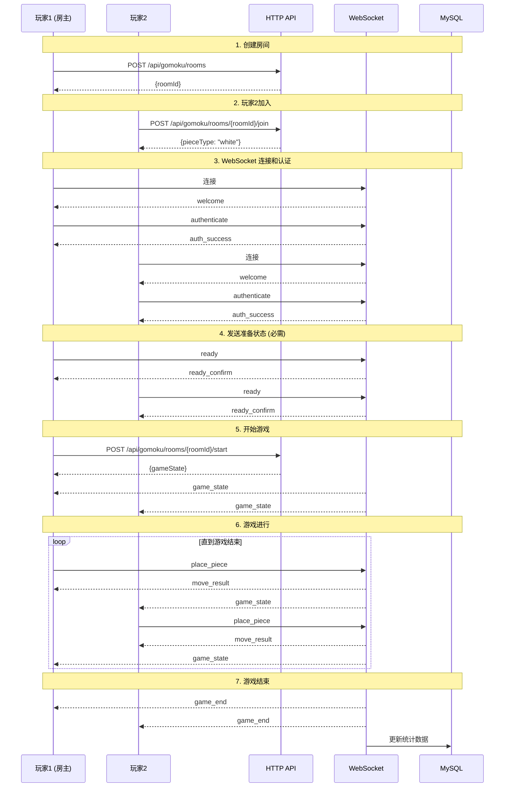
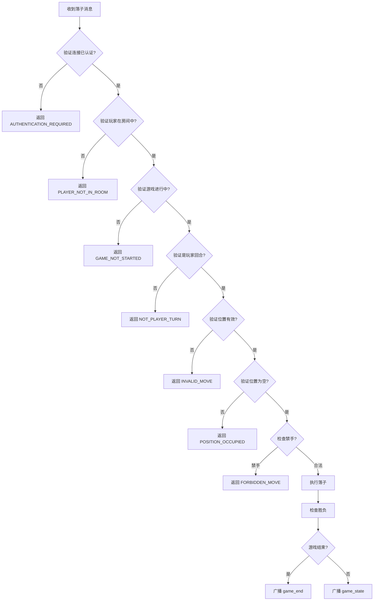

# 五子棋游戏服务 (Gomoku Server) 详细文档

## 1. 服务概述

| 项目 | 说明 |
|------|------|
| 服务名称 | gomoku_server |
| HTTP 端口 | 8085 |
| WebSocket 端口 | 8086 |
| 服务版本 | 2.0.0 (架构简化版本) |
| 基础路径 | `/api/gomoku/` |
| 数据库 | MySQL (gomoku_game_db) + Redis (可选缓存) |
| 架构模式 | 简化微服务架构 + 统一线程池 |

### 1.1 服务职责

五子棋游戏服务负责处理所有游戏相关的实时交互：
- 游戏房间管理（创建、加入、离开、开始）
- 实时对弈（落子、悔棋、认输、和棋）
- 游戏逻辑（胜负判定、禁手规则）
- 排行榜系统（玩家评分、排名）
- 观战系统（观战者管理）
- 聊天系统（房间内聊天）

### 1.2 支持的游戏模式

| 模式 | 代码 | 说明 |
|------|------|------|
| Freestyle | 0 | 自由模式，无禁手 |
| Renju | 1 | 连珠模式，黑棋有禁手 |
| Swap2 | 2 | Swap2 规则 |
| Pro | 3 | 职业规则 |
| Tournament | 4 | 锦标赛规则 |

---

## 2. 架构设计

### 2.1 简化架构图

```
┌────────────────────────────────────────────────────────────────┐
│                        HTTP Controller                          │
│            (REST API: 房间管理、排行榜、统计)                    │
├────────────────────────────────────────────────────────────────┤
│                    WebSocket Handler                            │
│           (实时游戏: 落子、聊天、状态同步)                        │
├────────────────────────────────────────────────────────────────┤
│                      Game Service                               │
│        (游戏逻辑、房间管理、玩家管理)                            │
├───────────────────┬────────────────────┬───────────────────────┤
│   Gomoku Room     │   Gomoku Board     │   Gomoku Database     │
│   (房间状态)       │   (棋盘逻辑)        │   (数据持久化)         │
├───────────────────┴────────────────────┴───────────────────────┤
│                    Unified Thread Pool                          │
│                  (4 工作线程 + 1 IO 线程)                        │
├─────────────────────────┬──────────────────────────────────────┤
│      MySQL Pool         │           Redis Pool (可选)           │
│    (持久化存储)          │           (缓存加速)                  │
└─────────────────────────┴──────────────────────────────────────┘
```

### 2.2 线程架构

| 线程类型 | 数量 | 职责 |
|----------|------|------|
| HTTP EventLoop | 1 | HTTP 请求处理 |
| WebSocket IO | 1 | WebSocket 连接管理 |
| 统一工作线程池 | 4 | 游戏逻辑、数据库操作、事件处理 |
| **总计** | **6** | 简化架构 (原 15-30 个) |

### 2.3 核心组件

| 组件 | 文件路径 | 职责 |
|------|----------|------|
| GomokuServer | `src/game_services/gomoku/src/gomoku_server.cpp` | 服务主类、生命周期管理 |
| GomokuRoom | `include/gomoku_room.h` | 房间状态管理、游戏流程控制 |
| GomokuBoard | `include/gomoku_board.h` | 棋盘逻辑、胜负判定 |
| GomokuDatabase | `include/gomoku_database.h` | 数据持久化、排行榜 |
| GomokuWebSocketHandler | `include/gomoku_websocket_handler.h` | WebSocket 消息处理 |
| GomokuRedisRepository | `include/gomoku_redis_repository.h` | Redis 缓存操作 |

---

## 3. 数据模型

### 3.1 游戏配置

```cpp
struct GomokuConfig {
    GameMode gameMode;              // 游戏模式
    int timeLimit;                  // 思考时间限制 (秒)
    int incrementPerMove;           // 每步加时 (秒)
    bool allowUndo;                 // 是否允许悔棋
    bool allowSpectators;           // 是否允许观战
    int maxSpectators;              // 最大观战人数
    int handicap;                   // 让子数
    bool rankingEnabled;            // 是否计入排名
};
```

### 3.2 棋盘状态

```cpp
struct BoardState {
    std::array<std::array<int, 15>, 15> board;  // 15x15 棋盘 (0=空,1=黑,2=白)
    int currentPlayer;                          // 当前执棋方 (1=黑,2=白)
    int gameResult;                             // 游戏结果 (0=进行中,1=黑胜,2=白胜,3=和棋)
    int totalMoves;                             // 总步数
    Position lastMove;                          // 最后一步位置
    std::vector<MoveRecord> moveHistory;        // 落子历史
    int blackTimeLeft;                          // 黑方剩余时间
    int whiteTimeLeft;                          // 白方剩余时间
    bool canUndo;                               // 是否可以悔棋
    std::vector<Position> forbiddenPositions;   // 禁手位置 (连珠模式)
};
```

### 3.3 房间状态

```cpp
enum class RoomState {
    WAITING_PLAYERS = 0,    // 等待玩家
    GAME_IN_PROGRESS = 1,   // 游戏进行中
    GAME_PAUSED = 2,        // 游戏暂停
    GAME_FINISHED = 3       // 游戏结束
};

struct GomokuRoomData {
    std::string room_id;                    // 房间ID
    std::string creator_id;                 // 创建者ID
    RoomState state;                        // 房间状态
    std::vector<PlayerInfo> players;        // 玩家列表
    std::map<std::string, int> playerPieces;// 玩家棋子分配
    BoardState boardState;                  // 棋盘状态
    GomokuConfig config;                    // 游戏配置
    std::set<std::string> spectators;       // 观战者列表
    int64_t created_at;                     // 创建时间
    int64_t last_activity;                  // 最后活动时间
    std::set<std::string> ready_players;    // 准备好的玩家
};
```

---

## 4. HTTP API 端点

### 4.1 房间管理 API

| 方法 | 端点 | 功能 | 实现状态 |
|------|------|------|----------|
| POST | `/api/v1/gomoku/rooms` | 创建房间 | ✅ 完成 |
| GET | `/api/v1/gomoku/rooms` | 获取房间列表 | ✅ 完成 |
| GET | `/api/v1/gomoku/rooms/:room_id` | 获取房间详情 | ✅ 完成 |
| POST | `/api/v1/gomoku/rooms/:room_id/join` | 加入房间 | ✅ 完成 |
| POST | `/api/v1/gomoku/rooms/:room_id/leave` | 离开房间 | ✅ 完成 |
| POST | `/api/v1/gomoku/rooms/:room_id/start` | 开始游戏 | ✅ 完成 |

### 4.2 排行榜 API

| 方法 | 端点 | 功能 | 实现状态 |
|------|------|------|----------|
| GET | `/api/v1/gomoku/leaderboard` | 获取排行榜 | ✅ 完成 |

### 4.3 系统 API

| 方法 | 端点 | 功能 | 实现状态 |
|------|------|------|----------|
| GET | `/api/v1/gomoku/health` | 健康检查 | ✅ 完成 |
| GET | `/api/v1/gomoku/stats` | 服务统计 | ✅ 完成 |
| GET | `/api/v1/gomoku/service/endpoints` | 端点发现 | ✅ 完成 |
| GET | `/api/v1/gomoku/server/status` | 服务器状态 | ✅ 完成 |
| POST | `/api/v1/gomoku/announcement` | 系统公告 | ✅ 完成 |

### 4.4 管理员 API

| 方法 | 端点 | 功能 | 实现状态 |
|------|------|------|----------|
| POST | `/api/v1/gomoku/admin/reset-stats` | 重置统计 | ✅ 完成 |

---

## 5. WebSocket API

### 5.1 连接流程



### 5.2 客户端消息类型

| 类型 | 方向 | 说明 | 数据结构 |
|------|------|------|----------|
| `authenticate` | C→S | 认证请求 | `{token, playerId}` |
| `ready` | C→S | 准备就绪 | `{ready: true}` |
| `place_piece` | C→S | 落子 | `{position: {row, col}}` |
| `undo_move` | C→S | 悔棋请求 | `{}` |
| `surrender` | C→S | 认输 | `{}` |
| `draw_offer` | C→S | 和棋提议 | `{}` |
| `draw_response` | C→S | 和棋响应 | `{accept: bool}` |
| `chat` | C→S | 聊天消息 | `{message: string}` |
| `heartbeat` | C→S | 心跳 | `{}` |

### 5.3 服务器消息类型

| 类型 | 方向 | 说明 | 数据结构 |
|------|------|------|----------|
| `welcome` | S→C | 欢迎消息 | `{player_id, server_info}` |
| `auth_success` | S→C | 认证成功 | `{playerId, authenticated}` |
| `error` | S→C | 错误消息 | `{error_code, error_message}` |
| `ready_confirm` | S→C | 准备确认 | `{playerId, ready}` |
| `game_state` | S→C | 游戏状态 | `{board, config, currentTurn, ...}` |
| `move_result` | S→C | 落子结果 | `{playerId, position, success}` |
| `game_end` | S→C | 游戏结束 | `{result, winnerPiece, gameStats}` |
| `time_update` | S→C | 时间更新 | `{blackTime, whiteTime}` |
| `draw_offer` | S→C | 和棋提议通知 | `{fromPlayer}` |
| `draw_response` | S→C | 和棋响应通知 | `{fromPlayer, accepted}` |
| `chat` | S→C | 聊天广播 | `{playerId, message}` |
| `spectator_change` | S→C | 观战者变化 | `{spectatorId, joined, spectatorCount}` |
| `notification` | S→C | 系统通知 | `{type, message}` |

---

## 6. 业务流程

### 6.1 完整游戏流程



### 6.2 落子验证流程



### 6.3 胜负判定算法

```cpp
// 五子连珠判定
bool GomokuBoard::checkWin(int row, int col, int piece) {
    // 检查四个方向
    const int directions[4][2] = {
        {1, 0},   // 水平
        {0, 1},   // 垂直
        {1, 1},   // 对角线
        {1, -1}   // 反对角线
    };

    for (const auto& [dx, dy] : directions) {
        int count = 1;  // 包含当前落子

        // 正向检查
        for (int i = 1; i < 5; ++i) {
            int r = row + i * dx;
            int c = col + i * dy;
            if (r < 0 || r >= 15 || c < 0 || c >= 15) break;
            if (board_[r][c] != piece) break;
            ++count;
        }

        // 反向检查
        for (int i = 1; i < 5; ++i) {
            int r = row - i * dx;
            int c = col - i * dy;
            if (r < 0 || r >= 15 || c < 0 || c >= 15) break;
            if (board_[r][c] != piece) break;
            ++count;
        }

        if (count >= 5) {
            // 连珠模式检查禁手
            if (gameMode_ == GameMode::RENJU && piece == 1) {
                // 黑棋禁手检查 (三三、四四、长连)
                if (isForbidden(row, col)) {
                    return false;
                }
            }
            return true;
        }
    }
    return false;
}
```

---

## 7. 数据库设计

### 7.1 用户统计表

```sql
CREATE TABLE gomoku_users (
    user_id VARCHAR(50) PRIMARY KEY,
    player_name VARCHAR(100),
    rating INT DEFAULT 1500,
    total_games INT DEFAULT 0,
    wins INT DEFAULT 0,
    losses INT DEFAULT 0,
    draws INT DEFAULT 0,
    win_streak INT DEFAULT 0,
    max_win_streak INT DEFAULT 0,
    is_active BOOLEAN DEFAULT TRUE,
    created_at TIMESTAMP DEFAULT CURRENT_TIMESTAMP,
    updated_at TIMESTAMP DEFAULT CURRENT_TIMESTAMP ON UPDATE CURRENT_TIMESTAMP,
    INDEX idx_rating (rating DESC),
    INDEX idx_total_games (total_games)
);
```

### 7.2 游戏记录表

```sql
CREATE TABLE gomoku_games (
    game_id BIGINT PRIMARY KEY AUTO_INCREMENT,
    room_id VARCHAR(100),
    black_player_id VARCHAR(50) NOT NULL,
    white_player_id VARCHAR(50) NOT NULL,
    game_mode TINYINT DEFAULT 0,
    result TINYINT,  -- 1=黑胜, 2=白胜, 3=和棋
    total_moves INT DEFAULT 0,
    game_duration INT,  -- 秒
    created_at TIMESTAMP DEFAULT CURRENT_TIMESTAMP,
    finished_at TIMESTAMP,
    INDEX idx_black_player (black_player_id),
    INDEX idx_white_player (white_player_id),
    INDEX idx_created_at (created_at)
);
```

### 7.3 落子记录表

```sql
CREATE TABLE gomoku_moves (
    move_id BIGINT PRIMARY KEY AUTO_INCREMENT,
    game_id BIGINT NOT NULL,
    move_number INT NOT NULL,
    player_id VARCHAR(50) NOT NULL,
    row TINYINT NOT NULL,
    col TINYINT NOT NULL,
    piece_type TINYINT NOT NULL,  -- 1=黑, 2=白
    time_used INT,  -- 思考时间(毫秒)
    created_at TIMESTAMP DEFAULT CURRENT_TIMESTAMP,
    INDEX idx_game_id (game_id),
    FOREIGN KEY (game_id) REFERENCES gomoku_games(game_id)
);
```

---

## 8. 实现状态评估

### 8.1 功能完成度

| 模块 | 完成度 | 说明 |
|------|--------|------|
| HTTP REST API | ✅ 100% | 所有路由正确定义和实现 |
| WebSocket 通信 | ✅ 90% | 玩家会话创建待完善 |
| 房间管理 | ✅ 100% | 创建、加入、离开、开始 |
| 游戏逻辑 | ✅ 100% | 多种游戏模式支持 |
| 胜负判定 | ✅ 100% | 五连、禁手检测 |
| 排行榜 | ✅ 100% | 真实数据查询 |
| 数据库持久化 | ✅ 100% | MySQL + Redis |
| 健康检查 | ✅ 100% | 基类实现 |

### 8.2 业务逻辑正确性

| 检查项 | 状态 | 说明 |
|--------|------|------|
| 落子合法性 | ✅ | 位置、轮次、禁手 |
| 胜负判定 | ✅ | 五连判定正确 |
| 准备状态检查 | ✅ | 必须所有玩家 ready |
| 房主权限 | ✅ | 只有房主可开始游戏 |
| 时间控制 | ✅ | 倒计时和加时 |
| 断线处理 | ✅ | 超时自动判负 |
| 数据持久化 | ✅ | 游戏记录和落子历史 |

### 8.3 已知问题

1. **JWT 认证模拟实现**
   - 问题：当前 JWT 验证器只检查格式
   - 建议：完善与认证服务的真实集成

2. **玩家会话创建**
   - 问题：`createPlayerSession` 返回 nullptr
   - 影响：部分 WebSocket 功能受限
   - 建议：完善会话管理

---

## 9. 配置参考

```yaml
# config/gomoku_server.yml 关键配置

server:
  name: "gomoku_server"
  version: "2.0.0"
  port: 8085
  websocket_port: 8086

architecture:
  mode: "simple"  # 简化架构模式
  threads:
    worker_threads: 4
    event_threads: 0
    monitoring_threads: 0
  components:
    enable_kafka: false
    enable_redis: true
    enable_monitoring: false

game:
  max_concurrent_games: 100
  max_rooms: 1000
  allow_spectators: true
  enable_ranking: true
  default_time_limit: 900      # 15分钟
  default_increment: 10        # 每步10秒
  game_modes:
    - freestyle
    - renju

mysql:
  host: "172.26.26.199"
  database: "gomoku_game_db"
  pool:
    initial_size: 5
    max_size: 20

redis:
  host: "172.26.26.199"
  database: 5  # 五子棋专用数据库
  pool_size: 10
```

---

## 10. 性能指标

| 指标 | 目标值 | 说明 |
|------|--------|------|
| 并发连接 | 1000 | WebSocket 连接数 |
| 最大房间数 | 1000 | 同时存在的房间 |
| 并发游戏 | 100 | 同时进行的对局 |
| HTTP 响应时间 | <30ms | 95% 分位 |
| WebSocket 延迟 | <8ms | 本地网络 |
| 内存占用 | ~48MB | 简化架构 |
| 启动时间 | <5秒 | 快速启动 |

---

## 11. 客户端集成示例

### 11.1 JavaScript 客户端

```javascript
class GomokuClient {
    constructor(serverUrl, wsUrl) {
        this.serverUrl = serverUrl;
        this.wsUrl = wsUrl;
        this.ws = null;
        this.playerId = null;
        this.isAuthenticated = false;
    }

    // 创建房间
    async createRoom(config) {
        const response = await fetch(`${this.serverUrl}/api/gomoku/rooms`, {
            method: 'POST',
            headers: { 'Content-Type': 'application/json' },
            body: JSON.stringify({
                creatorId: this.playerId,
                config: config
            })
        });
        return response.json();
    }

    // 连接 WebSocket
    connect(token) {
        return new Promise((resolve, reject) => {
            this.ws = new WebSocket(this.wsUrl);

            this.ws.onmessage = (event) => {
                const msg = JSON.parse(event.data);

                if (msg.type === 'welcome') {
                    // 收到欢迎消息后发送认证
                    this.ws.send(JSON.stringify({
                        type: 'authenticate',
                        data: {
                            token: token,
                            playerId: this.playerId
                        }
                    }));
                }

                if (msg.type === 'auth_success') {
                    this.isAuthenticated = true;
                    resolve();
                }

                this.handleMessage(msg);
            };

            this.ws.onerror = reject;
        });
    }

    // 发送准备状态
    sendReady() {
        this.ws.send(JSON.stringify({
            type: 'ready',
            data: { ready: true }
        }));
    }

    // 落子
    placePiece(row, col) {
        this.ws.send(JSON.stringify({
            type: 'place_piece',
            data: { position: { row, col } }
        }));
    }

    // 处理服务器消息
    handleMessage(msg) {
        switch (msg.type) {
            case 'game_state':
                this.onGameState(msg.data);
                break;
            case 'game_end':
                this.onGameEnd(msg.data);
                break;
            case 'chat':
                this.onChat(msg.data);
                break;
            // ... 其他消息类型
        }
    }

    // 子类实现这些回调
    onGameState(data) {}
    onGameEnd(data) {}
    onChat(data) {}
}
```

---

## 17. 服务生命周期

### 17.1 启动流程

五子棋游戏服务的启动流程如下：

```
main() → GomokuServer::createFromConfig() → GomokuServer::initialize() → GomokuServer::start()
```

**初始化阶段** (`initialize()` 调用 `GameServerBase::initialize()`):
1. 初始化 MySQL 连接池
2. 初始化 Redis 连接池
3. 初始化线程池
4. 初始化 HTTP 服务器
5. 初始化 WebSocket 处理器
6. 初始化安全管理器和告警管理器

**启动阶段** (`start()`):
1. 注册 HTTP 路由
2. 启动定时任务（房间清理、统计更新）
3. 服务进入运行状态

### 17.2 关闭流程

五子棋游戏服务的优雅关闭流程：

```
SIGINT/SIGTERM → signalHandler → GameServerBase::stop()
```

**关闭顺序** (`GameServerBase::stop()`):
1. 停止基于 EventLoop 的定时任务 (`stopTimerBasedTasks()`)
2. 停止告警管理器 (`alert_manager_->stop()`)
3. 停止 WebSocket 服务器 (`websocket_handler_->stop()`)
4. 停止 HTTP 服务器 (`http_server_->stop()`)
   - 调用 `event_loop_->quit()` 设置退出标志
   - 关闭监听 socket
   - 关闭所有活跃会话
   - 等待 EventLoop 退出
5. 停止线程池 (`thread_pool_->shutdown()`)
6. 通知所有游戏房间停止
7. 清理所有房间和玩家数据

### 17.3 线程安全注意事项

- **EventLoop 线程安全**: EventLoop 操作必须在 EventLoop 线程中执行
- **WebSocket 与 HTTP 共享 EventLoop**: WebSocket 使用 HTTP 服务器的 EventLoop
- **跨线程操作**: 使用 `runInLoop()` 或 `queueInLoop()` 进行跨线程调度
- **quit() 方法**: 通过 wakeup fd 实现线程安全，可以从任何线程调用

---

**文档版本**: 1.1.0
**更新日期**: 2025-02-18
**维护状态**: ✅ 与代码实现同步
