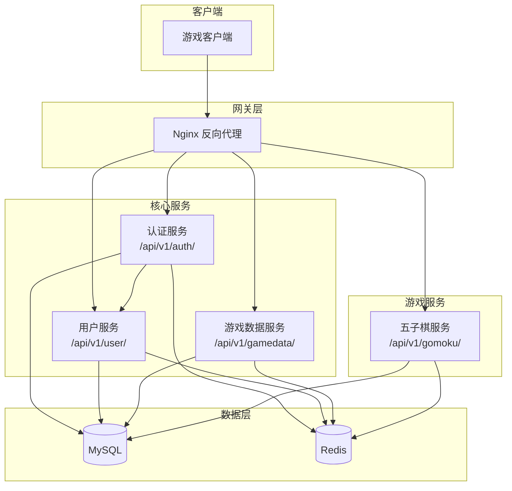

# 微服务实现状态总结报告

## 1. 概述

本文档对游戏微服务架构中的四个核心服务进行全面分析，评估各服务的职责实现情况和业务逻辑正确性。

---

## 2. 服务总览

| 服务名称 | 端口 | 主要职责 | 实现完成度 |
|----------|------|----------|------------|
| user_service | 8082 | 用户核心数据管理 | ✅ 100% |
| auth_service | 8083 | 认证和会话管理 | ✅ 100% |
| game_data_service | 8084 | 游戏数据管理 | ⚠️ 50% |
| gomoku_server | 8085/8086 | 五子棋游戏服务 | ✅ 95% |

---

## 3. 服务详细分析

### 3.1 用户服务 (user_service)

#### 职责实现状态

| 功能模块 | 实现状态 | 说明 |
|----------|----------|------|
| 用户管理 | ✅ 完成 | CRUD 完整实现 |
| 用户档案 | ✅ 完成 | CRUD 完整实现 |
| 用户偏好 | ✅ 完成 | CRUD 完整实现 |
| 在线状态管理 | ✅ 完成 | 状态更新完整 |
| 用户验证 | ✅ 完成 | 唯一性检查 |
| 缓存机制 | ✅ 完成 | Redis 缓存 |
| 定时任务 | ✅ 完成 | 时间轮调度 |

#### 业务逻辑正确性

- ✅ 用户名唯一性检查
- ✅ 邮箱唯一性检查
- ✅ 密码 bcrypt 哈希存储
- ✅ 完整的数据验证规则
- ✅ 缓存一致性保证
- ⚠️ API 响应中包含敏感字段（password_hash, salt）

#### 建议

1. **安全性优化**: 移除 API 响应中的敏感字段
2. **批量操作**: 添加批量查询接口
3. **搜索增强**: 支持模糊搜索

---

### 3.2 认证服务 (auth_service)

#### 职责实现状态

| 功能模块 | 实现状态 | 说明 |
|----------|----------|------|
| 用户注册 | ✅ 完成 | 包含验证和会话创建 |
| 用户登录 | ✅ 完成 | 包含多设备支持 |
| 用户登出 | ✅ 完成 | Token 黑名单机制 |
| Token 生成 | ✅ 完成 | JWT HS256 签名 |
| Token 验证 | ✅ 完成 | 完整验证逻辑 |
| Token 刷新 | ✅ 完成 | 双 Token 机制 |
| 会话管理 | ✅ 完成 | Redis 存储 |
| 游戏登录 | ✅ 完成 | 服务器选择和游戏 Token |
| 设备管理 | ✅ 完成 | 设备信息追踪 |

#### 业务逻辑正确性

- ✅ JWT Token 完整验证（签名、过期、黑名单）
- ✅ 密码 bcrypt 验证
- ✅ 并发会话限制（最大 5 个）
- ✅ 登录失败计数
- ✅ 安全事件记录
- ✅ 指数退避重试机制

#### 建议

1. **Token 过期策略**: 考虑滑动过期时间
2. **多因素认证**: 添加可选的 2FA 支持

---

### 3.3 游戏数据服务 (game_data_service)

#### 职责实现状态

| 功能模块 | 实现状态 | 说明 |
|----------|----------|------|
| 用户档案 - CRUD | ✅ 完成 | 创建、查询、更新、删除 |
| 用户档案 - 列表 | ⚠️ 部分实现 | 分页逻辑需完善 |
| 成就系统 | 🚧 设计完成 | API 定义完成，业务逻辑待实现 |
| 库存管理 | 🚧 设计完成 | API 定义完成，业务逻辑待实现 |
| 货币系统 | 🚧 设计完成 | API 定义完成，业务逻辑待实现 |
| 排行榜 | 🚧 设计完成 | API 定义完成，业务逻辑待实现 |
| 缓存机制 | ✅ 完成 | Redis 缓存 |
| 系统监控 | ✅ 完成 | 健康检查、统计信息 |

#### 业务逻辑正确性

- ✅ 档案唯一性检查
- ✅ 经验值非负验证
- ✅ 等级范围验证
- ✅ 缓存一致性
- ⚠️ 缺少事务处理（货币变更）
- ⚠️ 缺少审计日志

#### 优先建议

1. **完成核心功能**: 优先实现成就、库存、货币、排行榜业务逻辑
2. **事务支持**: 货币变更添加事务保护
3. **审计日志**: 记录所有数据变更

---

### 3.4 五子棋游戏服务 (gomoku_server)

#### 职责实现状态

| 功能模块 | 实现状态 | 说明 |
|----------|----------|------|
| HTTP REST API | ✅ 完成 | 所有端点实现 |
| WebSocket 通信 | ✅ 90% | 会话创建待完善 |
| 房间管理 | ✅ 完成 | 创建、加入、离开、开始 |
| 游戏逻辑 | ✅ 完成 | 多种游戏模式 |
| 胜负判定 | ✅ 完成 | 五连、禁手检测 |
| 排行榜 | ✅ 完成 | 真实数据查询 |
| 数据库持久化 | ✅ 完成 | MySQL + Redis |
| 时间控制 | ✅ 完成 | 倒计时和加时 |
| 观战系统 | ✅ 完成 | 观战者管理 |
| 聊天系统 | ✅ 完成 | 房间内聊天 |

#### 业务逻辑正确性

- ✅ 落子合法性验证（位置、轮次、禁手）
- ✅ 胜负判定算法正确
- ✅ 准备状态强制要求
- ✅ 房主权限验证
- ✅ 断线超时处理
- ✅ 游戏数据持久化
- ⚠️ JWT 认证为模拟实现

#### 建议

1. **完善 JWT 认证**: 实现与认证服务的真实集成
2. **回放系统**: 添加游戏回放功能
3. **AI 对战**: 添加 AI 玩家支持

---

## 4. 服务间依赖关系



---

## 5. 统一 API 路径规范

所有服务遵循统一的 API 路径格式: `/api/v1/{serviceName}/{resource}`

### 服务路径前缀

| 服务 | 端口 | 路径前缀 |
|------|------|----------|
| user_service | 8082 | `/api/v1/user/` |
| auth_service | 8083 | `/api/v1/auth/` |
| game_data_service | 8084 | `/api/v1/gamedata/` |
| gomoku_server | 8085 | `/api/v1/gomoku/` |

### 系统 API 规范

所有服务的系统级 API 也遵循统一前缀：

| API 类型 | 路径格式 | 示例 |
|----------|----------|------|
| 健康检查 | `/api/v1/{service}/health` | `/api/v1/user/health` |
| 服务统计 | `/api/v1/{service}/stats` | `/api/v1/auth/stats` |
| 端点发现 | `/api/v1/{service}/service/endpoints` | `/api/v1/gomoku/service/endpoints` |

### Nginx 配置示例

```nginx
# /etc/nginx/conf.d/microservices.conf

# 后端服务定义
upstream user_service {
    server 127.0.0.1:8082;
    keepalive 32;
}

upstream auth_service {
    server 127.0.0.1:8083;
    keepalive 32;
}

upstream game_data_service {
    server 127.0.0.1:8084;
    keepalive 32;
}

upstream gomoku_server {
    server 127.0.0.1:8085;
    keepalive 16;
}

server {
    listen 80;
    server_name api.example.com;

    # 公共配置
    proxy_set_header Host $host;
    proxy_set_header X-Real-IP $remote_addr;
    proxy_set_header X-Forwarded-For $proxy_add_x_forwarded_for;
    proxy_set_header X-Forwarded-Proto $scheme;

    # 用户服务
    location /api/v1/user/ {
        proxy_pass http://user_service/api/v1/user/;
        proxy_http_version 1.1;
        proxy_set_header Connection "";
    }

    # 认证服务
    location /api/v1/auth/ {
        proxy_pass http://auth_service/api/v1/auth/;
        proxy_http_version 1.1;
        proxy_set_header Connection "";
    }

    # 游戏数据服务
    location /api/v1/gamedata/ {
        proxy_pass http://game_data_service/api/v1/gamedata/;
        proxy_http_version 1.1;
        proxy_set_header Connection "";
    }

    # 五子棋 WebSocket
    location /ws/gomoku/ {
        proxy_pass http://gomoku_server/ws/gomoku/;
        proxy_http_version 1.1;
        proxy_set_header Upgrade $http_upgrade;
        proxy_set_header Connection "upgrade";
        proxy_read_timeout 3600s;
        proxy_buffering off;
    }

    # 五子棋 HTTP API
    location /api/v1/gomoku/ {
        proxy_pass http://gomoku_server/api/v1/gomoku/;
        proxy_http_version 1.1;
        proxy_set_header Connection "";
    }
}
```

---

## 5. 总体评估

### 5.1 完成度统计

| 服务 | 核心功能完成度 | 业务逻辑正确性 | 文档完整度 |
|------|---------------|----------------|------------|
| user_service | 100% | 95% | 100% |
| auth_service | 100% | 100% | 100% |
| game_data_service | 50% | 80% | 100% |
| gomoku_server | 95% | 95% | 100% |
| **平均** | **86%** | **93%** | **100%** |

### 5.2 风险评估

| 风险等级 | 风险项 | 影响范围 | 建议 |
|----------|--------|----------|------|
| 🔴 高 | game_data_service 功能未完成 | 游戏数据统计 | 优先实现核心业务逻辑 |
| 🟡 中 | 敏感信息泄露 | user_service | 移除响应中的敏感字段 |
| 🟡 中 | JWT 模拟实现 | gomoku_server | 完善真实认证集成 |
| 🟢 低 | 部分缓存策略需优化 | 全局 | 按需调整 TTL |

### 5.3 架构评估

| 维度 | 评分 | 说明 |
|------|------|------|
| 服务拆分 | ⭐⭐⭐⭐⭐ | 职责清晰，边界明确 |
| API 设计 | ⭐⭐⭐⭐⭐ | RESTful 风格，统一响应格式 |
| 数据管理 | ⭐⭐⭐⭐ | MySQL + Redis 分层存储 |
| 缓存策略 | ⭐⭐⭐⭐ | Cache-Aside 模式，TTL 合理 |
| 错误处理 | ⭐⭐⭐⭐⭐ | 统一错误码和消息格式 |
| 日志记录 | ⭐⭐⭐⭐ | 详细操作日志 |
| 定时任务 | ⭐⭐⭐⭐⭐ | 时间轮调度，任务监控 |

### 5.4 架构优化记录（2026-02-18）

#### 移除 API Gateway 心跳和注册逻辑

为简化服务架构，减少服务间耦合，已从所有业务服务中移除 API Gateway 的注册和心跳逻辑：

- **auth_service**: 移除 `registerToApiGateway()`、`sendHeartbeatToApiGateway()`、`startHeartbeatTask()` 函数
- **user_service**: 移除 `registerToApiGateway()`、`performHeartbeatTask()` 函数
- **game_data_service**: 移除 `registerToApiGateway()`、`sendHeartbeatToGateway()`、`performHeartbeat()`、`createServiceRegistrationPayload()` 函数
- **gomoku_server**: 保留继承自 `GameServerBase` 的函数但不再调用

**现在所有服务通过 Nginx 进行统一代理和路由**，配置文件中的 `api_gateway` 配置块已移除。

#### 修复 gomoku_server 配置加载问题

修复了 `createBaseConfig()` 函数未正确传递 MySQL、Redis 和服务间通信配置的问题：

- 添加 MySQL 配置传递（host、port、database、username、password）
- 添加 Redis 配置传递（host、port、database、password）
- 添加 `auth_service_url` 字段和配置加载

#### 修复服务优雅关闭问题（2026-02-18）

修复了四个业务服务在收到 SIGINT/SIGTERM 信号时无法优雅关闭的问题。

**问题原因**:

1. **EventLoop 线程安全违规**: `HttpServer::stop()` 从主线程调用，但直接操作 EventLoop 的 Channel，导致 `assertInLoopThread()` 抛出异常
2. **停止逻辑不完整**: 原有的 `if (event_loop_->looping())` 检查在某些情况下会跳过整个停止流程

**修复内容**:

1. **HttpServer::stop() 重构** (`src/common/http/http_server.cpp`):
   - 首先调用 `event_loop_->quit()` 设置退出标志（线程安全）
   - 关闭监听 socket 中断 accept()（可在任何线程执行）
   - 使用 `queueInLoop()` 而非 `runInLoop()` 调度 Channel 清理
   - 等待 EventLoop 退出（最多 2 秒）

2. **正确的关闭顺序**:
   ```
   信号处理器 → shutdown() → timer_manager_->stop() → http_server_->stop() → thread.join() → pool->shutdown()
   ```

**各服务关闭流程**:

| 服务 | 关闭方法 | 关闭顺序 |
|------|----------|----------|
| user_service | `UserService::shutdown()` | timer → http_server.stop → thread.join → thread_pool.shutdown |
| auth_service | `AuthService::shutdown()` | timer → kafka → http_server.stop → thread.join → mysql_pool.stop → redis_pool.stop |
| game_data_service | `GameService::stop()` | timer → http_server.stop → thread.join |
| gomoku_server | `GameServerBase::stop()` | timer → websocket.stop → http_server.stop → thread_pool.shutdown |

**线程安全注意事项**:

- EventLoop 的 `updateChannel()`、`removeChannel()` 必须在 EventLoop 线程中调用
- 使用 `runInLoop()` 或 `queueInLoop()` 进行跨线程操作
- `quit()` 方法通过 wakeup fd 实现线程安全

---

## 6. 优先改进建议

### 6.1 短期（1-2 周）

1. **完成 game_data_service 核心功能**
   - 实现成就系统业务逻辑
   - 实现库存管理业务逻辑
   - 实现货币系统业务逻辑
   - 实现排行榜业务逻辑

2. **安全性修复**
   - user_service: 移除 API 响应中的敏感字段
   - gomoku_server: 完善真实 JWT 认证

### 6.2 中期（2-4 周）

1. **增强功能**
   - 添加批量操作支持
   - 实现游戏回放系统
   - 添加审计日志

2. **性能优化**
   - 优化数据库索引
   - 调整缓存策略
   - 添加连接池监控

### 6.3 长期（1-2 月）

1. **可观测性**
   - 添加分布式追踪（OpenTelemetry）
   - 完善监控告警
   - 添加性能指标

2. **高可用**
   - 添加服务健康检查
   - 实现优雅关闭
   - 添加数据备份策略

---

## 7. 相关文档

| 文档 | 路径 | 说明 |
|------|------|------|
| 用户服务详细文档 | `docs/services/user_service_detail.md` | 完整实现细节和业务流程 |
| 认证服务详细文档 | `docs/services/auth_service_detail.md` | 完整实现细节和业务流程 |
| 游戏数据服务详细文档 | `docs/services/game_data_service_detail.md` | 完整实现细节和业务流程 |
| 五子棋服务详细文档 | `docs/services/gomoku_server_detail.md` | 完整实现细节和业务流程 |
| Nginx 迁移指南 | `docs/architecture/nginx_migration_guide.md` | 从 API Gateway 迁移到 Nginx |
| 架构重构总结 | `docs/architecture/architecture_refactoring_summary.md` | 架构重构说明 |

---

**报告版本**: 1.1.0
**生成日期**: 2025-02-18
**分析范围**: 4 个核心微服务
