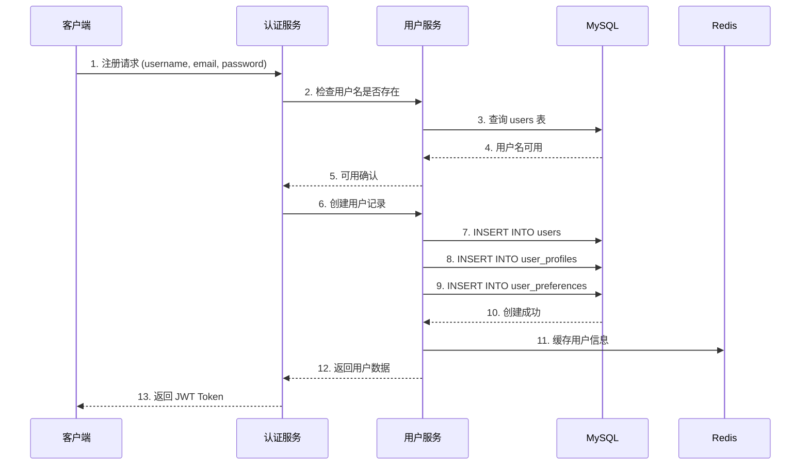
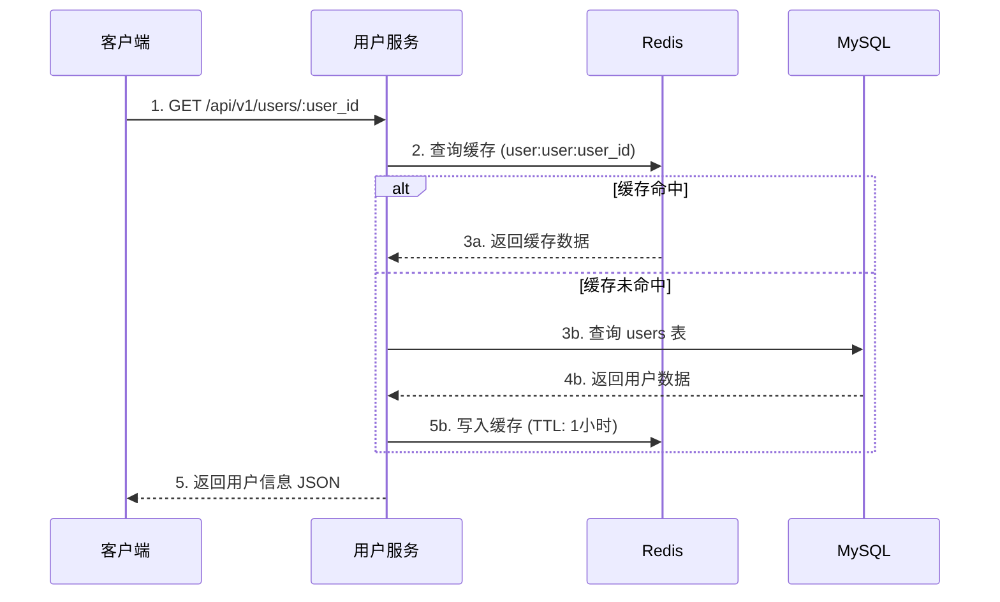
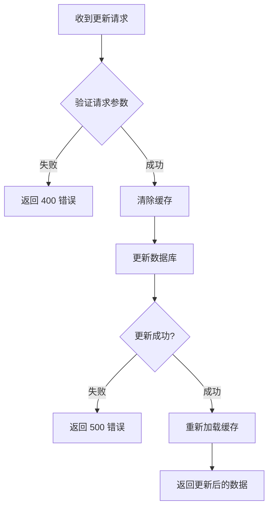

# 用户服务 (User Service) 详细文档

## 1. 服务概述

| 项目 | 说明 |
|------|------|
| 服务名称 | user_service |
| 默认端口 | 8082 |
| 服务版本 | 1.0.0 |
| 基础路径 | `/api/v1/` |
| 数据库 | MySQL (user_service_db) + Redis (缓存) |
| 架构模式 | Repository 模式 + 分层架构 |

### 1.1 服务职责

用户服务负责管理游戏平台中所有用户的核心数据，包括：
- 用户基础信息管理（注册、查询、更新）
- 用户档案管理（昵称、头像、简介等）
- 用户偏好设置（主题、通知、语言等）
- 用户在线状态管理
- 用户验证（用户名/邮箱唯一性检查）

---

## 2. 架构设计

### 2.1 分层架构

```
┌──────────────────────────────────────────────────────┐
│                   HTTP Controller                     │
│         (路由处理、请求验证、响应格式化)               │
├──────────────────────────────────────────────────────┤
│                   Service Layer                       │
│           (业务逻辑、数据验证、缓存管理)               │
├──────────────────────────────────────────────────────┤
│                   Repository Layer                    │
│        (数据访问、SQL构建、缓存读写)                   │
├──────────────────┬───────────────────────────────────┤
│   MySQL Pool     │           Redis Pool              │
│   (持久化存储)    │          (缓存加速)                │
└──────────────────┴───────────────────────────────────┘
```

### 2.2 核心组件

| 组件 | 文件路径 | 职责 |
|------|----------|------|
| UserService | `src/core_services/user_service/src/user_service.cpp` | 服务主类、生命周期管理 |
| UserRepository | `src/core_services/user_service/include/user_repository.h` | 数据访问层 |
| UserRedisRepository | `src/core_services/user_service/include/user_redis_repository.h` | Redis 缓存操作 |
| UserModels | `src/core_services/user_service/include/user_models.h` | 数据模型定义 |

### 2.3 数据模型

```cpp
// 用户基础信息
struct UserInfo {
    std::string user_id;        // 用户ID
    std::string username;       // 用户名
    std::string email;          // 邮箱
    std::string password_hash;  // 密码哈希
    std::string salt;           // 盐值
    std::string phone;          // 手机号
    std::string status;         // 状态: active/inactive/suspended/banned
    std::string online_status;  // 在线状态: offline/online/away/busy
    int login_attempts;         // 登录尝试次数
    std::string last_login_ip;  // 最后登录IP
    int64_t created_at;         // 创建时间
    int64_t updated_at;         // 更新时间
};

// 用户档案
struct UserProfile {
    std::string user_id;
    std::string nickname;
    std::string real_name;
    std::string avatar_url;
    std::string bio;
    std::string location;
    std::string website;
    int64_t birth_date;
    std::string gender;
    std::string language;
    std::string timezone;
    int64_t created_at;
    int64_t updated_at;
};

// 用户偏好设置
struct UserPreferences {
    std::string user_id;
    bool email_notifications;
    bool push_notifications;
    bool sms_notifications;
    std::string theme;
    std::string language;
    bool sound_effects;
    bool music;
    int volume;
    bool auto_login;
    bool remember_me;
    int session_timeout;
    nlohmann::json custom_settings;
    int64_t created_at;
    int64_t updated_at;
};
```

---

## 3. API 端点

### 3.1 用户管理 API

| 方法 | 端点 | 功能 | 实现状态 |
|------|------|------|----------|
| POST | `/api/v1/user` | 创建用户 | ✅ 完成 |
| GET | `/api/v1/user/:user_id` | 获取用户信息 | ✅ 完成 |
| PUT | `/api/v1/user/:user_id` | 更新用户信息 | ✅ 完成 |
| GET | `/api/v1/user/by-username/:username` | 按用户名查询 | ✅ 完成 |
| GET | `/api/v1/user/by-email/:email` | 按邮箱查询 | ✅ 完成 |

### 3.2 用户档案 API

| 方法 | 端点 | 功能 | 实现状态 |
|------|------|------|----------|
| GET | `/api/v1/user/:user_id/profile` | 获取用户档案 | ✅ 完成 |
| PUT | `/api/v1/user/:user_id/profile` | 更新用户档案 | ✅ 完成 |

### 3.3 用户偏好 API

| 方法 | 端点 | 功能 | 实现状态 |
|------|------|------|----------|
| GET | `/api/v1/user/:user_id/preferences` | 获取偏好设置 | ✅ 完成 |
| PUT | `/api/v1/user/:user_id/preferences` | 更新偏好设置 | ✅ 完成 |

### 3.4 状态管理 API

| 方法 | 端点 | 功能 | 实现状态 |
|------|------|------|----------|
| PUT | `/api/v1/user/:user_id/online-status` | 更新在线状态 | ✅ 完成 |

### 3.5 验证 API

| 方法 | 端点 | 功能 | 实现状态 |
|------|------|------|----------|
| POST | `/api/v1/user/check-username` | 检查用户名可用性 | ✅ 完成 |
| POST | `/api/v1/user/check-email` | 检查邮箱可用性 | ✅ 完成 |

### 3.6 系统 API

| 方法 | 端点 | 功能 | 实现状态 |
|------|------|------|----------|
| GET | `/api/v1/user/health` | 健康检查 | ✅ 完成 |
| GET | `/api/v1/user/stats` | 服务统计 | ✅ 完成 |
| GET | `/api/v1/user/info` | 服务信息 | ✅ 完成 |
| GET | `/api/v1/user/timer-stats` | 定时器统计 | ✅ 完成 |
| GET | `/api/v1/user/service/endpoints` | 端点发现 | ✅ 完成 |

---

## 4. 业务流程

### 4.1 用户注册流程



### 4.2 用户信息查询流程



### 4.3 用户档案更新流程



---

## 5. 定时任务

用户服务包含以下定时任务：

| 任务ID | 任务名称 | 间隔 | 功能 |
|--------|----------|------|------|
| `health_check_task` | 健康检查任务 | 5分钟 | 检查数据库、缓存连接状态 |
| `user_status_check` | 用户状态检查 | 10分钟 | 检查并清理过期用户状态 |
| `cache_cleanup_task` | 缓存清理任务 | 30分钟 | 清理过期缓存数据 |
| `user_statistics_task` | 统计任务 | 1小时 | 收集用户统计数据 |

---

## 6. 缓存策略

### 6.1 缓存键命名规范

```
user:user:{user_id}              # 用户基础信息
user:profile:{user_id}           # 用户档案
user:preferences:{user_id}       # 用户偏好
user:idx:username:{username}     # 用户名索引
user:idx:email:{email}           # 邮箱索引
```

### 6.2 TTL 策略

| 数据类型 | TTL | 说明 |
|----------|-----|------|
| 用户基础信息 | 1小时 | 经常访问，变更较少 |
| 用户档案 | 1小时 | 经常访问，变更较少 |
| 用户偏好 | 1小时 | 经常访问，变更较少 |
| 用户名索引 | 24小时 | 几乎不变 |
| 邮箱索引 | 24小时 | 几乎不变 |

### 6.3 Cache-Aside 模式

```cpp
// 获取用户信息（自动缓存填充）
std::optional<UserInfo> getUserById(const std::string& user_id) {
    // 1. 尝试从缓存获取
    auto cached = user_redis_->findById(user_id);
    if (cached.has_value() && cached->has_value()) {
        return cached->value();
    }

    // 2. 从数据库加载
    auto user = loadFromMySQL(user_id);
    if (user.has_value()) {
        // 3. 写入缓存
        user_redis_->save(user_id, user.value());
    }

    return user;
}
```

---

## 7. 数据验证规则

### 7.1 用户名验证
- 长度：3-50 字符
- 格式：字母、数字、下划线 (`^[a-zA-Z0-9_-]+$`)
- 唯一性：全局唯一

### 7.2 邮箱验证
- 长度：最大 255 字符
- 格式：标准邮箱格式
- 唯一性：全局唯一

### 7.3 手机号验证
- 格式：中国手机号 (`1[3-9]xxxxxxxxx`)
- 可选字段

### 7.4 档案验证
- 昵称：1-100 字符
- 个人简介：最大 500 字符
- 时区：标准时区格式 (如 `Asia/Shanghai`)
- 语言：xx-XX 格式 (如 `zh-CN`)

### 7.5 偏好设置验证
- 音量：0-100
- 会话超时：300-86400 秒（5分钟 - 24小时）

---

## 8. 服务间通信

### 8.1 与认证服务集成

```yaml
# 用户服务为认证服务提供：
- 用户信息查询
- 用户名/邮箱唯一性检查
- 用户状态更新（登录后更新在线状态）
```

### 8.2 Nginx 反向代理路由

服务通过 Nginx 反向代理对外暴露，路由配置：

```nginx
# 用户服务路由
location /api/v1/user {
    proxy_pass http://127.0.0.1:8082;
    proxy_set_header Host $host;
    proxy_set_header X-Real-IP $remote_addr;
}
```

统一 API 路径格式：`/api/v1/{serviceName}/{resource}/{...}`

---

## 9. 服务生命周期

### 9.1 启动流程

用户服务的启动流程如下：

```
main() → UserService::initialize() → UserService::start()
```

**初始化阶段** (`initialize()`):
1. 初始化 MySQL 连接池 (`mysql_pool_->start()`)
2. 初始化 Redis 连接池 (`redis_pool_->start()`)
3. 初始化数据访问层 (`UserRepository::initialize()`)
4. 初始化数据库表结构 (`initializeDatabaseSchema()`)
5. 初始化线程池 (`ThreadPool`)
6. 初始化定时器管理器 (`UserServiceTimerManager::start()`)
7. 启动 HTTP 服务器线程 (`initializeHttpServer()`)

**启动阶段** (`start()`):
1. 设置定时任务 (`setupTimerTasks()`)
2. 服务进入运行状态

### 9.2 关闭流程

用户服务的优雅关闭流程：

```
SIGINT/SIGTERM → signalHandler → UserService::shutdown()
```

**关闭顺序** (`shutdown()`):
1. 设置 `running_ = false` 停止接收新请求
2. 停止定时器管理器 (`timer_manager_->stop()`)
3. 停止 HTTP 服务器 (`http_server_->stop()`)
   - 调用 `event_loop_->quit()` 设置退出标志
   - 关闭监听 socket
   - 关闭所有活跃会话
   - 等待 EventLoop 退出
4. 等待 HTTP 服务器线程结束 (`http_server_thread_.join()`)
5. 停止线程池 (`thread_pool_->shutdown()`)
6. 连接池由 RAII 自动清理

### 9.3 线程安全注意事项

- **EventLoop 线程安全**: EventLoop 操作（如 `updateChannel`、`removeChannel`）必须在 EventLoop 线程中执行
- **跨线程操作**: 使用 `runInLoop()` 或 `queueInLoop()` 进行跨线程调度
- **quit() 方法**: 通过 wakeup fd 实现线程安全，可以从任何线程调用

---

## 10. 实现状态评估

### 9.1 功能完成度

| 模块 | 完成度 | 说明 |
|------|--------|------|
| 用户管理 | ✅ 100% | 完整实现 CRUD 操作 |
| 用户档案 | ✅ 100% | 完整实现 CRUD 操作 |
| 用户偏好 | ✅ 100% | 完整实现 CRUD 操作 |
| 状态管理 | ✅ 100% | 实现在线状态更新 |
| 用户验证 | ✅ 100% | 实现唯一性检查 |
| 系统监控 | ✅ 100% | 健康检查、统计信息 |
| 缓存机制 | ✅ 100% | Redis 缓存完整实现 |
| 定时任务 | ✅ 100% | 时间轮调度完整实现 |

### 9.2 业务逻辑正确性

| 检查项 | 状态 | 说明 |
|--------|------|------|
| 用户名唯一性检查 | ✅ | 注册前检查 |
| 邮箱唯一性检查 | ✅ | 注册前检查 |
| 密码安全存储 | ✅ | bcrypt 哈希 |
| 数据验证 | ✅ | 完整的输入验证 |
| 错误处理 | ✅ | 统一错误响应格式 |
| 日志记录 | ✅ | 详细的操作日志 |
| 缓存一致性 | ✅ | 更新时清除缓存 |

---

## 10. 潜在问题和建议

### 10.1 已识别问题

1. **密码哈希返回**
   - 问题：API 响应中包含 password_hash 字段
   - 建议：生产环境中不应返回密码哈希

2. **敏感信息暴露**
   - 问题：salt 字段也在响应中返回
   - 建议：过滤敏感字段

### 10.2 优化建议

1. **批量操作支持**
   - 当前仅支持单用户操作
   - 建议：添加批量查询接口

2. **搜索功能增强**
   - 当前仅支持精确匹配
   - 建议：添加模糊搜索功能

3. **好友系统**
   - 数据库已设计好友表
   - 建议：实现好友关系 API

---

## 11. 配置参考

```yaml
# config/user_service.yml 关键配置

server:
  name: "user_service"
  version: "1.0.0"

network:
  host: "0.0.0.0"
  port: 8082
  worker_threads: 4
  io_threads: 2

mysql:
  host: "172.26.26.199"
  port: 3306
  database: "user_service_db"
  pool:
    initial_size: 5
    max_size: 20

redis:
  host: "172.26.26.199"
  port: 6379
  database: 3
  pool_size: 5

api_gateway:
  enabled: false  # 使用 Nginx 时禁用
  url: "http://172.26.26.199:8081"
```

---

**文档版本**: 1.1.0
**更新日期**: 2025-02-18
**维护状态**: ✅ 与代码实现同步
