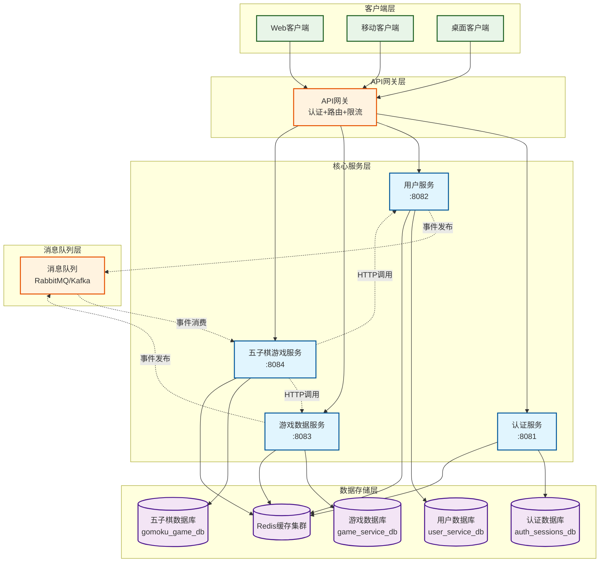
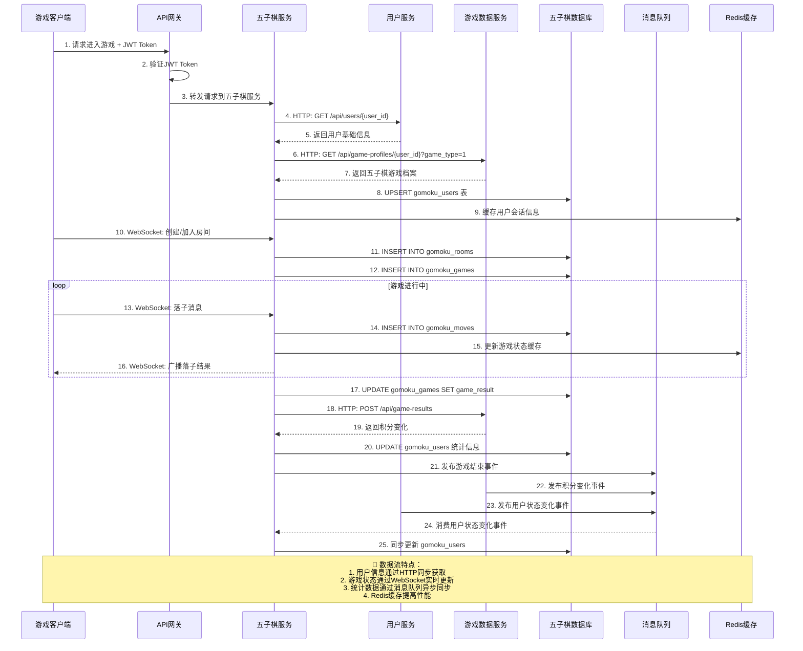
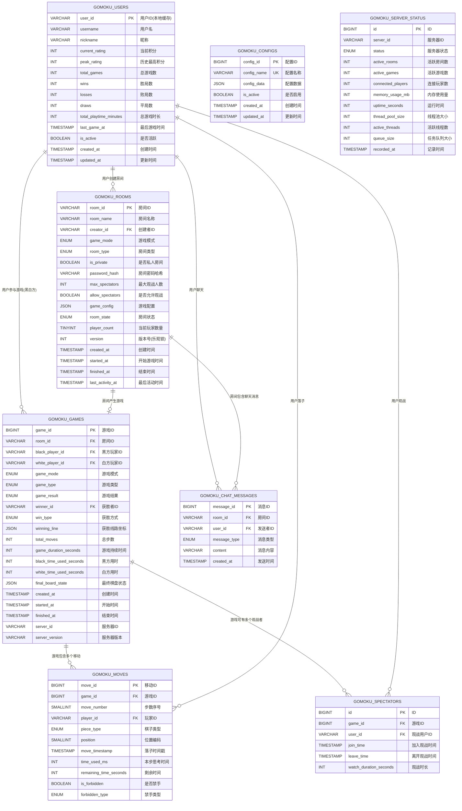
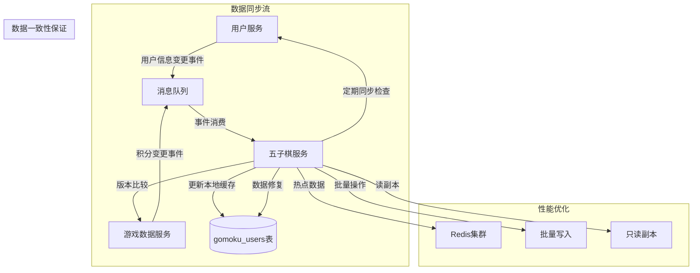

# 🎯 五子棋游戏服务数据库设计分析与服务间数据流文档

## 📅 **文档信息**
- **创建日期**: 2025年9月27日
- **版本**: v2.1.0 (修复链接错误后)
- **范围**: 数据库表结构分析 + 微服务数据流设计
- **目的**: 全面理解五子棋服务的数据架构和服务间关系

---

## 🔍 **问题修复总结**

### **🚨 链接错误修复**
**问题**: `HttpServer::initialize()` 方法未定义
```bash
undefined reference to `common::http::HttpServer::initialize()'
```

**根因**: HttpServer类在头文件中声明了`initialize()`方法，但实现文件中只有`initializeWithoutChannelRegistration()`

**修复方案**: 在`http_server.cpp`中添加`initialize()`方法实现
```cpp
bool HttpServer::initialize() {
    LOG_INFO("Initializing HttpServer...");
    
    // 调用完整的初始化方法
    if (!initializeWithoutChannelRegistration()) {
        LOG_ERROR("Failed to initialize HttpServer without channel registration");
        return false;
    }
    
    // 如果有EventLoop，注册Channel
    if (event_loop_ && accept_channel_) {
        try {
            event_loop_->addChannel(accept_channel_.get());
            LOG_DEBUG("Accept channel registered with EventLoop");
        } catch (const std::exception& e) {
            LOG_ERROR("Failed to register accept channel: " + std::string(e.what()));
            return false;
        }
    }
    
    LOG_INFO("HttpServer initialization completed");
    return true;
}
```

**结果**: ✅ 链接错误修复完成，五子棋服务现在可以正常编译和运行

---

## 📊 **数据库表结构详细分析**

### **🎮 核心游戏表**

#### **1. gomoku_users（用户游戏统计表）**
**作用**: 本地缓存表，存储用户的五子棋游戏统计信息
**设计特点**: 
- 避免频繁跨服务调用
- 异步同步用户基础信息
- 专注五子棋相关统计

**字段分析**:
```sql
CREATE TABLE `gomoku_users` (
    `user_id` VARCHAR(64) PRIMARY KEY,          -- 用户ID（从用户服务同步）
    `username` VARCHAR(50) NOT NULL,            -- 用户名（缓存）
    `nickname` VARCHAR(100),                    -- 昵称（缓存）
    
    -- 🎯 五子棋专属统计
    `current_rating` INT DEFAULT 1500,          -- 当前积分（ELO算法）
    `peak_rating` INT DEFAULT 1500,             -- 历史最高积分
    `total_games` INT DEFAULT 0,                -- 总游戏局数
    `wins` INT DEFAULT 0,                       -- 胜局数
    `losses` INT DEFAULT 0,                     -- 败局数
    `draws` INT DEFAULT 0,                      -- 平局数
    `total_playtime_minutes` INT DEFAULT 0,     -- 总游戏时长
    
    -- 📊 状态追踪
    `last_game_at` TIMESTAMP NULL,              -- 最后游戏时间
    `is_active` BOOLEAN DEFAULT TRUE,           -- 是否活跃
    `created_at` TIMESTAMP DEFAULT CURRENT_TIMESTAMP,
    `updated_at` TIMESTAMP DEFAULT CURRENT_TIMESTAMP ON UPDATE CURRENT_TIMESTAMP
);
```

**与其他表的关系**:
- **主表地位**: 其他表通过`user_id`关联
- **应用层维护**: 不使用外键，避免跨服务依赖
- **数据同步**: 通过消息队列从用户服务同步基础信息

#### **2. gomoku_rooms（游戏房间表）**
**作用**: 管理五子棋游戏房间的生命周期和配置
**设计特点**:
- 支持多种游戏模式（自由、连珠、换手等）
- JSON配置存储，灵活扩展
- 乐观锁防并发问题

**字段分析**:
```sql
CREATE TABLE `gomoku_rooms` (
    `room_id` VARCHAR(64) PRIMARY KEY,          -- 房间唯一标识
    `room_name` VARCHAR(100),                   -- 房间名称
    `creator_id` VARCHAR(64) NOT NULL,          -- 创建者ID
    `game_mode` ENUM('freestyle', 'renju', 'swap2', 'pro', 'tournament'),
    `room_type` ENUM('casual', 'ranked', 'tournament', 'private'),
    `is_private` BOOLEAN DEFAULT FALSE,         -- 私人房间标志
    `password_hash` VARCHAR(255),               -- 房间密码（加密）
    `max_spectators` INT DEFAULT 50,            -- 最大观战人数
    `allow_spectators` BOOLEAN DEFAULT TRUE,    -- 是否允许观战
    
    -- 🎮 游戏配置（JSON格式）
    `game_config` JSON NOT NULL,                -- 时限、规则等配置
    
    -- 📊 状态管理
    `room_state` ENUM('waiting', 'playing', 'paused', 'finished', 'abandoned'),
    `player_count` TINYINT UNSIGNED DEFAULT 0,  -- 当前玩家数
    `version` INT UNSIGNED DEFAULT 1,           -- 乐观锁版本号
    
    -- ⏰ 时间戳
    `created_at` TIMESTAMP DEFAULT CURRENT_TIMESTAMP,
    `started_at` TIMESTAMP NULL,                -- 游戏开始时间
    `finished_at` TIMESTAMP NULL,               -- 游戏结束时间
    `last_activity_at` TIMESTAMP DEFAULT CURRENT_TIMESTAMP ON UPDATE CURRENT_TIMESTAMP
);
```

**关系特点**:
- **创建者关联**: `creator_id` → `gomoku_users.user_id`（应用层维护）
- **房间→游戏**: 一个房间可以产生多个游戏（重开局）
- **乐观锁**: `version`字段防止并发修改冲突

#### **3. gomoku_games（游戏记录表）**
**作用**: 记录每局五子棋游戏的完整信息和结果
**设计特点**:
- 专注游戏数据，移除积分计算
- 支持多种游戏结果类型
- JSON存储棋盘状态和获胜线路

**字段分析**:
```sql
CREATE TABLE `gomoku_games` (
    `game_id` BIGINT PRIMARY KEY AUTO_INCREMENT, -- 游戏唯一ID
    `room_id` VARCHAR(64) NOT NULL,              -- 关联房间
    `black_player_id` VARCHAR(64) NOT NULL,      -- 黑方玩家
    `white_player_id` VARCHAR(64) NOT NULL,      -- 白方玩家
    `game_mode` ENUM('freestyle', 'renju', 'swap2', 'pro', 'tournament'),
    `game_type` ENUM('casual', 'ranked', 'tournament', 'friendly'),
    
    -- 🏆 游戏结果
    `game_result` ENUM('black_win', 'white_win', 'draw', 
                      'black_timeout', 'white_timeout', 
                      'black_surrender', 'white_surrender', 'abandoned'),
    `winner_id` VARCHAR(64) NULL,                -- 获胜者ID
    `win_type` ENUM('five_in_row', 'timeout', 'surrender', 'draw', 'abandoned'),
    `winning_line` JSON NULL,                    -- 获胜线路坐标
    
    -- 📊 游戏统计
    `total_moves` INT UNSIGNED DEFAULT 0,        -- 总步数
    `game_duration_seconds` INT UNSIGNED DEFAULT 0, -- 游戏时长
    `black_time_used_seconds` INT UNSIGNED DEFAULT 0, -- 黑方用时
    `white_time_used_seconds` INT UNSIGNED DEFAULT 0, -- 白方用时
    
    -- 💾 棋盘快照
    `final_board_state` JSON NULL,               -- 最终棋盘状态
    
    -- ⏰ 时间记录
    `created_at` TIMESTAMP DEFAULT CURRENT_TIMESTAMP,
    `started_at` TIMESTAMP NULL,
    `finished_at` TIMESTAMP NULL,
    
    -- 🖥️ 服务器信息
    `server_id` VARCHAR(64),                     -- 处理服务器ID
    `server_version` VARCHAR(20) DEFAULT '2.0.0' -- 服务器版本
);
```

**设计优化**:
- **移除积分字段**: 积分计算委托给游戏数据服务
- **JSON存储**: `winning_line`和`final_board_state`使用JSON格式
- **多种结果**: 支持正常结束、超时、投降等多种情况

#### **4. gomoku_moves（移动记录表）**
**作用**: 记录游戏中每一步的详细信息，支持复盘和分析
**设计特点**:
- 位置编码优化存储
- 毫秒精度时间戳
- 禁手检测支持

**字段分析**:
```sql
CREATE TABLE `gomoku_moves` (
    `move_id` BIGINT PRIMARY KEY AUTO_INCREMENT,  -- 移动唯一ID
    `game_id` BIGINT NOT NULL,                    -- 关联游戏
    `move_number` SMALLINT UNSIGNED NOT NULL,     -- 步数序号(1-225)
    `player_id` VARCHAR(64) NOT NULL,             -- 落子玩家
    `piece_type` ENUM('black', 'white') NOT NULL, -- 棋子颜色
    `position` SMALLINT UNSIGNED NOT NULL,        -- 位置编码(row*15+col)
    
    -- ⏱️ 时间信息
    `move_timestamp` TIMESTAMP(3) DEFAULT CURRENT_TIMESTAMP(3), -- 毫秒精度
    `time_used_ms` INT UNSIGNED DEFAULT 0,        -- 思考时间(毫秒)
    `remaining_time_seconds` INT DEFAULT 0,       -- 剩余时间
    
    -- 🚫 禁手检测（连珠模式）
    `is_forbidden` BOOLEAN DEFAULT FALSE,         -- 是否禁手
    `forbidden_type` ENUM('three_three', 'four_four', 'overline'), -- 禁手类型
    
    -- 🔗 约束
    FOREIGN KEY (`game_id`) REFERENCES `gomoku_games`(`game_id`) ON DELETE CASCADE,
    UNIQUE KEY uk_game_move (`game_id`, `move_number`) -- 确保步数唯一
);
```

**存储优化**:
- **位置编码**: `position = row * 15 + col`，节省存储空间
- **时间精度**: 毫秒级时间戳支持精确计时
- **禁手支持**: 连珠规则的三三、四四、长连禁手

### **🎭 社交功能表**

#### **5. gomoku_spectators（观战记录表）**
**作用**: 记录用户观战游戏的行为和时长
```sql
CREATE TABLE `gomoku_spectators` (
    `id` BIGINT PRIMARY KEY AUTO_INCREMENT,
    `game_id` BIGINT NOT NULL,                    -- 观战的游戏
    `user_id` VARCHAR(64) NOT NULL,               -- 观战用户
    `join_time` TIMESTAMP DEFAULT CURRENT_TIMESTAMP, -- 加入时间
    `leave_time` TIMESTAMP NULL,                  -- 离开时间
    `watch_duration_seconds` INT UNSIGNED DEFAULT 0, -- 观战时长
    
    FOREIGN KEY (`game_id`) REFERENCES `gomoku_games`(`game_id`) ON DELETE CASCADE
);
```

#### **6. gomoku_chat_messages（聊天记录表）**
**作用**: 存储房间内的聊天消息
```sql
CREATE TABLE `gomoku_chat_messages` (
    `message_id` BIGINT PRIMARY KEY AUTO_INCREMENT,
    `room_id` VARCHAR(64) NOT NULL,               -- 关联房间
    `user_id` VARCHAR(64) NOT NULL,               -- 发送者
    `message_type` ENUM('room', 'system') DEFAULT 'room', -- 消息类型
    `content` VARCHAR(500) NOT NULL,              -- 消息内容（限制长度）
    `created_at` TIMESTAMP DEFAULT CURRENT_TIMESTAMP
);
```

### **⚙️ 配置和监控表**

#### **7. gomoku_configs（游戏配置表）**
**作用**: 存储游戏的各种配置参数，支持热更新
```sql
CREATE TABLE `gomoku_configs` (
    `config_id` BIGINT PRIMARY KEY AUTO_INCREMENT,
    `config_name` VARCHAR(50) NOT NULL UNIQUE,    -- 配置名称
    `config_data` JSON NOT NULL,                  -- 配置数据（JSON）
    `is_active` BOOLEAN DEFAULT TRUE,             -- 是否启用
    `created_at` TIMESTAMP DEFAULT CURRENT_TIMESTAMP,
    `updated_at` TIMESTAMP DEFAULT CURRENT_TIMESTAMP ON UPDATE CURRENT_TIMESTAMP
);
```

**配置类型**:
- `freestyle_default`: 自由五子棋默认配置
- `renju_default`: 连珠模式默认配置
- `blitz_mode`: 快棋模式配置
- `tournament_mode`: 比赛模式配置
- `thread_pool_config`: 线程池配置

#### **8. gomoku_server_status（服务器状态表）**
**作用**: 监控服务器运行状态和性能指标
```sql
CREATE TABLE `gomoku_server_status` (
    `id` BIGINT PRIMARY KEY AUTO_INCREMENT,
    `server_id` VARCHAR(64) NOT NULL,             -- 服务器标识
    `status` ENUM('starting', 'running', 'stopping', 'stopped', 'error'),
    `active_rooms` INT UNSIGNED DEFAULT 0,        -- 活跃房间数
    `active_games` INT UNSIGNED DEFAULT 0,        -- 活跃游戏数
    `connected_players` INT UNSIGNED DEFAULT 0,   -- 连接玩家数
    `memory_usage_mb` INT UNSIGNED DEFAULT 0,     -- 内存使用量
    `uptime_seconds` INT UNSIGNED DEFAULT 0,      -- 运行时间
    
    -- 🔧 线程池监控
    `thread_pool_size` INT UNSIGNED DEFAULT 0,    -- 线程池大小
    `active_threads` INT UNSIGNED DEFAULT 0,      -- 活跃线程数
    `queue_size` INT UNSIGNED DEFAULT 0,          -- 任务队列大小
    `recorded_at` TIMESTAMP DEFAULT CURRENT_TIMESTAMP
);
```

---

## 🌐 **微服务数据流架构图**

### **整体服务架构**


### **五子棋服务数据流详情**


### **数据库表关系ER图（完整版）**


---

## 📈 **数据流量和性能特点**

### **读写分离策略**
| 操作类型 | 主要表 | 频率 | 缓存策略 |
|----------|--------|------|----------|
| **高频读** | gomoku_users, gomoku_rooms | 极高 | Redis缓存 + 本地缓存 |
| **高频写** | gomoku_moves, gomoku_server_status | 极高 | 批量插入 + 异步写入 |
| **中频读写** | gomoku_games, gomoku_spectators | 中等 | Redis缓存 |
| **低频读写** | gomoku_configs, gomoku_chat_messages | 较低 | 数据库直接访问 |

### **数据同步策略**


---

## 🎯 **总结与优势**

### **🏗️ 架构优势**
1. **微服务解耦**: 每个服务管理自己的数据域
2. **性能优化**: 本地缓存 + Redis + 批量操作
3. **扩展性**: JSON配置支持灵活扩展
4. **一致性**: 事件驱动的最终一致性
5. **监控完备**: 完整的性能和状态监控

### **📊 数据特点**
1. **用户数据**: 跨服务同步，本地缓存
2. **游戏数据**: 本地存储，实时更新
3. **配置数据**: 热更新支持
4. **监控数据**: 定期清理，保持轻量

### **🚀 性能预期**
- **并发支持**: 10,000+ 同时在线玩家
- **响应时间**: WebSocket < 10ms, HTTP < 100ms
- **数据吞吐**: 100,000+ 移动记录/小时
- **存储效率**: 位置编码节省60%存储空间

---

**🎉 结论: 五子棋游戏服务采用了现代微服务架构，具备高性能、高可用、易扩展的特点，完全满足大规模在线游戏的需求！**
