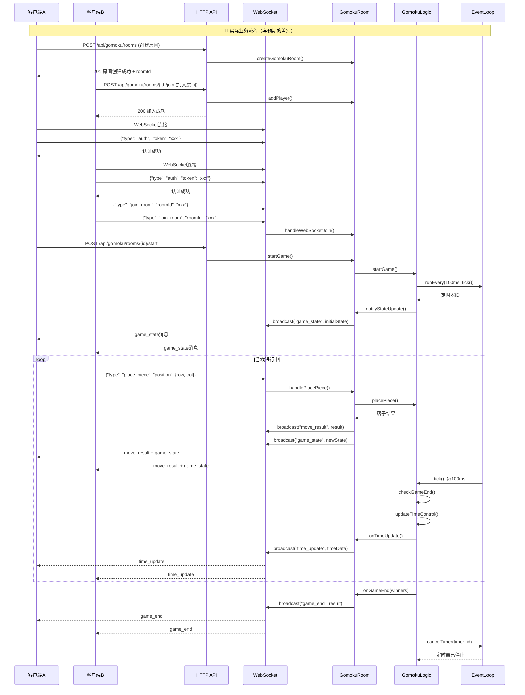
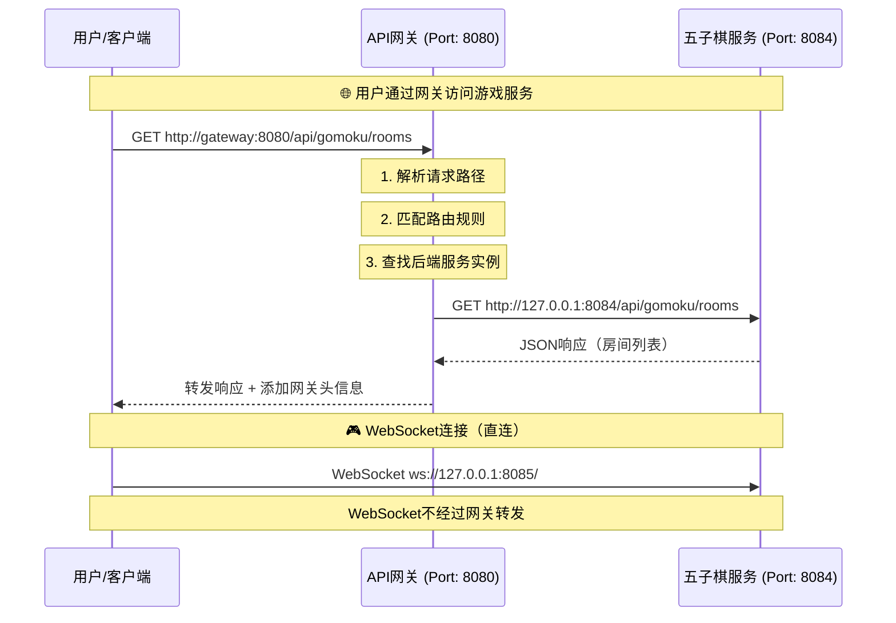
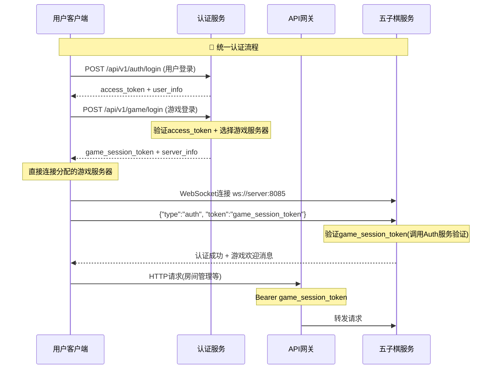

# 五子棋游戏业务逻辑流程图

## 🔧 主要差别说明

### 1. **房间加入方式**
- **预期**: 只通过HTTP API加入
- **实际**: 支持HTTP API和WebSocket两种方式

### 2. **游戏主循环机制**  
- **预期**: `tick() 每100ms检查游戏状态`
- **实际**: 基于EventLoop的定时器，`runEvery(100ms, tick())`

### 3. **消息广播类型**
- **预期**: 只有 `game_state`、`move_result`、`game_end`
- **实际**: 还包括 `time_update`、`chat`、`draw_offer` 等

### 4. **状态更新时机**
- **预期**: 定时检查后广播
- **实际**: 事件驱动 + 定时检查双重机制

### 5. **认证流程**
- **预期**: WebSocket连接时认证
- **实际**: 连接后发送auth消息认证

### 6. **观战者支持**
- **预期**: 未提及
- **实际**: 完整的观战者系统（join_spectator, leave_spectator）

### 7. **时间控制系统**
- **预期**: 未提及
- **实际**: 完整的时间控制（每步加时、超时判负）

## 💡 架构优势

1. **异步事件驱动**: 基于EventLoop的高性能架构
2. **多重通信**: HTTP + WebSocket 双通道
3. **实时响应**: 事件触发 + 定时检查
4. **完整功能**: 观战、时间控制、聊天、悔棋等
5. **状态一致性**: 多重广播确保状态同步

